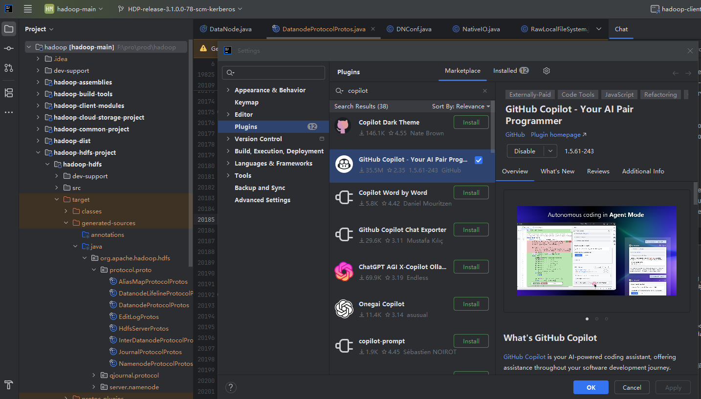
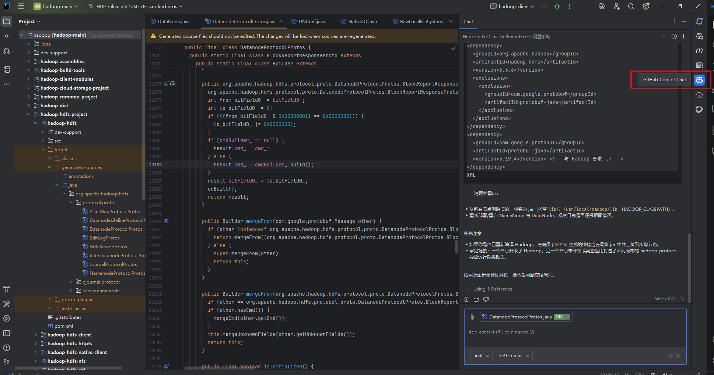
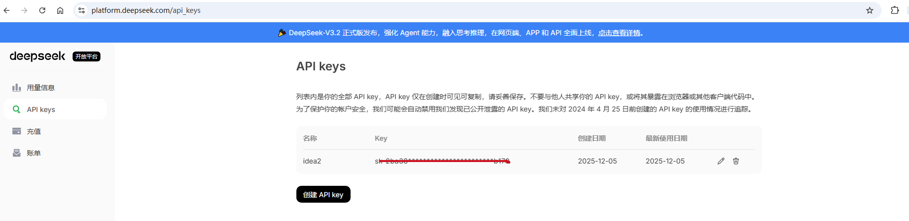
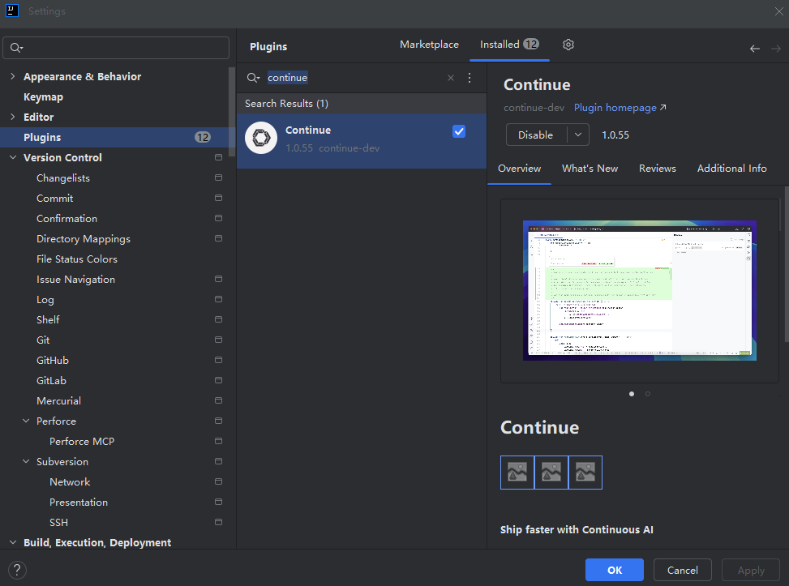
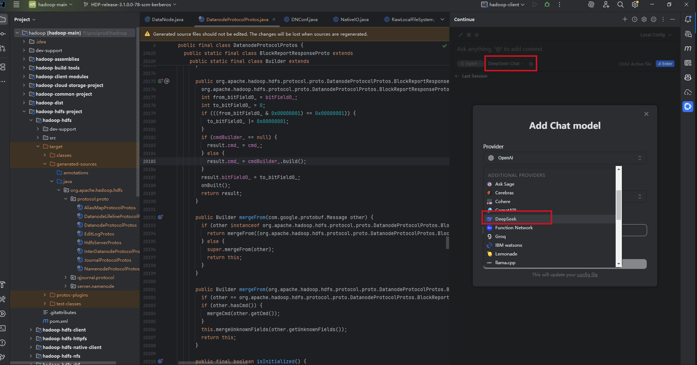
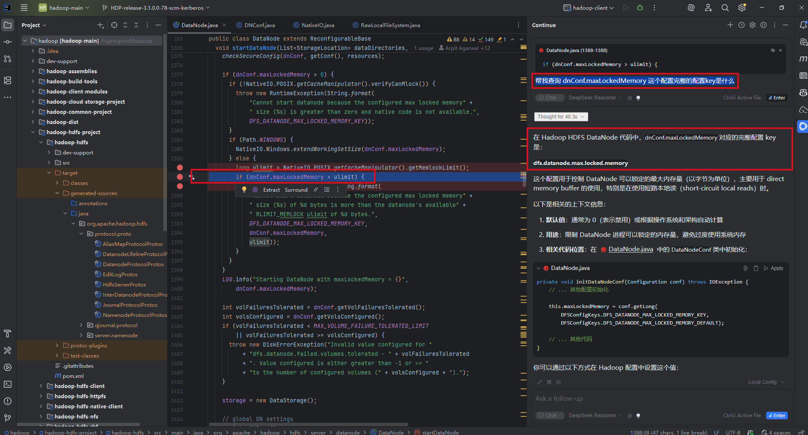

# idea plugins ai proxy
以前试用过trae,这个界面很不友好，调试代码和查看代码没有idea好用，idea也可以直接集成AI对话，这样方便许多。   
以下是集成copilot和deepseek的方法.这里copilot也可以直接用GPT-5,这个变相开放也很意外，你要是直接用GPT5是被禁用的。    
## idea plugins to copilot
1:idea -> sttings -> plugins -> copilot -> install    
  
2:安装完后，就可以在这里和ai对话，copilot每个月有免费的限制，用完后需要收费    
  

## idea plugins to deepseek
1:申请app-key:https://platform.deepseek.com/api_keys  

这玩意也需要充值，先充10元试玩一把   

2:idea -> sttings -> continue -> install   
   

3:完装完后，这里可以添加很多种类的AI API开发接口，可以根据自己的需求选择，这里以deepSeek为例   

4:问答示例
帮我查询 dnConf.maxLockedMemory 这个配置完整的配置key是什么   
deepSeek成功回答出是：dfs.datanode.max.locked.memory   
   

  📅
  发布：
  <time datetime="2025-12-10" class="date-value">2025-12-10</time>

  <strong>大纲：</strong>
  <ul id="outline-list" style="margin:0;padding-left:1.2em;"></ul>

<!--菜单栏-->
  <nav class="blog-nav">
    <button class="collapse-btn" onclick="toggleBlogNav()">☰</button>
    
 </nav>

 
<link rel="stylesheet" href="/assets/blog.css">