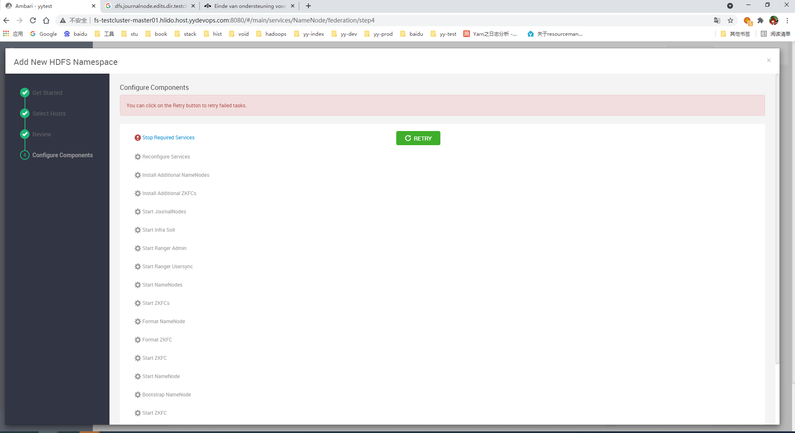
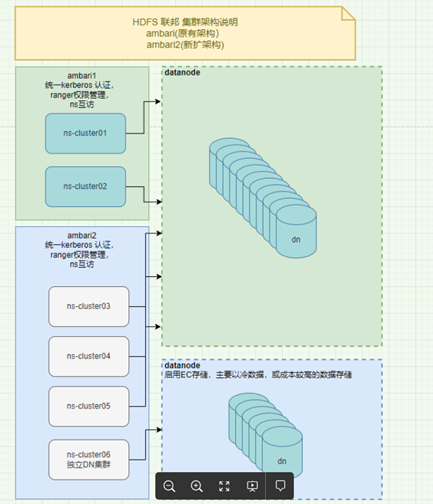
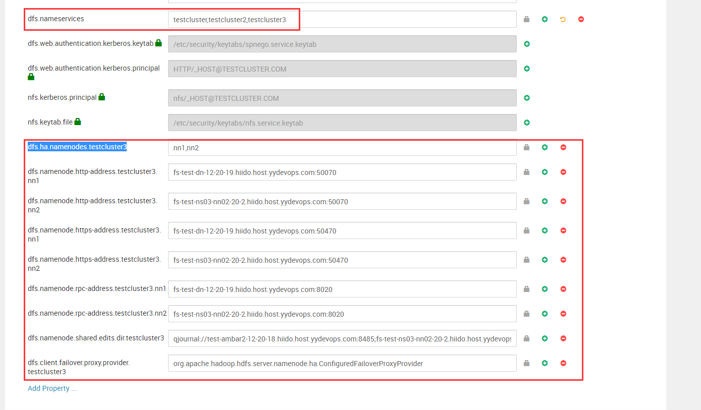
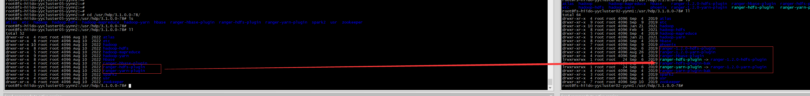
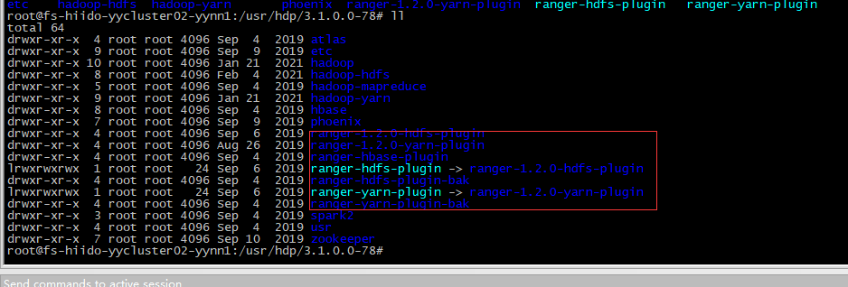
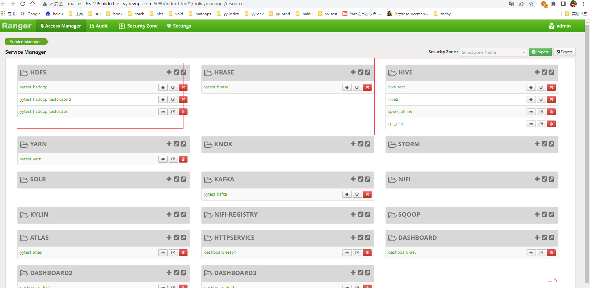
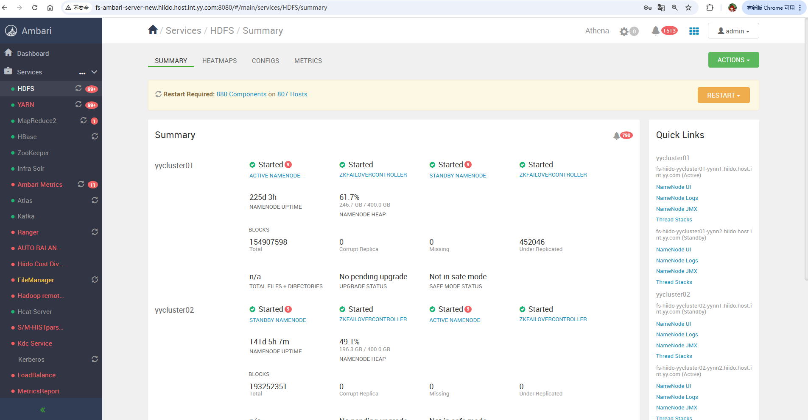
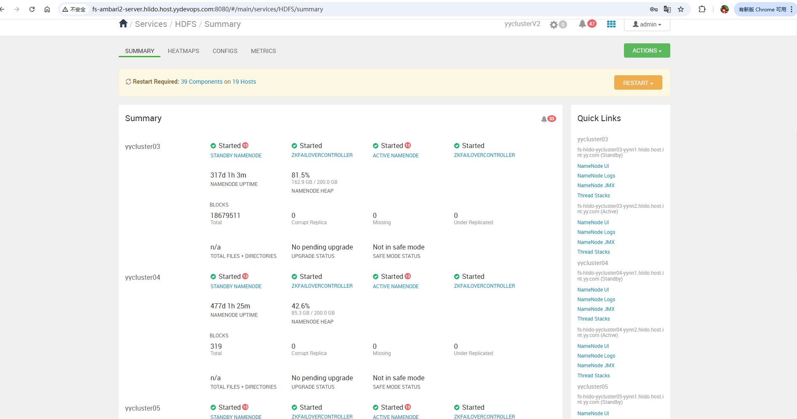

<div class="post-date">
  <span class="calendar-icon">📅</span>
  <span class="date-label">发布：</span>
  <time datetime="2025-11-20" class="date-value">2025-11-20</time>
</div>

<div class="outline" style="background:#f6f8fa;padding:1em 1.5em 1em 1.5em;margin-bottom:2em;border-radius:8px;">
  <strong>大纲：</strong>
  <ul id="outline-list" style="margin:0;padding-left:1.2em;"></ul>
</div>

# hdfs ambari扩容6个联邦集群

## 需求背景
 当前hadoop集群只有2个ns,yycluster01,yycluster02。文件增长的较快，2.5亿+。需要扩容两个ns。

## 解决方案
### 方案1
在原有的ambari中执行扩容，简单方便，但需要停止所有服务后，才能安装，然后启动所有服务。但我们线上的数据量很大，启动需要花很长时间，预估2个小时吧。这个无法接受。  
官方扩容文档：https://docs.cloudera.com/HDPDocuments/Ambari-latest/managing-and-monitoring-ambari/content/amb_configure_federation.html
经过在测试环境上验证，确实是需要全部停掉后，才能安装。  

### 方案2 
单独部署一套ambar+namenode服务，通过手动修改相关配置的方式，使nn和已有的dn建立链接，一样需要重启服务才能生效，但这个重启我们可以手动来控制，按批来重启，不需要全部一次停掉。  
目前在测试环境上已经搭建完毕，是可以这么来做，但手动修改的地方较大，后续维护起来有成本，
#### 方案2详细部署
需要独立ambari环境，独立服务器（ambari,zk,jn），避免和老nn混用，带来不必要的异常  
   
先手动搭建好独立的ambari+ns集群，并且手动改相关配置（根据老集群的nn配置）。  
对于老集群需要加入以下配置，并重启所有dn和相关服务，分批重启，手动控制  
  

## ranger问题解决
### ranger-plugin变动
因服务默认是用kerberos协议请求ranger, 但是我们ranger启用了keeplive转发，这里会丢失kerberos认证密钥相关，导致请求不成功.  
如果请求150，151直连，就是成功的。但配置只能配置一个url,不支持高可用。所以：  
这里是有改动过原码，强制用用户密码login，进行下载ranger数据。  
因此需要对03-06进行同样的jar包copy.需要重启nn服务。  
/usr/hdp/3.1.0.0-78/ranger-1.2.0-hdfs-plugin  
/usr/hdp/3.1.0.0-78/ranger-1.2.0-yarn-plugin  


### ranger集成
在新的ambari装一个空的ranger服务，但在hdfs配置上进行更换ranger url和登录逻辑即可。  
类似这样，ranger分多个hdfs服务来管理权限  

测试验证：
```
#add user
ipa user-add yycluster10

#在新的集群上hdfs账号去建文件
hdfs dfs -mkdir -p /user/hdfs/test
echo 'test new cluster ranger rw' > hello.txt
hdfs dfs -put hello.txt  /user/hdfs/test
hdfs dfs -chmod 700  /user/hdfs/test/hello.txt
 
#用新建的账号yycluster10去读
liangrui@ipa-test-65-198:~$ hdfs dfs -cat /user/hdfs/test/hello.txt
cat: Permission denied: user=yycluster10, access=READ, inode="/user/hdfs/test/hello.txt":hdfs:hdfs:-rwx------
 
#接下来用ranger去授权
/user/hdfs/test/*    --EnabledEnabled --   yycluster10
 
#再次去用cluster10去访问hdfs建的文件，这时候是可以进行读的
liangrui@ipa-test-65-198:~$ hdfs dfs -cat hdfs://yycluster10/user/hdfs/test/hello.txt
test new cluster ranger rw
 
到此ranger共用测试成功

```

## 客户端配置更新
### 当前更换列表
- 备：没有启用Router-based,历史原因，这里中间不好加，改动较大，所以只能更换客户端方式。
1：spark on yarn 配置excutor默认是依懒 yarn /etc/hadoop下的，这个不需要改动，dirver是会用到spark config下面的配置，这个是需要更换最新的hdfs-stie文件  
2：hive metastore 需要刷新一下客户端，重启就好，如果有独立安装的，需要手动去替换hdfs相关配置  
3：trio需要更新hdfs  hdfs-site配置文件  
4：alluxio需要手动替换hdfs core-stie hdfs-site配置文件  
5：flink需要手动替换hdfs  hdfs-site配置文件  
6:其它有用到新的集群的hadoop client都需要替换新的文件  
7：资源分摊相关的统计也需要接入新集群  
8：hdfs audit日志采集写入hive任务也需要接入新集群，记得把那个appid也顺便加进去，方便查看那个作业id操作的  
如果没有需要访问到新的集群上面，不替换也不影响  
spark需要修改：  
原：spark.kerberos.access.hadoopFileSystems=hdfs://yycluster01,hdfs://yycluster02  
改：spark.kerberos.access.hadoopFileSystems=hdfs://yycluster01,hdfs://yycluster02,hdfs://yycluster03,hdfs://yycluster04,hdfs://yycluster05,hdfs://yycluster06  

### yarn需要重启  
这个是版本bug，高版本已修复。https://issues.apache.org/jira/browse/YARN-8308
```
22/09/07 21:47:59 INFO yarn.Client: Submitting application application_1657779753832_2162414 to ResourceManager
22/09/07 21:47:59 INFO yarn.Client: Deleted staging directory hdfs://yycluster01/user/hiidoagent/.sparkStaging/application_1657779753832_2162414
Exception in thread "main" org.apache.hadoop.yarn.exceptions.YarnException: Failed to submit application_1657779753832_2162414 to YARN : Failed to renew token: Kind: HDFS_DELEGATION_TOKEN, Service: ha-hdfs:yycluster06, Ident: (token for hiidoagent: HDFS_DELEGATION_TOKEN owner=hiidoagent@YYDEVOPS.COM, renewer=yarn, realUser=, issueDate=1662558478096, maxDate=1678110478096, sequenceNumber=3, masterKeyId=26)
        at org.apache.hadoop.yarn.client.api.impl.YarnClientImpl.submitApplication(YarnClientImpl.java:336)
        at org.apache.spark.deploy.yarn.Client.submitApplication(Client.scala:207)
        at org.apache.spark.deploy.yarn.Client.run(Client.scala:1268)
        at org.apache.spark.deploy.yarn.YarnClusterApplication.start(Client.scala:1677)
        at org.apache.spark.deploy.SparkSubmit.org$apache$spark$deploy$SparkSubmit$$runMain(SparkSubmit.scala:955)
        at org.apache.spark.deploy.SparkSubmit.doRunMain$1(SparkSubmit.scala:180)
        at org.apache.spark.deploy.SparkSubmit.submit(SparkSubmit.scala:203)
        at org.apache.spark.deploy.SparkSubmit.doSubmit(SparkSubmit.scala:90)
        at org.apache.spark.deploy.SparkSubmit$$anon$2.doSubmit(SparkSubmit.scala:1043)
        at org.apache.spark.deploy.SparkSubmit$.main(SparkSubmit.scala:1052)
        at org.apache.spark.deploy.SparkSubmit.main(SparkSubmit.scala)
22/09/07 21:47:59 INFO util.ShutdownHookManager: Shutdown hook called
22/09/07 21:47:59 INFO util.ShutdownHookManager: Deleting directory /tmp/spark-18bcf826-0e30-45ea-8e50-b4c29933526f
22/09/07 21:47:59 INFO util.ShutdownHookManager: Deleting directory /tmp/spark-37fe007e-eca2-4cd9-9ae7-15530ab62ec1
```


## 最终效果
### 原来的ambari

### 新增的ambari

- 备:google浏览器升级后，ambari 2.7.3.0的版本菜单栏和右边正文错位，ambar需要修复，这个ambar2还没有改，所以还是错位状态。修复如下：
修改ambari-server的前端文件：/usr/lib/ambari-server/web/javascripts/app.js   
```javascript
-- 原代码
initNavigationBar: function () {
    if (App.get('router.mainController.isClusterDataLoaded')) {
      $('body').on('DOMNodeInserted', '.navigation-bar', function () {
        $('.navigation-bar').navigationBar({
          fitHeight: true,
          collapseNavBarClass: 'icon-double-angle-left',
          expandNavBarClass: 'icon-double-angle-right'
        });
        $('body').off('DOMNodeInserted', '.navigation-bar');
      });
    }
  }.observes('App.router.mainController.isClusterDataLoaded')
-- 修改后 
 initNavigationBar: function () {
    let navigationBarObserver = null;
    if (App.get('router.mainController.isClusterDataLoaded')) {
      navigationBarObserver = new MutationObserver((mutationsList) => {
        mutationsList.forEach((mutation) => {
          if (mutation.type === 'childList') {
            mutation.addedNodes.forEach((node) => {
              if (node.classList && node.classList.contains('navigation-bar')) {
                $(node).navigationBar({
                  fitHeight: true,
                  collapseNavBarClass: 'icon-double-angle-left',
                  expandNavBarClass: 'icon-double-angle-right'
                });
                navigationBarObserver.disconnect();
              }
            });
          }
        });
      });
      const targetNode = document.body;
      const config = { childList: true, subtree: true };
      navigationBarObserver.observe(targetNode, config);
    }
  }.observes('App.router.mainController.isClusterDataLoaded')

```

## 需要注意
因为是共用的datanode服务器，2个ambari进行管理，日常还是在ambari1上进行运维，  
但在退役和上线上需要手动补全ambari2上没有的操作，我们通过运维管理服务来进行完善自动补全操作。  
不然会有大问题，需要谨慎操作和对待，需要严格测试。 
退役节点和上线节点可参考以下文档： 
<a href="https://liangrui198.github.io/blog/bigdata/hadoop/hdfs/op-node.html">hadoop上下线节点流程</a> 

<!--菜单栏-->
  <nav class="blog-nav">
    <button class="collapse-btn" onclick="toggleBlogNav()">☰</button>
    
 </nav>

 <script src="/assets/blog.js"></script>
<link rel="stylesheet" href="/assets/blog.css">