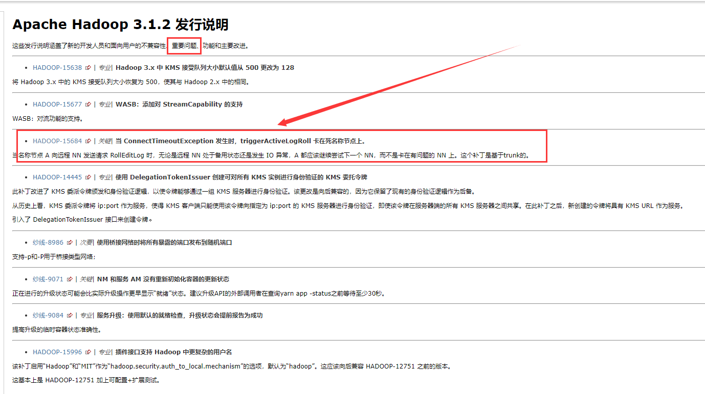
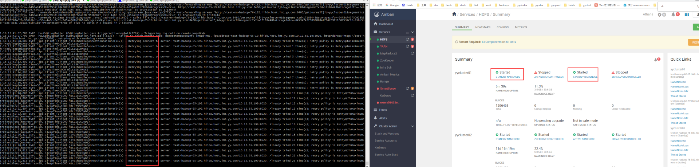
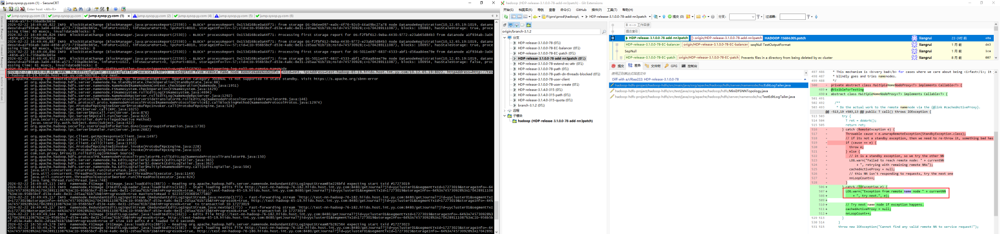
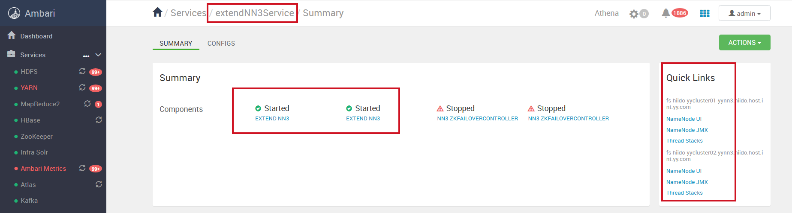
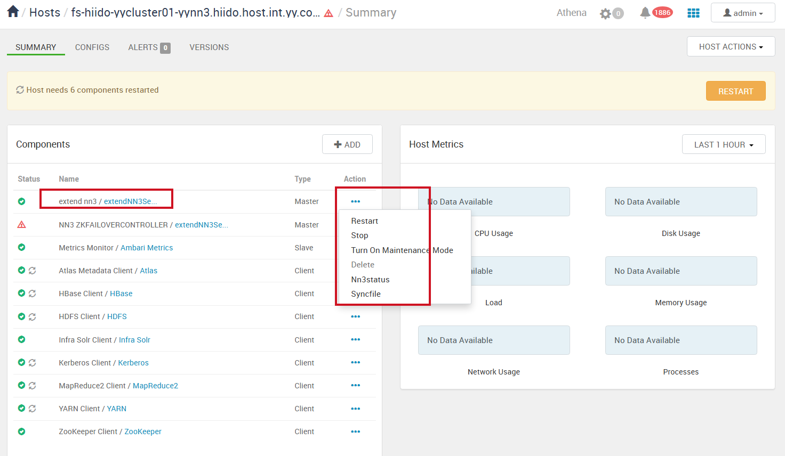
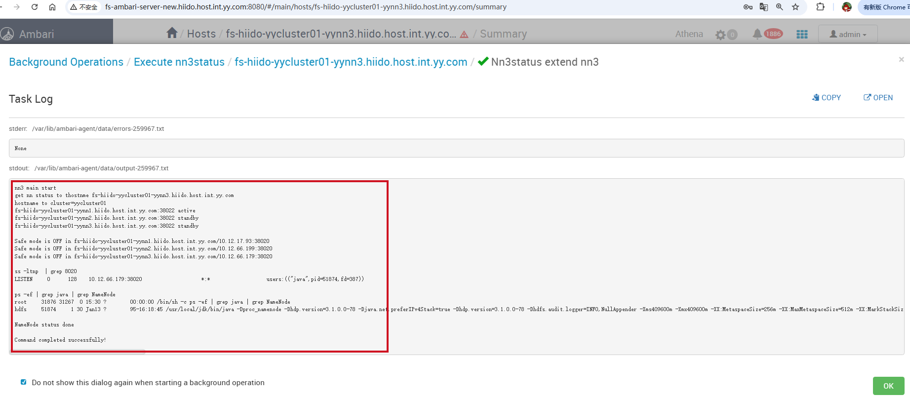

<div class="post-date">
  <span class="calendar-icon">📅</span>
  <span class="date-label">发布：</span>
  <time datetime="2025-11-20" class="date-value">2025-11-20</time>
</div>

<div class="outline" style="background:#f6f8fa;padding:1em 1.5em 1em 1.5em;margin-bottom:2em;border-radius:8px;">
  <strong>大纲：</strong>
  <ul id="outline-list" style="margin:0;padding-left:1.2em;"></ul>
</div>


# hdfs 扩展第三台nn
扩展需求和方案PPT
[text](add-nn/add-nn.pptx)
<iframe src="https://view.officeapps.live.com/op/embed.aspx?src=https%3A%2F%2Fliangrui198.github.io%2Fblog%2Fbigdata%2Fhadoop%2Fhdfs%2Fadd-nn%2Fadd-nn.pptx"
        width="100%" height="700" frameborder="0" scrolling="no"></iframe>

## 问题描述
  ambari默认只支持2台主备namenode,基于ambari插件方式完成第三台nn扩展
  ambari插件文档：https://cwiki.apache.org/confluence/display/AMBARI/Defining+a+Custom+Stack+and+Services
  hdfs文档：https://hadoop.apache.org/docs/stable/hadoop-project-dist/hadoop-hdfs/HDFSHighAvailabilityWithNFS.html

## 配置变更记录
```
dfs.ha.namenodes.yycluster04=nn1,nn2,nnn3
...

dfs.namenode.rpc-address.yycluster04.nnn3=fs-hiido-yycluster04-yynn3.hiido.host.xx.com:8020
dfs.namenode.http-address.yycluster04.nnn3=fs-hiido-yycluster04-yynn3.hiido.host.xx.com:50070
dfs.namenode.https-address.yycluster04.nnn3=fs-hiido-yycluster04-yynn3.hiido.host.xx.com:50470


dfs.namenode.rpc-address.yycluster01.nnn3=fs-hiido-yycluster01-yynn3.hiido.host.xx.com:8020
dfs.namenode.http-address.yycluster01.nnn3=fs-hiido-yycluster01-yynn3.hiido.host.xx.com:50070
dfs.namenode.https-address.yycluster01.nnn3=fs-hiido-yycluster01-yynn3.hiido.host.xx.com:50470
dfs.namenode.rpc-address.yycluster02.nnn3=fs-hiido-yycluster02-yynn3.hiido.host.xx.com:8020
dfs.namenode.http-address.yycluster02.nnn3=fs-hiido-yycluster02-yynn3.hiido.host.xx.com:50070
dfs.namenode.https-address.yycluster02.nnn3=fs-hiido-yycluster02-yynn3.hiido.host.xx.com:50470
dfs.namenode.rpc-address.yycluster03.nnn3=fs-hiido-yycluster03-yynn3.hiido.host.xx.com:8020
dfs.namenode.http-address.yycluster03.nnn3=fs-hiido-yycluster03-yynn3.hiido.host.xx.com:50070
dfs.namenode.https-address.yycluster03.nnn3=fs-hiido-yycluster03-yynn3.hiido.host.xx.com:50470
dfs.namenode.rpc-address.yycluster05.nnn3=fs-hiido-yycluster05-yynn3.hiido.host.xx.com:8020
dfs.namenode.http-address.yycluster05.nnn3=fs-hiido-yycluster05-yynn3.hiido.host.xx.com:50070
dfs.namenode.https-address.yycluster05.nnn3=fs-hiido-yycluster05-yynn3.hiido.host.xx.com:50470
dfs.namenode.rpc-address.yycluster06.nnn3=fs-hiido-yycluster06-yynn3.hiido.host.xx.com:8020
dfs.namenode.http-address.yycluster06.nnn3=fs-hiido-yycluster06-yynn3.hiido.host.xx.com:50070
dfs.namenode.https-address.yycluster06.nnn3=fs-hiido-yycluster06-yynn3.hiido.host.xx.com:50470

-- 手动生成keytab
ipa service-add nn/fs-hiido-yycluster04-yynn3.hiido.host.xx.com
ipa-getkeytab -p nn/fs-hiido-yycluster04-yynn3.hiido.host.xx.com -k /root/keytab_file/nn/c04.yynn3.nn.service.keytab

ipa service-add nn/fs-hiido-yycluster06-yynn3.hiido.host.xx.com
ipa-getkeytab -p nn/fs-hiido-yycluster06-yynn3.hiido.host.xx.com -k /root/keytab_file/nn/c06.yynn3.nn.service.keytab

```

## add NN3 操作步骤
```
0：先在新服务器上装hdfs client—->init hdfs环境
1：hdfs-site.xml配置文件增加以下配置
dfs.ha.namenodes.testcluster=nn1,nn2,nnn3
dfs.namenode.rpc-address.testcluster.nnn3=fs-testcluster-dn04.hiido.host.xx.com:8020
dfs.namenode.http-address.testcluster.nnn3=fs-testcluster-dn04.hiido.host.xx.com:50070
dfs.namenode.https-address.testcluster.nnn3=fs-testcluster-dn04.hiido.host.xx.com:50470
2：手动手成keytab
ipa service-add nn/fs-testcluster-dn04.hiido.host.xx.com
ipa-getkeytab -p nn/fs-testcluster-dn04.hiido.host.xx.com -k /root/nn.service.keytab
3：建好nn需要存fsimage的目录
mkdir /data/hadoop/hdfs  
mkdir /data/logs/hadoop/hdfs
4：配置同步，nn启动需要这些配置文件，注意hostname需要换成本机的
相关配置copy文件到 /etc/hadoop/conf       lib/ranger-hdfs-imple
/usr/hdp/3.1.0.0-78/hadoop/lib/ranger-hdfs-plugin-impl
 /usr/hdp/3.1.0.0-78/hadoop/jmx_prometheus_javaagent-0.14.0.jar
 ...
ranger-hdfs-security.xml  ranger-hdfs-audit.xml  namenode.yaml  hdfs_jaas.conf
5：通过执行以下命令格式化 备节点 并将最新的检查点 (FSImage) 从 主 复制到 备：
需要先login keytab
hdfs namenode -bootstrapStandby -force
6 启动nn && zkfc
/usr/hdp/current/hadoop-hdfs-namenode/../hadoop/sbin/hadoop-daemon.sh start namenode
/usr/hdp/current/hadoop-hdfs-namenode/bin/hdfs --daemon start  zkfc
```

## 遇到的问题
### 当前版本3.1.0需要修复  

测试环境复现，不断重启nn，机率性的出现，例 ：  
```
nn1 (active) restart
nn2(stanby)
nn3(stanby)  zk stop
actvie to nn2 [会正常转换，如果nn2网络不通，也会一直卡顿，所有状态都会stanby状态]
active to nn3[会一直连接，但其实nn3不会转为active 因为zk stop掉了]
此patch会偿式连接下一下nn服务，使其转换为active状态。
```
 测试环境复现的例子：  

patch的修复  


### 服务客户端更新
  - 客户端需要更新所有hdfs-site.xml配置文件

### 最终效果展示
ambari插件管理每三台nn服务


操作可以启，停，查看状态


查看当前所有nn状态详细信息


- zkfc没有启动，是避免这个新的nn先为主节点，客户端配置全部更新完后，可为主节点进行切换。

<!--菜单栏-->
  <nav class="blog-nav">
    <button class="collapse-btn" onclick="toggleBlogNav()">☰</button>
    
 </nav>

 <script src="/assets/blog.js"></script>
<link rel="stylesheet" href="/assets/blog.css">