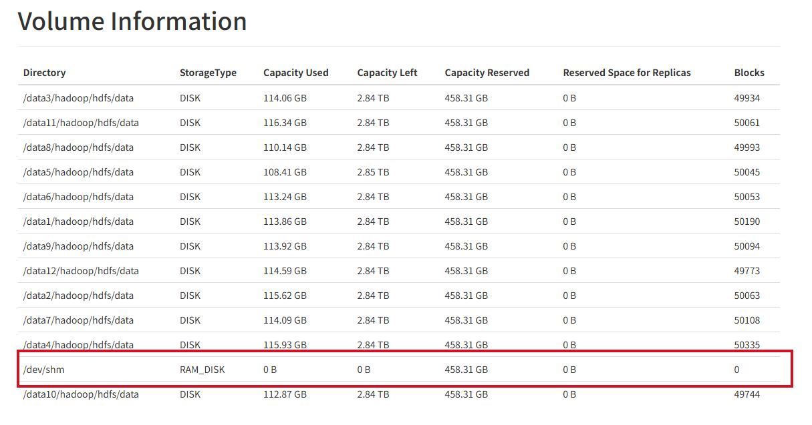

# hdfs集中式缓存
hdfs也支持缓存配置，把内存当作磁盘一样读写数据，类似alluxio cache,这个是基于hdfs内部管理的，如果某些hdfs文件高io的tmp时文件，是一个很好的选择。  
内存存储：https://hadoop.apache.org/docs/stable/hadoop-project-dist/hadoop-hdfs/MemoryStorage.html
官方文档：https://hadoop.apache.org/docs/stable/hadoop-project-dist/hadoop-hdfs/CentralizedCacheManagement.html


## 配置相关
### 内存存储
**必须配置 此参数决定了 DataNode 用于缓存的最大内存量，字节为单位指定.**     
`dfs.datanode.max.locked.memory=34359738368`  
**挂载一个 32 GB 的tmpfs分区或者直接用系统上已挂载的tmp分区**    
`sudo mount -t tmpfs -o size=32g tmpfs /mnt/dn-tmpfs/`   
**或者(系统不一样，挂载的名字也会不一样，根据自己的系统选择)**       
```
df -h  
tmpfs            63G     0   63G   0% /dev/shm  
```
**tmpfs使用 RAM_DISK 存储类型标记卷**   
```xml
    <property>
      <name>dfs.datanode.data.dir</name>
      <value>/data1/x,/data1/x,/data3/x,[RAM_DISK]/dev/shm</value>
    </property>
```


### 集中式缓存管理
**必须配置 此参数决定了 DataNode 用于缓存的最大内存量，字节为单位指定.**   
`dfs.datanode.max.locked.memory=34359738368`
//这个配置数要低于linux上的(ulimit -l)的值，这个参数控制进程可以将多少内存锁定在物理RAM中，防止被交换到磁盘。例：
`max locked memory       (kbytes, -l) 64`

默认太小，tmp修改到32g  
`ulimit -l 33554432`
永久修改 （需要root权限） 编辑   
`echo -e "\nhdfs soft memlock 33554432\nhdfs hard memlock 33554432" >> /etc/security/limits.d/hdfs.conf`
查看这个值  
`ulimit -l`


启动日志显示Cannot start datanode because the configured max locked memory size 问题   
```
2025-12-08 14:32:21,168 ERROR datanode.DataNode (DataNode.java:secureMain(2883)) - Exception in secureMain
java.lang.RuntimeException: Cannot start datanode because the configured max locked memory size (dfs.datanode.max.locked.memory) of 3612361255 bytes is more than the datanode's available RLIMIT_MEMLOCK ulimit of 65536 bytes.
        at org.apache.hadoop.hdfs.server.datanode.DataNode.startDataNode(DataNode.java:1389)
        at org.apache.hadoop.hdfs.server.datanode.DataNode.<init>(DataNode.java:500)
        at org.apache.hadoop.hdfs.server.datanode.DataNode.makeInstance(DataNode.java:2782)
        at org.apache.hadoop.hdfs.server.datanode.DataNode.instantiateDataNode(DataNode.java:2690)
        at org.apache.hadoop.hdfs.server.datanode.DataNode.createDataNode(DataNode.java:2732)
        at org.apache.hadoop.hdfs.server.datanode.DataNode.secureMain(DataNode.java:2876)
        at org.apache.hadoop.hdfs.server.datanode.SecureDataNodeStarter.start(SecureDataNodeStarter.java:100)
        at sun.reflect.NativeMethodAccessorImpl.invoke0(Native Method)
        at sun.reflect.NativeMethodAccessorImpl.invoke(NativeMethodAccessorImpl.java:62)
        at sun.reflect.DelegatingMethodAccessorImpl.invoke(DelegatingMethodAccessorImpl.java:43)
        at java.lang.reflect.Method.invoke(Method.java:498)
        at org.apache.commons.daemon.support.DaemonLoader.start(DaemonLoader.java:243)

hdfs@on-test-hadoop-65-239:/home/liangrui06$ cat /proc/34131/limits
Limit                     Soft Limit           Hard Limit           Units     
Max locked memory         65536                65536                bytes     
...    
```
**解决方案**   

1：ambari 中的hadoop-env.sh模板也有点问题, "$command" == "datanode" 这个变量我的环境是空的，需要去掉   
```
 # Fix temporary bug, when ulimit from conf files is not picked up, without full relogin.
 # Makes sense to fix only when runing DN as root
 #  if [ "$command" == "datanode" ] && [ "$EUID" -eq 0 ] && [ -n "$HDFS_DATANODE_SECURE_USER" ]; then
 if [ "$EUID" -eq 0 ] && [ -n "$HDFS_DATANODE_SECURE_USER" ]; then
 
 ulimit -l {{datanode_max_locked_memory}}
 
 ulimit -n {{hdfs_user_nofile_limit}}
 fi
```

2：只修改上而那个文件不行，发现在ambari中启动的时候，会覆盖这个玩意，原来是ambari内部有个etc配置文件，需要手动修改，在页面上找不到入口修改,单位是kb。

`echo -e "\n{{hdfs_user}}   - memlock {{hdfs_user_memlock_limit|default(33554432)}}" >> /data/ambari-agent/cache/stacks/HDP/3.0/services/HDFS/package/templates/hdfs.conf.j2`  
或    
`echo -e "\n*   - memlock {{hdfs_user_memlock_limit|default(33554432)}}" >> /data/ambari-agent/cache/stacks/HDP/3.0/services/HDFS/package/templates/hdfs.conf.j2`    
ambari-service文件也需要更改   
`echo -e "\n*   - memlock {{hdfs_user_memlock_limit|default(33554432)}}" >> /var/lib/ambari-server/resources/stacks/HDP/3.0/services/HDFS/package/templates/hdfs.conf.j2`

这个配置测试没有用到，mark一下       
`echo -e "\nhdfs soft memlock 33554432\nhdfs hard memlock 33554432" >> /usr/hdp/3.1.0.0-78/etc/security/limits.d/hdfs.conf`

3：如果还不行，就用通配符配置
```
echo "* - memlock 33554432" | sudo tee -a /etc/security/limits.conf
```

4:验证进程的locked memory
```
cat /proc/${PID}$/limits | grep 'locked memory'
Max locked memory         35184372088832       35184372088832       bytes     
```


## cache命令
```
# 新建pool 和路径
hdfs cacheadmin -addPool p001
hdfs cacheadmin -addDirective -path /cache/001 -pool p001 
hdfs cacheadmin -addDirective -path /cache/002  -pool p001  -replication 1 -ttl 1h
hdfs dfs -mkdir  /cache/001

# 查看
hdfs cacheadmin -listDirectives 
Found 1 entry
 ID POOL   REPL EXPIRY  PATH       
  1 p001      1 never   /cache/001

hdfs cacheadmin -listDirectives  -stats  
hdfs cacheadmin -listPools -stats  

# 通过list查看id 进行删除
hdfs cacheadmin -removeDirective id  
hdfs cacheadmin -removeDirectives <path>
```


## 验证
  
打开服务节点后，在显示存储信息时，会有内存存储信息   
  

在cache中put一个文件  
```bash
hdfs dfs -put mysql-connector-java-5.1.49.jar /cache/002/
hdfs dfs -cat /cache/002/mysql-connector-java-5.1.49.jar > /dev/null 2>&1
```


查看cache中的统计   
```
hdfs cacheadmin -listDirectives -stats
Found 2 entries
 ID POOL   REPL EXPIRY                    PATH         BYTES_NEEDED  BYTES_CACHED  FILES_NEEDED  FILES_CACHED
  1 p001      1 never                     /cache/001        1006904       1006904             1             1
  2 p001      1 2025-12-09T16:02:01+0800  /cache/002        1006904       1006904             1             1
```

查看节点Cache Used  
`hdfs dfsadmin -report`   
```
... 
Name: 10.12.65.x:1019 (on-test-hadoop-65-239.x.x.x.x.com)
Hostname: on-test-hadoop-65-239.hiido.host.int.yy.com
Rack: /4F08-06-04
Decommission Status : Normal
Configured Capacity: 41337038389248 (37.60 TB)
DFS Used: 1463606235771 (1.33 TB)
Non DFS Used: 0 (0 B)
DFS Remaining: 37472759803269 (34.08 TB)
DFS Used%: 3.54%
DFS Remaining%: 90.65%
Configured Cache Capacity: 34359738368 (32 GB)
Cache Used: 2015232 (1.92 MB)
Cache Remaining: 34357723136 (32.00 GB)
Cache Used%: 0.01%
Cache Remaining%: 99.99%
Xceivers: 2
Last contact: Tue Dec 09 15:08:33 CST 2025
Last Block Report: Tue Dec 09 14:51:33 CST 2025
Num of Blocks: 554506
```  
可以看到 Configured Cache Capacity: 34359738368 (32 GB)  Cache Used: 2015232 (1.92 MB)  符合预期


<div class="post-date">
  <span class="calendar-icon">📅</span>
  <span class="date-label">发布：</span>
  <time datetime="2025-12-10" class="date-value">2025-12-10</time>
</div>

<div class="outline" style="background:#f6f8fa;padding:1em 1.5em 1em 1.5em;margin-bottom:1em;border-radius:8px;">
  <strong>大纲：</strong>
  <ul id="outline-list" style="margin:0;padding-left:1.2em;"></ul>
</div>

<!--菜单栏-->
  <nav class="blog-nav">
    <button class="collapse-btn" onclick="toggleBlogNav()">☰</button>
    
 </nav>

 <script src="/assets/blog.js"></script>
<link rel="stylesheet" href="/assets/blog.css">