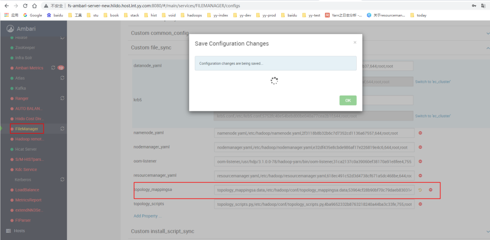
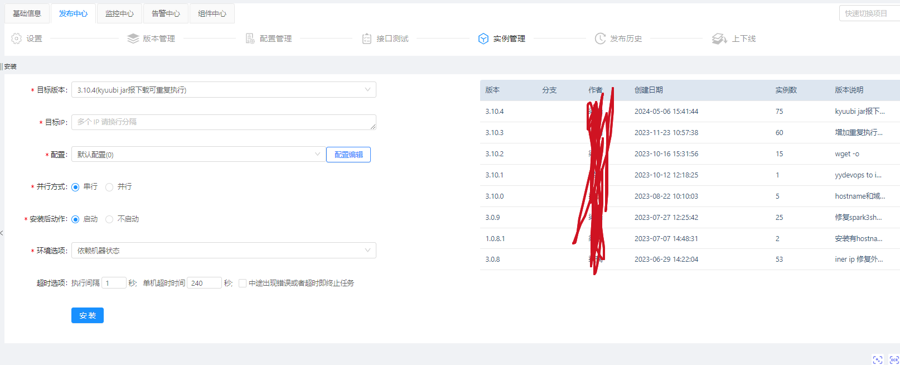
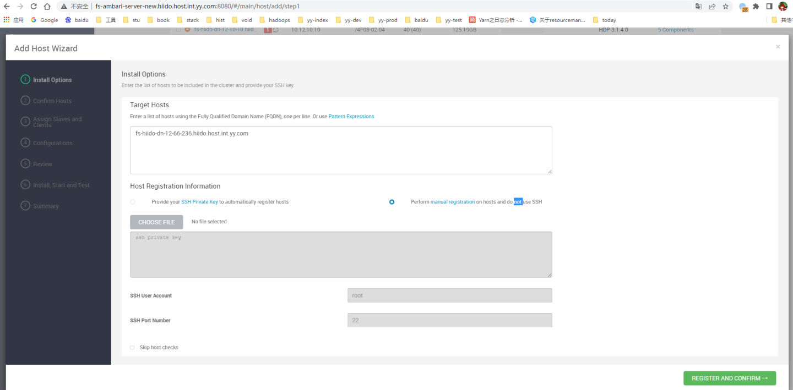
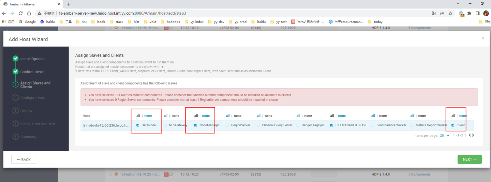
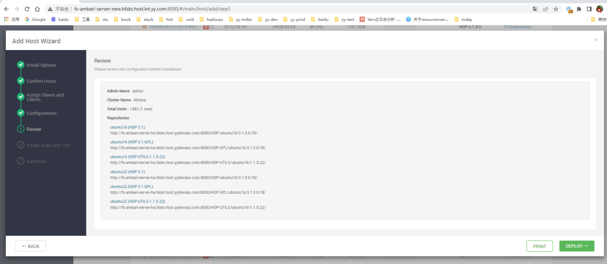
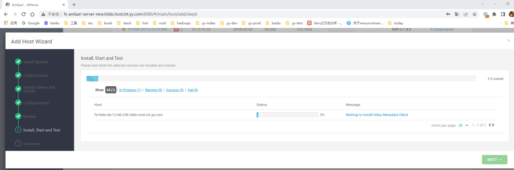
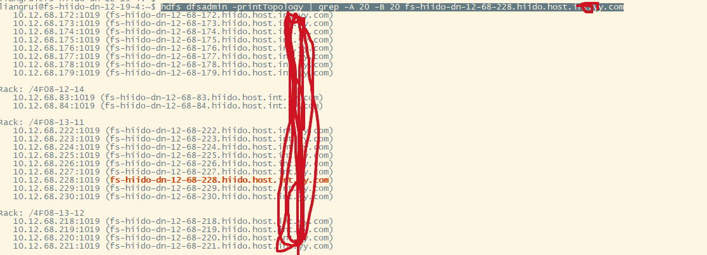
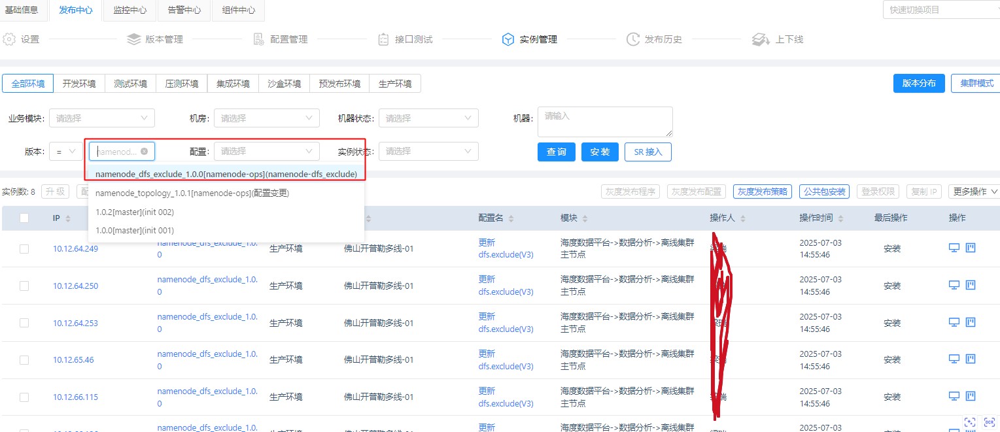

<div class="post-date">
  <span class="calendar-icon">📅</span>
  <span class="date-label">发布：</span>
  <time datetime="2025-11-20" class="date-value">2025-11-20</time>
</div>

<div class="outline" style="background:#f6f8fa;padding:1em 1.5em 1em 1.5em;margin-bottom:2em;border-radius:8px;">
  <strong>大纲：</strong>
  <ul id="outline-list" style="margin:0;padding-left:1.2em;"></ul>
</div>


# hadoop上下线节点操作
因为我们的hadoop集群，实现了ambari上扩展第三台anmendoe服务和扩容第二个ambari服务来进行hdfs namenode联邦到6个集群进行管理，所以在上下线节点上需要特殊操作，以下是具体操作流程。  

## hadoop上线节点操作
ambari文档参考：https://docs.cloudera.com/HDPDocuments/HDP3/HDP-3.1.5/administration/content/add-slave-nodes.html  

### 1:配置机架信息
 1）在fs-ambari-server-.xx.com机器上，目录：/var/www/html/filemanager/file/topology_mappingsa.data 文件中新增机器机架信息
   - 官方文档：https://hadoop.apache.org/docs/r3.1.1/hadoop-project-dist/hadoop-common/RackAwareness.html  
 2）修改ambari中的文件管理 topology文件的md5值，这里主要是提供给NM服务用的  
   **备注：这个是基于ambari插件编写的文件同步服务，每个节点都会装一个，会自动把需要更换的文件替换掉，比如补丁升级后的jars，自定义的配置文件等。**
   
 3）在运维管理服务里，选择namenode_topology_(最高版本)，重启下面的实列就可更新节点上的topology_mappingsa.data文件，验证文件：md5sum /etc/hadoop/conf/topology_mappingsa.data  
   **备注：运维管理服务是自定义的脚本执行管理，如果没有，可以手动进行管理和执行，主要是批量替换文件或批量执行shell命令相关操作。**
 

### 2:服务器初始化hadoop环境
这个服务安装了hadoop需要环境和下载需要的jars到本地 


### 3:刷新NN服务
执行namenode刷新命令
```
     hdfs dfsadmin -fs hdfs://yycluster01 -refreshNodes
     hdfs dfsadmin -fs hdfs://yycluster02 -refreshNodes
     hdfs dfsadmin -fs hdfs://yycluster03 -refreshNodes
     hdfs dfsadmin -fs hdfs://yycluster05 -refreshNodes
```
### 4:在ambari上进行安装相关hadoop服务包
ambari会进行相关hdp服务包的配置下载，点完这个流程后，服务会自动启动 





### 5：检查服务日志是否正常
1:检查服务器上进程和服务日志是否正常运行和输出
2：检查机架信息是否一致
``` hdfs dfsadmin -printTopology | grep -A 20 -B 20 fs-hiido-dn-12-68-228.hiido.host.xx.xx.com ```
 

## hadoop退役节点操作
正常退役节点，ambari操作文档参考：https://docs.cloudera.com/HDPDocuments/HDP3/HDP-3.1.5/administration/content/decommissioning-slave-nodes.html  
**因有两个ambari在管理dn,在主ambar上执行后，并不会退役第二个ambari上的nn服务，需要执行以下命令进行退役。**  
1:在主ambari上执行退役datanode  
2:在运维管理服务上执行dfs.exclude文件变更，版本选择namenode_dfs_exclude_（最高版本）  
  **备注：这个是批量执行在没有ambari上正常操作退役后，扩展出来的nn上的文件没有更新，需要额外的批量执行**
  
  随机上一台nn验证: cat /etc/hadoop/conf/dfs.exclude 
3: 执行刷新
  ```shell
  # 跳板机上执行
  ssh fs-hiido-yycluster01-yynn3.xx.com  "sudo -s su hdfs -c 'hdfs dfsadmin -fs hdfs://fs-hiido-yycluster01-yynn3.xx.com:8020 -refreshNodes'"
ssh fs-hiido-yycluster02-yynn3.xx.com  "sudo -s su hdfs -c 'hdfs dfsadmin -fs hdfs://fs-hiido-yycluster02-yynn3.xx.com:8020 -refreshNodes'"

#或hdfs客户端上执行03 05退役
hdfs dfsadmin -fs hdfs://yycluster03 -refreshNodes
hdfs dfsadmin -fs hdfs://yycluster05 -refreshNodes
  ````
4：过3-5天查看退役状态，在hdfs web页面上看到退役完成后，即可删除datanode。进行隔离下线即可  
5：如果在ambari2上执行退役，会更改nn3-6的dfs.exclude文件，如果再次刷新节点，会重新把之前的dn退役后，没有stop掉的dn重新拉回去。(不能同时两边操作退役dn)


<!--菜单栏-->
  <nav class="blog-nav">
    <button class="collapse-btn" onclick="toggleBlogNav()">☰</button>
    
 </nav>

 <script src="/assets/blog.js"></script>
<link rel="stylesheet" href="/assets/blog.css">