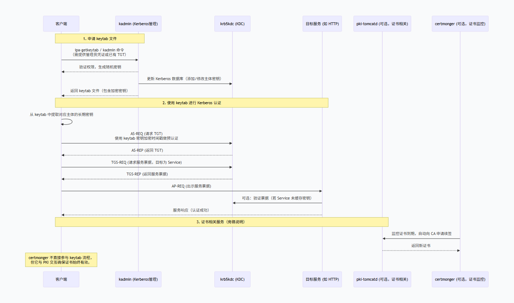

# hadoop集成kerberos认证

## kerberos服务环境架构
FreeIPA 是一个集成的身份管理解决方案，结合了 Linux 原生工具和协议（LDAP、Kerberos、DNS、PKI 等）。下面首先解释 ipactl status 列出的服务以及 certmonger 的作用，然后通过一个流程图展示申请 keytab 文件和利用 keytab 进行 Kerberos 认证的完整流程。  

### 服务角色说明

| 服务名称 | 作用 |
|----------|------|
| Directory Service (389-ds) | 基于 LDAP 的目录服务器，存储所有身份数据（用户、组、主机、策略、sudo 规则等）。 |
| krb5kdc (Kerberos KDC) | Kerberos 密钥分发中心，包含认证服务（AS）和票据授予服务（TGS），负责发放 TGT 和服务票据。 |
| kadmin | Kerberos 管理服务，提供对 Kerberos 数据库的管理接口（如创建主体、生成 keytab、修改密码等）。 |
| ipa_memcached | Memcached 缓存服务，用于缓存会话、配置等数据，提高 IPA 服务器性能。 |
| httpd (Apache) | 提供 FreeIPA 的 Web 界面和 REST API 服务，用户和管理员通过它进行管理操作。 |
| ipa-custodia | 密钥守护进程，用于安全存储和分发敏感数据（如证书私钥、Kerberos keytab 片段），保护 IPA 内部通信。 |
| pki-tomcatd (Dogtag PKI) | 证书颁发机构（CA）服务，运行在 Tomcat 中，负责证书的签发、续期、吊销等全生命周期管理。 |
| ipa-otpd | 一次性密码（OTP）服务，支持双因素认证，与 Kerberos 结合实现 OTP 认证。 |
| certmonger | 证书监控和续签守护进程。它定期检查本地证书的有效期，并在必要时与 CA（如 pki-tomcatd）交互自动续签证书。 |

这些服务共同构成了 FreeIPA 的核心功能：集中身份认证（Kerberos）、身份存储（LDAP）、证书管理（PKI）和管理接口（HTTP）。  

### 申请 keytab 文件及 keytab 认证流程图
下图展示客户端如何向 FreeIPA 申请一个 keytab 文件，随后使用该 keytab 文件向服务进行 Kerberos 认证的完整流程。图中标注了关键步骤涉及的服务。  
  

#### 流程解释：
- **1:申请 keytab**   

客户端通过 ipa-getkeytab 或 kadmin 命令向 kadmin 服务发起请求（通常需要管理员权限或有效的 Kerberos 票据）。  
kadmin 验证权限后，生成新的随机密钥，并更新 Kerberos 数据库（krb5kdc 使用的后端）。  
kadmin 将生成的密钥打包成 keytab 文件返回给客户端。客户端保存该文件供后续认证使用。  
**2:使用 keytab 认证**   

客户端读取 keytab 中对应主体的长期密钥。  
向 KDC（krb5kdc）的认证服务（AS）发送 TGT 请求，并用该密钥加密时间戳作为预认证数据。  
KDC 验证成功后返回 TGT（票据授予票据）。  
客户端使用 TGT 向 KDC 的票据授予服务（TGS）请求访问目标服务（如 HTTP 服务）的服务票据。
KDC 返回服务票据，客户端将其发送给目标服务。  
目标服务验证票据（可能通过本地密钥或再次询问 KDC），确认客户端身份，允许访问。   
**证书管理（certmonger + pki-tomcatd）**       
certmonger 作为独立守护进程，持续监控主机上的证书有效期，当证书即将到期时，自动向 pki-tomcatd (CA) 发起续签请求。   
虽然 certmonger 不参与 keytab 的申请或认证流程，但它是 FreeIPA 中确保证书服务高可用的关键组件，与 PKI 紧密配合。     

### 总结
FreeIPA 的服务分工明确：  
目录服务 存储数据，KDC 负责票据，kadmin 管理 Kerberos 主体，HTTP 提供管理界面，PKI 和 certmonger 管理证书生命周期，ipa-custodia 保护密钥，memcached 加速访问，ipa-otpd 增强认证安全。   
申请 keytab 主要涉及 kadmin 和 KDC，而 keytab 认证则依赖 KDC 的 AS 和 TGS 功能。   
证书相关服务与 keytab 流程正交，但共同构建了完整的身份与访问管理环境。   

## 常用命令

```
pass = xx

# 检查复制状态 nsds5replicaLastUpdateStatus   
ldapsearch -LLL -x -H ldap://localhost:389     -D "cn=Directory Manager" -w $pass     -b "cn=replica,cn=dc\3Dyydevops\2Cdc\3Dcom,cn=mapping tree,cn=config"    "(objectClass=nsds5ReplicationAgreement)" cn nsDS5ReplicaHost nsds5replicaLastUpdateStatus

# 查看topologysegment
ipa topologysegment-find 

#删除复制协议
ipa topologysegment-del

#添加
ipa topologysegment-add --leftnode=fs-hiido-kerberos-server04.hiido.host.yydevops.com --rightnode=fs-hiido-kerveros-test08.hiido.host.yydevops.com

ldapdelete -x -H ldap://localhost -D "cn=Directory Manager" -w $pass   "cn=fs-hiido-kerberos-server04.hiido.host.yydevops.com-to-fs-hiido-kerveros-test08.hiido.host.yydevops.com,cn=replica,cn=dc\3Dyydevops\2Cdc\3Dcom,cn=mapping tree,cn=config"

#验证已删除
ldapsearch -LLL -x -H ldap://localhost -D "cn=Directory Manager" -w $pass   \
-b "cn=replica,cn=dc\3Dyydevops\2Cdc\3Dcom,cn=mapping tree,cn=config" "(cn=fs-hiido-kerberos-server04.hiido.host.yydevops.com-to-fs-hiido-kerveros-test08.hiido.host.yydevops.com)" cn

# ldapmodify 密码或kerberos  
ldapmodify -x -D "cn=Directory Manager" -W -f ref_test08.ldif
ldapmodify -H ldap://localhost:389 -Y GSSAPI -f ref_test08.ldif

#检查映射
ldapsearch -LLL -x -H ldap://localhost -D "cn=Directory Manager" -w $pass  -b "cn=config" "(objectClass=nsSaslMapping)"


```
### 证书相关
```
# 查看证书情况
getcert list | grep -B 10 2026-

#续订证书
getcert resubmit -i 20220901103045

# 停止跟踪坏掉的请求
getcert stop-tracking -i 20220901103045

# 重新提交新的请求
getcert request -d /etc/pki/pki-tomcat/alias     -n "subsystemCert cert-pki-ca"     -c dogtag-ipa-ca-renew-agent     -P 150763924800
getcert request -d /etc/pki/pki-tomcat/alias     -n "Server-Cert cert-pki-ca"     -c dogtag-ipa-ca-renew-agent     -P 150763924800

# 重新生成记录
getcert request -d /etc/pki/pki-tomcat/alias     -n "subsystemCert cert-pki-ca"     -c dogtag-ipa-ca-renew-agent     -p /etc/pki/pki-tomcat/password.conf


# 查询dn
ldapsearch -x -D "cn=Directory Manager" -w $pass -b "cn=39840,ou=ca,ou=requests,o=ipaca" 

#删除dn
ldapdelete -x -D "cn=Directory Manager" -w $pass "cn=39840,ou=ca,ou=requests,o=ipaca"

#证书People相关条目录，需要检查是否有最新的证书
#People 条目 在 Dogtag/FreeIPA 架构里其实很重要，它不是随便的用户目录，而是 PKI 子系统内部用来做认证映射的用户集合。
ldapsearch -LLL -x   -D "cn=Directory Manager" -w $pass   -b "ou=People,o=ipaca" 

# 如果缺失需要 导出新证书
certutil -L -d /etc/pki/pki-tomcat/alias/ -n "subsystemCert cert-pki-ca" -a > /tmp/new-subsystemCert.crt

# 把新证书写入 People 条目
dn: uid=pkidbuser,ou=people,o=ipaca
changetype: modify
add: userCertificate;binary
userCertificate;binary:: MIIDkjCCAnqgAwIxxx...
-
replace: description
description: 2;268304453;CN=Certificate Authority,O=YYDEVOPS.COM;CN=CA Subsystem,O=YYDEVOPS.COM

# 执行
ldapmodify -x -D "cn=Directory Manager" -w ipaadmin4yycluster  -f xx.ldif

#验证
ldapsearch -LLL -x   -D "cn=Directory Manager" -w $pass   -b "uid=pkidbuser,ou=people,o=ipaca" 


```

### 服务重启
```
systemctl status apache2.service

systemctl restart certmonger
systemctl restart pki-tomcatd.service
systemctl restart apache2.service
systemctl restart dirsrv@YYDEVOPS-COM.service
systemctl restart krb5-kdc.service


#可能会执行
sudo -u dirsrv kdestroy 
sudo -u dirsrv kinit -kt /etc/dirsrv/ds.keytab  ldap/`hostname`
sudo -u dirsrv klist 

pki-server subsystem-enable -i pki-tomcat ca
rm -rf /var/run/ipa/renewal.lock

```


<div class="post-date">
  <span class="calendar-icon">📅</span>
  <span class="date-label">发布：</span>
  <time datetime="2025-10-20" class="date-value">2025-10-20</time>
</div>

<div class="outline" style="background:#f6f8fa;padding:1em 1.5em 1em 1.5em;margin-bottom:1em;border-radius:8px;">
  <strong>大纲：</strong>
  <ul id="outline-list" style="margin:0;padding-left:1.2em;"></ul>
</div>

<!--菜单栏-->
  <nav class="blog-nav">
    <button class="collapse-btn" onclick="toggleBlogNav()">☰</button>
    
 </nav>

 <script src="/assets/blog.js"></script>
<link rel="stylesheet" href="/assets/blog.css">