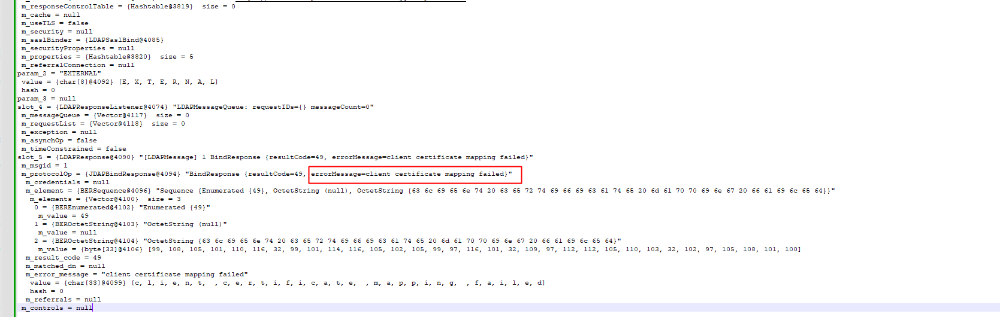
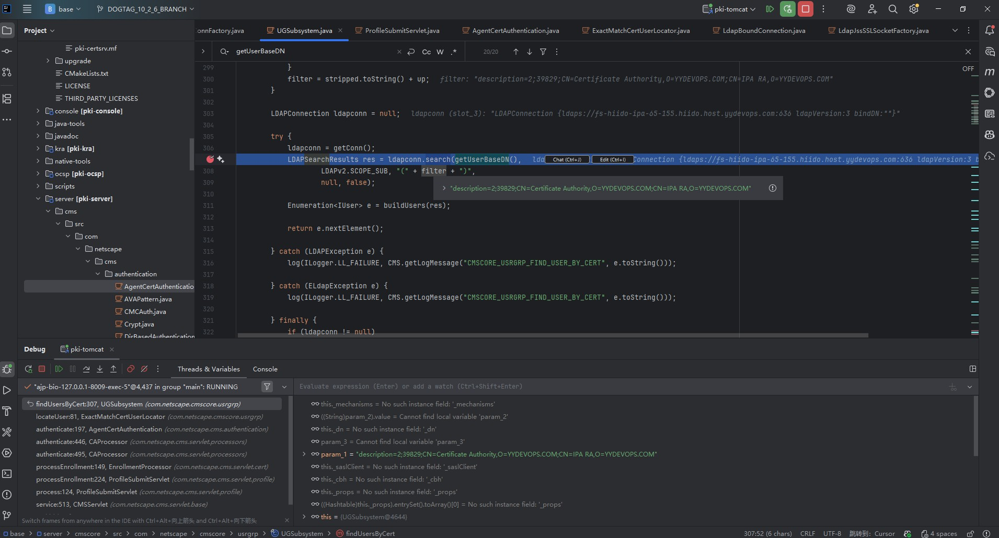
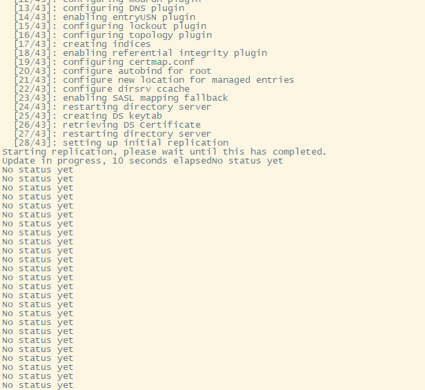
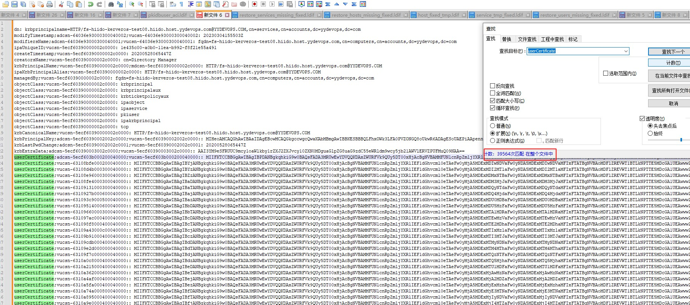
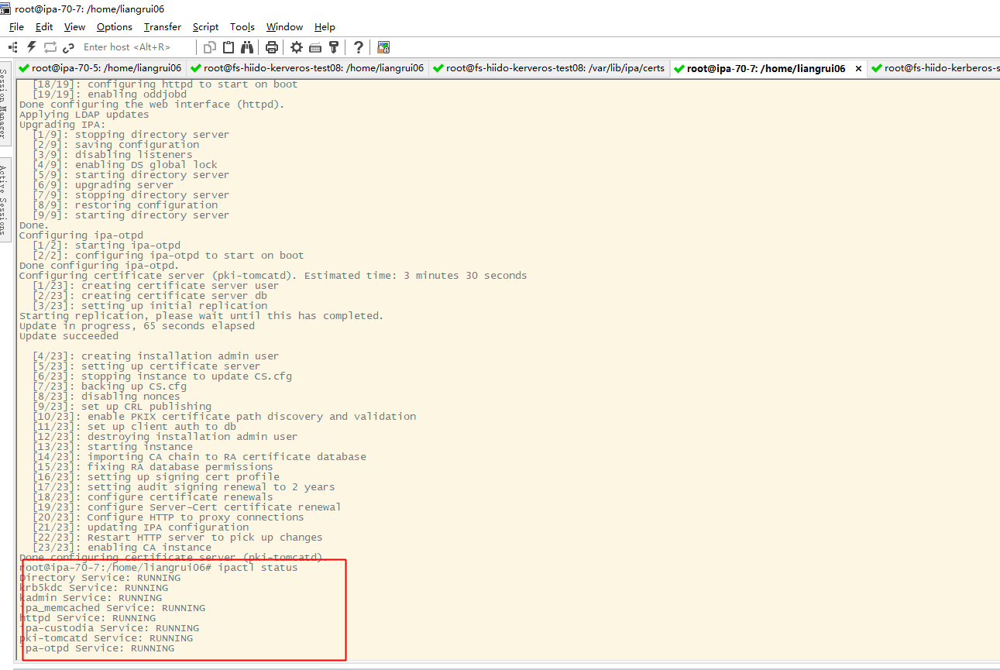

# freeipa cert过期或损坏问题说明  

  在低版本的freeipa中有个反人类的设计，就是证书过期后，的有ipa调用功能都不能执行，显示证书过期，2年会自动更新证书,如果没有及时更新成功，那么系统将是毁灭性的灾难。     
特别是部署在ubuntu系统上，因为freeipa是redHat社区开发维护的，ubuntu系统是移值版本，兼容性很差，高版本已经移除了ubuntu对freeipa的支持。  
  在高版本为了解决这个问题，增加一个ipa-cert-fix功能，就是解决证书过期后自己不能给自己续订证书的问题。 


## 问题触发原因
  我们可以用getcert list查看当前freeipa集群中服务证书情况,默认2年会过期，系统会自动更新证书，如果过期，有些http和slapd的交互就认证失败，不过还好不会影响kdc服务的认证，
 ```bash
 getcert list | egrep 'Request ID|expires'
Request ID '20200528135640':
        expires: unknown
Request ID '20200528135701':
        expires: 2022-05-29 21:57:03 CST
Request ID '20200528135717':
        expires: 2021-08-30 19:23:25 CST
Request ID '20200528135723':
        expires: 2027-02-13 15:47:33 CST
 ```
### ubuntu问题
开启debug  
增加配置 /etc/ipa/default.conf   
debug = True  
tailf /.ipa/log/renew.log  

#### 缺少libnsspem.so
解决： 
```bash
# 拷贝到这里
/usr/lib/x86_64-linux-gnu/libnsspem.so
ldconfig
```
### 缺少/etc/httpd/alias目录
原因是ubuntu是用的apache2作为http的交互，而redhat是用httpd  
解决： 
`ln -s /etc/apache2/nssdb /etc/httpd/alias`  

### 重新续订方案1
调整系统时间，调到证书还没有过期的点上  
```bash
date -s  2024-xx-xx
#重启这个会自动续订
service certmonger restar

# 或者手动续订
getcert resubmit -i 20220xxx

for line in `getcert list | grep Request | cut -d "'" -f2`; do getcert resubmit -i $line; done

```
### 重新续订方案2
手动生成证书  
我们通过getcert list可以查看到所有证书信息，其中有证书位置和名字，通过这些信息，手动完成生成证书->CA签名->导入证书到本地库->导入证书到389ds库  
/etc/pki/pki-tomcat/alias -n "Server-Cert cert-pki-ca" 为例： 

```bash 
# 删除旧证书
certutil -D -d /etc/dirsrv/slapd-YYDEVOPS-COM  -n "Server-Cert" -f /root/nss-pin.txt

# 在 CA 服务器上执行： 
certutil -S -d /etc/dirsrv/slapd-YYDEVOPS-COM \
  -n "Server-Cert" \
  -s "CN=$(hostname -f),O=YYDEVOPS.COM" \
  -c "caSigningCert cert-pki-ca" \
  -t "u,u,u" -k rsa -g 2048 -Z SHA256 \
  -f /root/nss-pin.txt

#  -n "Server-Cert" → 正确的 nickname。
#  -s → 使用主机 FQDN 作为 CN。
#  -c → 用 CA 签名证书签发。
#  -t "u,u,u" → 设置信任属性。
#  -k rsa -g 2048 -Z SHA256 → 生成 RSA 2048 位，SHA256 签名。


# 如果不是CA机，需要把生成的证书copy到CA机器上进行签名
# 副本机器上  
certutil -R -d /etc/dirsrv/slapd-YYDEVOPS-COM   -s "CN=ipa-70-3.hiido.host.int.yy.com,O=YYDEVOPS.COM"   -n "Server-Cert" -g 2048 -f pwdfile.txt -o server-cert.csr


#说明：
# -n 设置证书昵称 (NSS 数据库中的名字)。
# -g 密钥长度。
# -f pwdfile.txt NSS 数据库密码文件。
# -o server-cert.csr 输出 CSR 文件。

# 在 CA 服务器上执行：
certutil -C -d /etc/pki/pki-tomcat/alias \
  -i /home/liangrui06/70_3_csr/server-cert.csr \
  -o /home/liangrui06/70_3_csr/server-cert.crt \
  -c "caSigningCert cert-pki-ca" \
  -f /root/ca_pwdfile.txt

# 这个密码来自 /root/ca_pwdfile.txt -> /etc/pki/pki-tomcat/password.conf

# 验证新证书
openssl x509 -in /home/liangrui06/70_3_csr/server-cert.crt -noout -text
openssl x509 -in /home/liangrui06/70_3_csr/server-cert.crt -inform DER -out server-cert.pem
openssl x509 -in server-cert.pem -noout -text

#导入副本
certutil -A -d /etc/dirsrv/slapd-YYDEVOPS-COM \
  -n "Server-Cert" \
  -t "u,u,u" \
  -i /home/liangrui06/server-cert.crt \
  -f /etc/dirsrv/slapd-YYDEVOPS-COM/pwdfile.txt

# 说明：-n "Server-Cert"：证书昵称，必须和配置里引用的一致。
# -t "u,u,u"：设置信任属性（SSL、S/MIME、对象签名）。
# -i：指定签名后的证书文件。
# -f：副本机 NSS 库的密码文件（通常是 /etc/dirsrv/slapd-YYDEVOPS-COM/pwdfile.txt）。

# 验证新证书
certutil -L -d /etc/dirsrv/slapd-YYDEVOPS-COM -n "Server-Cert"
certutil -K -d /etc/dirsrv/slapd-YYDEVOPS-COM -f /etc/dirsrv/slapd-YYDEVOPS-COM/pwdfile.txt
# 确认新证书存在且有私钥。

# 导出并转 DER
certutil -L -d /etc/dirsrv/slapd-YYDEVOPS-COM  -n "Server-Cert" -a > /root/ds-server-cert.pem
openssl x509 -in /root/ds-server-cert.pem -out /root/ds-server-cert.der -outform DER

#提取公钥
openssl x509 -in /home/liangrui06/server-cert.crt -inform DER -pubkey -noout \
  | openssl rsa -pubin -outform DER 2>/dev/null \
  | base64 -w 64

certutil -L -d /etc/apache2/nssdb  -n ipaCert

# 获取序列号并转十进制
openssl x509 -in /root/ds-server-cert.pem -noout -serial
# 假设输出 serial=C9510BFB
printf "%d\n" 0xC9510BFB
# 输出 3377531899

# 更新 LDAP 条目
# 创建 /root/server-cert.ldif 内容如下

dn: cn=3377531899,ou=certificateRepository,ou=ca,o=ipaca
objectClass: top
objectClass: certificateRecord
cn: 3377531899
serialno: 053377531899
certStatus: VALID
subjectName: CN=fs-hiido-ipa-65-155.hiido.host.xx.com,O=YYDEVOPS.COM
publicKeyData:: MIIBIjANBgkqhkiG9...
notBefore: 20260211084404Z
notAfter: 20260511084404Z
metaInfo: profileId:caIPAserviceCert
userCertificate;binary:< file:/root/ds-server-cert.der 

#serialno 说明，前面会加01 02 03 04 05我们查询所有的ou=certificateRepository,ou=ca,o=ipaca,看当前最大值，就用这个值就可以了

# 导入389ds：
ldapadd -x -D "cn=Directory Manager" -w $pass -f /root/server-cert.ldif


6. 重启服务
bash
systemctl restart dirsrv@xx-COM.service
systemctl restart pki-tomcatd.service
systemctl restart apache2.service
systemctl restart certmonger

#可能会执行
rm -rf /var/run/ipa/renewal.lock  # 删除续订锁
pki-server subsystem-enable -i pki-tomcat ca  # 重启启用subsystem

```
全部执行顺利，有问题的证书更新完后，再使用getcert resubmit -i xxx就能正常续订新的证书了。  

## 更新证书遇到的问题
 导致某些副本无法进行证书更新，新建副本无法认证，主要是pki管理证书，自己或其它服务证书内容错乱。

### 证书内容复制错乱
过期的证书号cn和老的混了，没有及时更新到对应的dn下的description 属性，日志无法定位出问题，http error显示 
```log
[Mon Feb 09 17:46:31.876164 2026] [wsgi:error] [pid 64164:tid 139784563095296] ipa: DEBUG: response status 200
[Mon Feb 09 17:46:31.876256 2026] [wsgi:error] [pid 64164:tid 139784563095296] ipa: DEBUG: response headers {'date': 'Mon, 09 Feb 2026 09:46:30 GMT', 'vary': 'Accept-Encoding', 'content-length': '117', 'content-type': 'application/xml', 'server': 'Apache/2.4.18 (Ubuntu)'}
[Mon Feb 09 17:46:31.876299 2026] [wsgi:error] [pid 64164:tid 139784563095296] ipa: DEBUG: response body '<?xml version="1.0" encoding="UTF-8"?><XMLResponse><Status>1</Status><Error>Invalid Credential.</Error></XMLResponse>'
[Mon Feb 09 17:46:31.876684 2026] [wsgi:error] [pid 64164:tid 139784563095296] ipa: DEBUG: parse_profile_submit_result_xml() xml_text:
[Mon Feb 09 17:46:31.876694 2026] [wsgi:error] [pid 64164:tid 139784563095296] <?xml version="1.0" encoding="UTF-8"?><XMLResponse><Status>1</Status><Error>Invalid Credential.</Error></XMLResponse>
[Mon Feb 09 17:46:31.876697 2026] [wsgi:error] [pid 64164:tid 139784563095296] parse_result:
[Mon Feb 09 17:46:31.876700 2026] [wsgi:error] [pid 64164:tid 139784563095296] {'error_code': 1, 'error_string': u'Invalid Credential.'}
[Mon Feb 09 17:46:31.876790 2026] [wsgi:error] [pid 64164:tid 139784563095296] ipa: ERROR: ipaserver.plugins.dogtag.ra.request_certificate(): FAILURE (Invalid Credential.)
[Mon Feb 09 17:46:31.878984 2026] [wsgi:error] [pid 64164:tid 139784563095296] ipa: DEBUG: WSGI wsgi_execute PublicError: Traceback (most recent call last):
[Mon Feb 09 17:46:31.878996 2026] [wsgi:error] [pid 64164:tid 139784563095296]   File "/usr/lib/python2.7/dist-packages/ipaserver/rpcserver.py", line 350, in wsgi_execute
[Mon Feb 09 17:46:31.878999 2026] [wsgi:error] [pid 64164:tid 139784563095296]     result = self.Command[name](*args, **options)
[Mon Feb 09 17:46:31.879003 2026] [wsgi:error] [pid 64164:tid 139784563095296]   File "/usr/lib/python2.7/dist-packages/ipalib/frontend.py", line 446, in __call__
[Mon Feb 09 17:46:31.879007 2026] [wsgi:error] [pid 64164:tid 139784563095296]     ret = self.run(*args, **options)
[Mon Feb 09 17:46:31.879010 2026] [wsgi:error] [pid 64164:tid 139784563095296]   File "/usr/lib/python2.7/dist-packages/ipalib/frontend.py", line 763, in run
[Mon Feb 09 17:46:31.879014 2026] [wsgi:error] [pid 64164:tid 139784563095296]     return self.execute(*args, **options)
[Mon Feb 09 17:46:31.879030 2026] [wsgi:error] [pid 64164:tid 139784563095296]   File "/usr/lib/python2.7/dist-packages/ipalib/plugins/cert.py", line 501, in execute
[Mon Feb 09 17:46:31.879033 2026] [wsgi:error] [pid 64164:tid 139784563095296]     csr, profile_id, request_type=request_type)
[Mon Feb 09 17:46:31.879036 2026] [wsgi:error] [pid 64164:tid 139784563095296]   File "/usr/lib/python2.7/dist-packages/ipaserver/plugins/dogtag.py", line 1600, in request_certificate
[Mon Feb 09 17:46:31.879040 2026] [wsgi:error] [pid 64164:tid 139784563095296]     parse_result.get('error_string'))
[Mon Feb 09 17:46:31.879043 2026] [wsgi:error] [pid 64164:tid 139784563095296]   File "/usr/lib/python2.7/dist-packages/ipaserver/plugins/dogtag.py", line 1331, in raise_certificate_operation_error
[Mon Feb 09 17:46:31.879047 2026] [wsgi:error] [pid 64164:tid 139784563095296]     raise errors.CertificateOperationError(error=err_msg)
[Mon Feb 09 17:46:31.879051 2026] [wsgi:error] [pid 64164:tid 139784563095296] CertificateOperationError: Certificate operation cannot be completed: FAILURE (Invalid Credential.)
[Mon Feb 09 17:46:31.879055 2026] [wsgi:error] [pid 64164:tid 139784563095296] 
[Mon Feb 09 17:46:31.879251 2026] [wsgi:error] [pid 64164:tid 139784563095296] ipa: INFO: [xmlserver] host/ipa-70-7.hiido.host.int.yy.com@YYDEVOPS.COM: cert_request(u'MIIDfzCCAmcCAQAwKTEnMCUGA1UEAxMeaXBhLTcwLTcuaGlpZG8uaG9zdC5pbnQueXkuY29tMIIBIjANBgkqhkiG9w0BAQEFAAOCAQ8AMIIBCgKCAQEA2Z6tk1F8b+/WR9p40R4sLgmGeVsttGe3QwtGLchH...Q=', principal=u'ldap/ipa-70-7.hiido.host.int.yy.com@YYDEVOPS.COM', add=True, version=u'2.51'): CertificateOperationError
[Mon Feb 09 17:46:31.879305 2026] [wsgi:error] [pid 64164:tid 139784563095296] ipa: DEBUG: response: CertificateOperationError: Certificate operation cannot be completed: FAILURE (Invalid Credential.)
[Mon Feb 09 17:46:31.879614 2026] [wsgi:error] [pid 64164:tid 139784563095296] ipa: DEBUG: no session id in request, generating empty session data with id=d627693e47fa2e8e3f8b2c14cd0513b8

```
解决：把pki源码下载下来，远程调试才确定问题
resultCode=49, errorMessage=client certificate mapping failed
这种异常是证书映射异常，但在http只能看到Invalid Credential,一头懵逼。

certificate mapping failed是指http拿到了证书去访问389ds服务，但找不到具体的映射用户，经对比发现，证书内容不一样，错乱了，手动修复389ds中存储的证书内容即可。  
然后又继续抛出了Invalid Credential,再继续调试。发现search user return null，用的是description来查询用户的，具体信息如下：证书cn号不一致问题    
老证书的cn号92：description=2;96;CN=Certificate Authority,O=YYDEVOPS.COM;CN=IPA RA,O=YYDEVOPS.COM    
新证书应该是39829：description=2;39829;CN=Certificate Authority,O=YYDEVOPS.COM;CN=IPA RA,O=YYDEVOPS.COM   

相关代码如下：

```bash
certificates[0].getSubjectDN().toString()
CN=IPA RA,O=YYDEVOPS.COM

certificates[0].getIssuerDN().toString()
CN=Certificate Authority,O=YYDEVOPS.COM

cert.getSerialNumber().toString()
39829
# 调试代码的值是
description=2;39829;CN=Certificate Authority,O=YYDEVOPS.COM;CN=IPA RA,O=YYDEVOPS.COM

    public String getCertificateString(X509Certificate cert) {
        if (cert == null) {
            return null;
        }

        // note that it did not represent a certificate fully
        return cert.getVersion() + ";" + cert.getSerialNumber().toString() +
                ";" + cert.getIssuerDN() + ";" + cert.getSubjectDN();
    }
        String filter = "description=" +
                mUG.getCertificateString(certificates[pos]);
        return mUG.findUsersByCert(filter);

# ldap验证
ldapsearch -LLL -x   -D "cn=Directory Manager" -w xx   -b "ou=People,o=ipaca"   "(description=2;39829;CN=Certificate Authority,O=YYDEVOPS.COM;CN=IPA RA,O=YYDEVOPS.COM)"
```
手动修复这个老cn号所有请求成功了  

## 无法复制问题
### maximum allowed limit
在新装节点的时候，卡在复制数据上，日志显示 maximum allowed limit 某些条目太大，超出限时  
  
日志显示   
```log
[12/Feb/2026:15:18:43 +0800] - SASL encrypted packet length exceeds maximum allowed limit (length=16777279, limit=2097152).  Change the nsslapd-maxsasliosize attribute in cn=config to increase limit.
[12/Feb/2026:15:18:43 +0800] - ERROR bulk import abandoned
[12/Feb/2026:15:18:44 +0800] - import userRoot: Thread monitoring returned: -23
[12/Feb/2026:15:18:44 +0800] - import userRoot: Aborting all Import threads...
[12/Feb/2026:15:18:52 +0800] - import userRoot: Import threads aborted.
[12/Feb/2026:15:18:52 +0800] - import userRoot: Closing files...
[12/Feb/2026:15:18:52 +0800] - libdb: BDB3028 userRoot/mail.db: unable to flush: No such file or directory
```
偿试在安装的时候改变这个限制
```bash 
新增文件 /root/maxsasliosize.ldif
dn: cn=config
changetype: modify
replace: nsslapd-maxsasliosize
nsslapd-maxsasliosize: 33554432
-
replace: nsslapd-sasl-max-buffer-size
nsslapd-sasl-max-buffer-size: 20971520

# 安装时指定配置
ipa-replica-install  --dirsrv-config-file=/root/maxsasliosize.ldif --skip-conncheck 
```
还是没能解决，原因是一个超级多的证书问题,HTTP/xx下挂了39564个证书，应该是服务一直在偿试生成证书  

解决：只留一个最新证书
```bash
#新增文件 modify_http_08.ldif
dn: krbprincipalname=HTTP/fs-hiido-kerveros-test08.hiido.host.xx.com@YYDEVOPS.COM,cn=services,cn=accounts,dc=yydevops,dc=com
changetype: modify
replace: userCertificate
userCertificate:: MIIFKzCC...

ldapmodify -x -D "cn=Directory Manager" -w ipaadmin4yycluster -f modify_http_08.ldif

#日志异常输出
[13/Feb/2026:10:49:36 +0800] - database index operation failed BAD 1040, err=12 Cannot allocate memory
[13/Feb/2026:10:49:36 +0800] - index_add_mods failed, err=12 Cannot allocate memory

stop-dirsrv

修改/etc/dirsrv/slapd-YYDEVOPS-COM/dse.ldif 里的 nsslapd-db-locks配置，默认10000
grep nsslapd-db-locks /etc/dirsrv/slapd-YYDEVOPS-COM/dse.ldif
nsslapd-db-locks: 200000

start-dirsrv 

# 再次执行成功
ldapmodify -x -D "cn=Directory Manager" -w ipaadmin4yycluster -f modify_http_08.ldif

# 然后发现有很多ou=requests,o=ipaca数据，也是超级大，这些是审计日志，可以清理掉
ldapsearch -x -D "cn=Directory Manager" -W -b "ou=requests,o=ipaca" "(requestState=complete)" dn | grep "^dn:" > completed_requests.ldif
ldapmodify -x -D "cn=Directory Manager" -w ipaadmin4yycluster -f  completed_requests.ldif

```

### 再次执行安装
做完以上后，所有安装成功，证书也全部更新成功
```bash
ipa-client-install --domain=hiido.host.xx.com --realm=xx.COM --server=fs-hiido-ipa-65-155.hiido.host.xx.com  --force-join
ipa-replica-install  --skip-conncheck 
ipa-replica-install --setup-ca  --skip-conncheck
```


```bash
root@ipa-70-7:/home/liangrui06# getcert list | egrep "Request ID|status|expires|key pair storage" 
Request ID '20260213072418':
        status: MONITORING
        key pair storage: type=NSSDB,location='/etc/dirsrv/slapd-YYDEVOPS-COM',nickname='Server-Cert',token='NSS Certificate DB',pinfile='/etc/dirsrv/slapd-YYDEVOPS-COM//pwdfile.txt'
        expires: 2028-02-14 07:24:20 UTC
Request ID '20260213072451':
        status: MONITORING
        key pair storage: type=NSSDB,location='/etc/apache2/nssdb',nickname='Server-Cert',token='NSS Certificate DB',pinfile='/etc/apache2/nssdb/pwdfile.txt'
        expires: 2028-02-14 07:24:51 UTC
Request ID '20260213072458':
        status: MONITORING
        key pair storage: type=NSSDB,location='/etc/apache2/nssdb',nickname='ipaCert',token='NSS Certificate DB',pinfile='/etc/apache2/nssdb/pwdfile.txt'
        expires: 2027-05-25 07:43:19 UTC
Request ID '20260213073208':
        status: MONITORING
        key pair storage: type=NSSDB,location='/etc/pki/pki-tomcat/alias',nickname='auditSigningCert cert-pki-ca',token='NSS Certificate DB',pin set
        expires: 2026-05-06 13:43:44 UTC
Request ID '20260213073209':
        status: MONITORING
        key pair storage: type=NSSDB,location='/etc/pki/pki-tomcat/alias',nickname='ocspSigningCert cert-pki-ca',token='NSS Certificate DB',pin set
        expires: 2027-05-25 07:44:01 UTC
Request ID '20260213073210':
        status: MONITORING
        key pair storage: type=NSSDB,location='/etc/pki/pki-tomcat/alias',nickname='subsystemCert cert-pki-ca',token='NSS Certificate DB',pin set
        expires: 2026-05-10 03:29:18 UTC
Request ID '20260213073211':
        status: MONITORING
        key pair storage: type=NSSDB,location='/etc/pki/pki-tomcat/alias',nickname='caSigningCert cert-pki-ca',token='NSS Certificate DB',pin set
        expires: 2039-09-10 11:23:06 UTC
Request ID '20260213073212':
        status: MONITORING
        key pair storage: type=NSSDB,location='/etc/pki/pki-tomcat/alias',nickname='Server-Cert cert-pki-ca',token='NSS Certificate DB',pin set
        expires: 2028-02-03 07:31:51 UTC
```

<div class="post-date">
  <span class="calendar-icon">📅</span>
  <span class="date-label">发布：</span>
  <time datetime="2026-02-13" class="date-value">2026-02-13</time>
</div>

<div class="outline" style="background:#f6f8fa;padding:1em 1.5em 1em 1.5em;margin-bottom:1em;border-radius:8px;">
  <strong>大纲：</strong>
  <ul id="outline-list" style="margin:0;padding-left:1.2em;"></ul>
</div>

<!--菜单栏-->
  <nav class="blog-nav">
    <button class="collapse-btn" onclick="toggleBlogNav()">☰</button>
    
 </nav>

 <script src="/assets/blog.js"></script>
<link rel="stylesheet" href="/assets/blog.css">