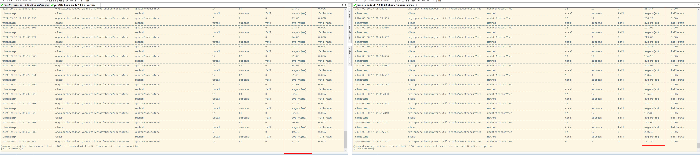
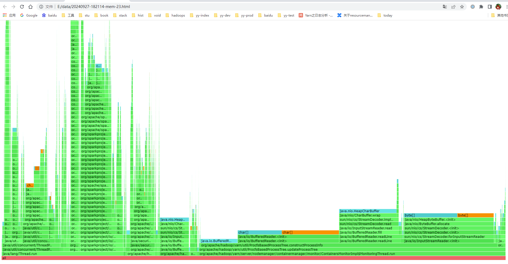
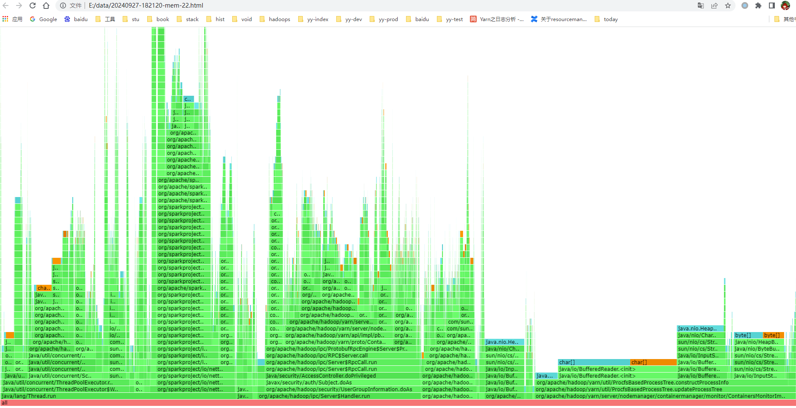
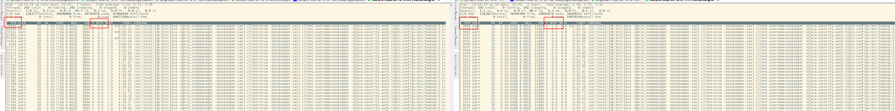
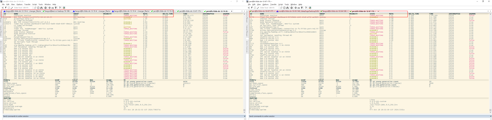
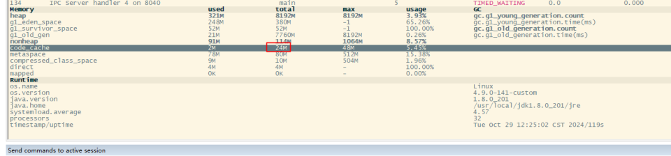
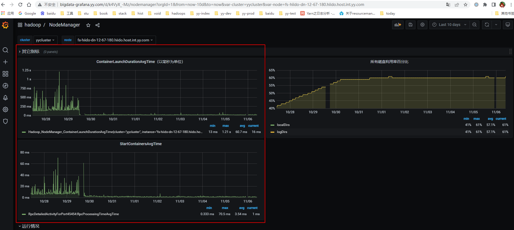

# jdk8存在codeCache bug，这里介绍调试优化过程，和优化后的指标提升

<div class="outline" style="background:#f6f8fa;padding:1em 1.5em 1em 1.5em;margin-bottom:2em;border-radius:8px;">
  <strong>大纲：</strong>
  <ul id="outline-list" style="margin:0;padding-left:1.2em;"></ul>
</div>

## 问题描述
nm服务启动大约在7-8天后，ContainerLaunchDurationAvgTime持续变长，进程启动6天左右后，这个指标明显会上涨。  
刚启动时约在20毫秒，7天后是在200毫秒左右，有10倍的延迟
 

## 解决方案
###  jvm 相关调试监控
- 这个方法RT时长确实和监控上一致，相差10倍的时长
```
monitor -c 5 org.apache.hadoop.yarn.util.ProcfsBasedProcessTree updateProcessTree
```


- xx服务器，刚启动后的火焰图（堆内存调用）

- 跑了7天后的火焰图（堆内存调用）,


- vs cpu 对比



- 这里省略一系列常规jvm调试监控
...  

## 问题总结
###  以上观察和调试总结：
虽然有几个耗时较长的方法可疑，但观察到所有stack方法都会变慢，评估是受到一致的影响所致。
观察很多服务code cache变化差异很大，不固定，排除法，先把能固定下来的空间给固定下来。
https://bugs.java.com/bugdatabase/view_bug.do?bug_id=8006952
结合jdk8 codecace bug描述，和这个表现很像
以下是调整参数前后的对比
```
-XX:CICompilerCount=4 -XX:InitialCodeCacheSize=24M -XX:ReservedCodeCacheSize=48M -XX:-UseCodeCacheFlushing -XX:+PrintCodeCache
```

### 7天后，container  launch和start 指标正常，并没有彪高。



<script src="/assets/blog.js"></script>
<link rel="stylesheet" href="/assets/blog.css">


<nav class="blog-nav">
  <button class="collapse-btn" onclick="toggleBlogNav()">☰</button>
  
</nav>