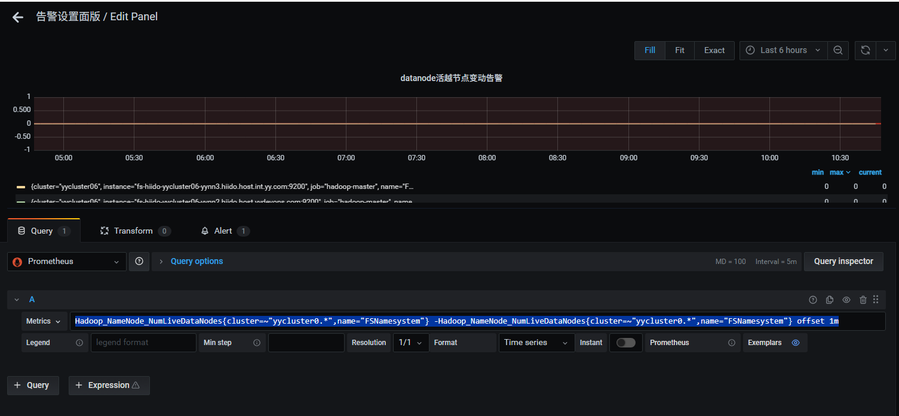
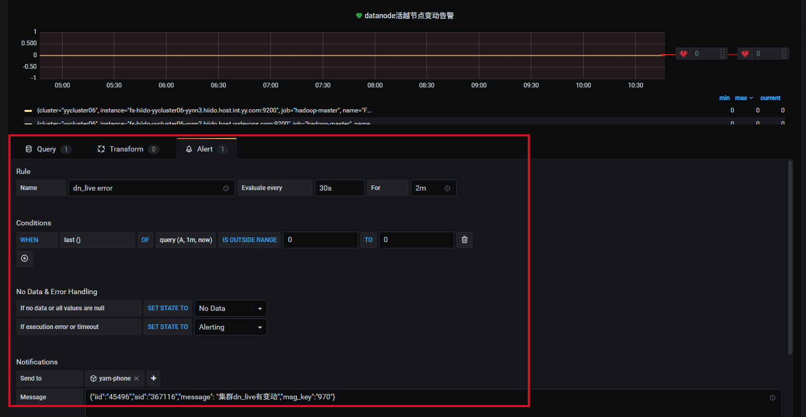
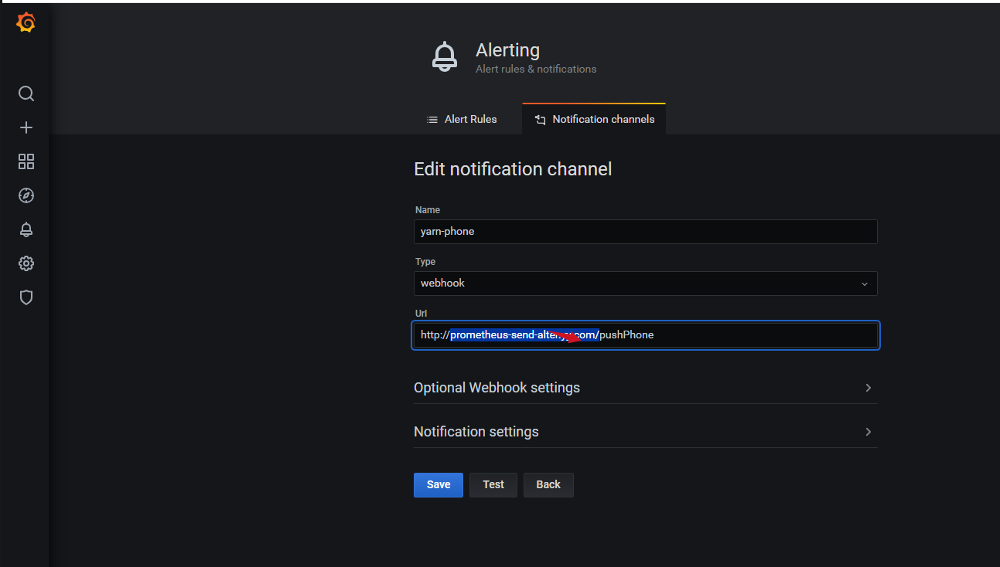

# 统一告警服务
指标告警在大数据平台运维是很重要的，告警分多种类  
1）服务内部指标，通过jmx暴露出来，再用prometheus去采集，在grafana中展示，grafana中有告警配置，根据指标做各种配置告警。  
2）shell脚本，监控进程和服务端口  

## grafana告警
### grafana告警配置
例：统计datandoe变动告警：  

```sql
-- psql:
Hadoop_NameNode_NumLiveDataNodes{cluster=~"yycluster0.*",name="FSNamesystem"} -Hadoop_NameNode_NumLiveDataNodes{cluster=~"yycluster0.*",name="FSNamesystem"} offset 1m
```


告警配置如下： 

通过webhook把消息发送到后端接口：  


然后后端接口接收到消息，再解析进行发送到打电话或发邮件或钉钉，如流等。下面是一个通用消息解析，打电话的参考，可根据情况自己实现。   

<details class="code-collapse">
<summary>显示/隐藏：告警解析示例（Python，默认收起，点击展示开）</summary>

#!/usr/bin/env python
# coding=utf-8
# encoding=utf8
# -*-coding:utf-8-*-

from flask import Flask, jsonify, request, json
import requests

import sys

app = Flask(__name__)


@app.route('/')
def hello_world():
    return 'Hello, World!'


@app.route('/pushPhone', methods=['GET', 'POST'])
def pushPhone():
    data = request.get_data()
    parm_data = json.loads(data)
    print type(parm_data)

    print parm_data
    message_context = parm_data['message']
    # print type(message_context)
    # print message_context
    # message_context = json.loads(eval(json.dumps(message_context, ensure_ascii=False).encode('utf-8')))
    message_context = json.loads(eval(json.dumps(message_context)))
    print type(message_context)
    print(message_context)
    # parm_message_context = json.loads(message_context)
    message = message_context['message']
    i_id = message_context["iid"]
    sid = message_context['sid']
    msgCustom = ""
    if 'msgCustom' in message_context:
        msgCustom = message_context['msgCustom']
    op_admin_dw = "dw_liangrui"
    if 'op_admin_dw' in message_context:
        op_admin_dw = message_context['op_admin_dw']
    msg_key = message_context['msg_key']
    # 告警值
    if op_admin_dw in (None, ""):
        op_admin_dw = "dw_liangrui"

    evalMatchesStr = ""
    # print(parm_data)
    if 'evalMatches' in parm_data:
        evalMatches = parm_data['evalMatches']
        for eva in evalMatches:
            if msgCustom is None or msgCustom == "":
                evalMatchesStr = evalMatchesStr + (eva['metric'] + ":" + str(round(eva['value'], 2))) + "%"
            else:
                # tags.deployment_name
                # metric.ods-turnover-order-id-mapping
                if "." in msgCustom:
                    msgCustomArray = msgCustom.split(".")
                    tagsOrMetric = msgCustomArray[0]
                    metricMsgCustomKey = msgCustomArray[1]
                    if tagsOrMetric == "tags":
                        tags = eva['tags']
                        tagsKeys = metricMsgCustomKey.split(",")
                        for tag in tagsKeys:
                            sendMsg = tags[tag]
                            evalMatchesStr = evalMatchesStr + (tag + ":" + sendMsg+"_")
                        # sendMsg = tags[metricMsgCustomKey]
                        # evalMatchesStr = evalMatchesStr + (metricMsgCustomKey + ":" + sendMsg) + "%"
                    elif tagsOrMetric == "metric":
                        metric = eva['metric']
                        keyArray = metricMsgCustomKey.split(",")
                        for key in keyArray:
                            if key == metric:
                                evalMatchesStr = evalMatchesStr + (metric + ":" + str(round(eva['value'], 2))+"_")
                else:
                    print("metric not:" + msgCustom)
    print "evalMatchesStr=" + evalMatchesStr
    import os
    reload(sys)
    sys.setdefaultencoding('utf-8')
    if sid is not None and sid != '':
        # get app
        parm_str = "id=%s&sid=%s&msg=%s&msg_key=%s" % (
            i_id, sid, message + "-" + evalMatchesStr.replace("=", "-"), msg_key)
        print "parm_str=%s" % parm_str.encode('utf-8')
        # 这里是服务器上的打电话告警脚本，每个公司的接入都不一样，需要自己去实现打电话的逻辑即可
        sys_str = (
                'python /home/dspeak/yyms/yymp/yymp_report_script/yymp_report_alarm.py '
                '"op_admin_dw=%s&%s"' % (op_admin_dw, parm_str.encode('utf-8')))
    else:
        print 'other===='
        sys_str = (
            'python /home/dspeak/yyms/yymp/yymp_report_script/yymp_report_alarm.py "id=45496&sid=358762&op_admin_dw=dw_liangrui&msg_key=dw236&msg=YARN调度异常"')
    print "python====%s" % sys_str
    p = os.system(sys_str)
    import time
    print(time.strftime("%Y-%m-%d %H:%M:%S", time.localtime()))
    print("retrun=========" + str(p))
    return "ok"

if __name__ == '__main__':
    app.run(host="0.0.0.0", port=9863)

</details>
-------------------------------------------------------------------------------------------------------------------------------------
## shell脚本告警
shell脚本告警，是写个定时任务，检查端口或主从切换或进程的告警  
### hdfs HA切换示例
比如hdfs发生主从切换，需要告警出来，可以立马去看日志，排查为什么要切换       
check_nn_state.sh 脚本代码如下：  

#!/bin/bash
active=""
c_time=`date +'%F %T'` 
active_nn=`hdfs haadmin -ns yycluster06 -getAllServiceState | grep active | awk -F ':' '{print $1}'`
# 这个是记录上一次的主节点 
old_state=`cat /data/hdfs/check_state/active_nn.state`
# yymp_report_alarm.py 是每个服务器自带的打电话逻辑，每个公司不一样，需要自己实现即可
if [[ $old_state != $active_nn ]];then
  python /home/dspeak/yyms/yymp/yymp_report_script/yymp_report_alarm.py "op_admin_dw=xx&id=111&sid=111&msg=nn_active_transform_Current_$active_nn&msg_key=778"
  echo "$c_time" nn_active_transform_Current_"$active_nn" >> /data/hdfs/check_state/nn_state.log
fi
c_hour=$(echo $c_time | awk -F ' ' '{print $2}' | awk -F ':' '{print $1}')
if [[ $c_hour == 10 ]];then
  echo "$c_time" active "$active_nn" > /data/hdfs/check_state/nn_state.log
else
  echo "$c_time" active "$active_nn" >> /data/hdfs/check_state/nn_state.log
fi
#check_current_rm_wirte state
echo $active_nn > /data/hdfs/check_state/active_nn.state


然后在corntab里增加每1分钟执行一次即可，共它的检查也可以按这个逻辑去改写  
```*/1 * * * *   hdfs /data/hdfs/check_state/check_nn_state.sh  >/dev/null 2>&1 ``` 


<div class="post-date">
  <span class="calendar-icon">📅</span>
  <span class="date-label">发布：</span>
  <time datetime="2025-10-20" class="date-value">2025-10-20</time>
</div>

<div class="outline" style="background:#f6f8fa;padding:1em 1.5em 1em 1.5em;margin-bottom:1em;border-radius:8px;">
  <strong>大纲：</strong>
  <ul id="outline-list" style="margin:0;padding-left:1.2em;"></ul>
</div>

<!--菜单栏-->
  <nav class="blog-nav">
    <button class="collapse-btn" onclick="toggleBlogNav()">☰</button>
    
 </nav>

 <script src="/assets/blog.js"></script>
<link rel="stylesheet" href="/assets/blog.css">