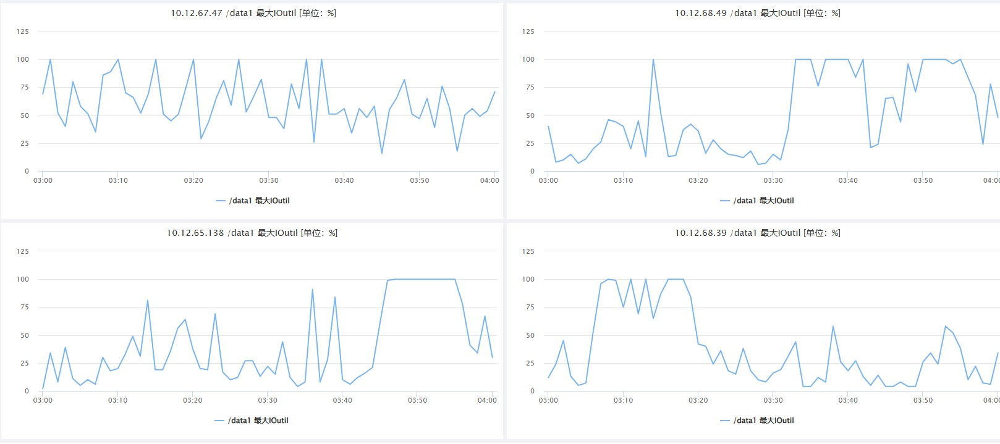
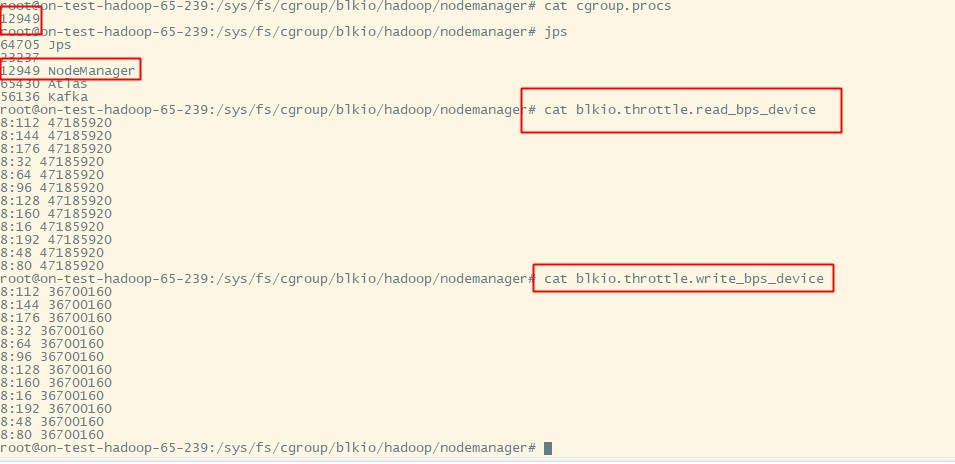
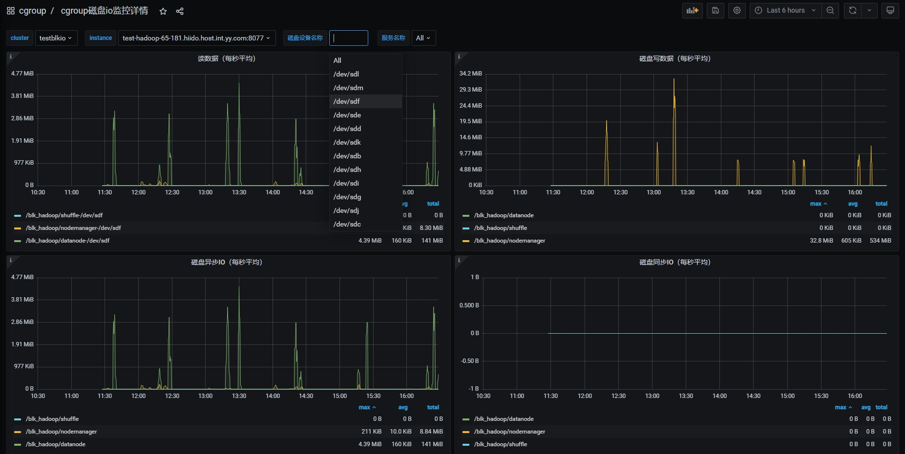
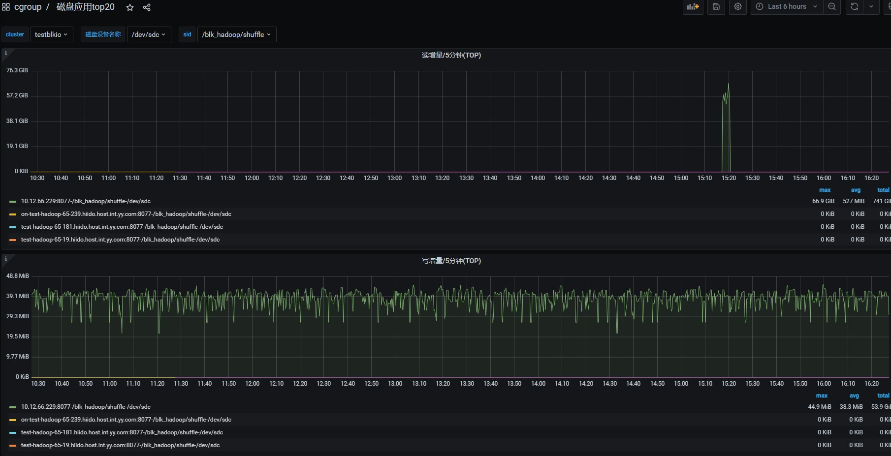

<div class="post-date">
  <span class="calendar-icon">📅</span>
  <span class="date-label">发布：</span>
  <time datetime="2025-10-20" class="date-value">2025-10-20</time>
</div>

<div class="outline" style="background:#f6f8fa;padding:1em 1.5em 1em 1.5em;margin-bottom:2em;border-radius:8px;">
  <strong>大纲：</strong>
  <ul id="outline-list" style="margin:0;padding-left:1.2em;"></ul>
</div>

# 磁盘io隔离&监控

## 需求背景
  目前我们hadoop集群是混部署方式，一台服务器上有dn,nm,shuffle服务，经常在作业高峰期的时候，出现集群服务器磁盘io使用100%的情况，  
但又没有日志可以追踪到是那个服务引起的，或那个作业引起的。这样就会导致这台物理机上的所有服务有读写100% io磁盘的数据时，都会卡顿，互相影响。  
  所以我们需要启用cgroup来隔离使用磁盘io的限制，并采集到磁盘使用数据，来对服务进行优化。
  - 例：磁盘io 100%后，无法知道是什么服务干的，没有优化的入口。
  

## cgroup blkio 文档参考
### kernel内核文档
https://docs.kernel.org/admin-guide/cgroup-v1/index.html
### alibaba cgroup参数参考
https://www.alibabacloud.com/help/zh/alinux/support/differences-between-cgroup-v1-and-cgroup-v2
### NM中启用cgroups
https://github.com/apache/hadoop/blob/trunk/hadoop-yarn-project/hadoop-yarn/hadoop-yarn-api/src/main/java/org/apache/hadoop/yarn/conf/YarnConfiguration.java#L1798
- 目前此配置是私有不稳定的
- 此设置用于控制磁盘操作的资源处理是否启用。
- 正在开发中：此配置参数未来可能会被修改/删除。


## 实现方案
### 确定服务器磁盘信息
```
lsblk -o NAME,MAJ:MIN,SIZE,TYPE,MOUNTPOINT  | grep disk | grep -v 8:0
sdf      8:80    3.7T disk 
sdd      8:48    3.7T disk 
sdm      8:192   3.7T disk 
sdb      8:16    3.7T disk 
sdk      8:160   3.7T disk 
sdi      8:128   3.7T disk 
sdg      8:96    3.7T disk 
sde      8:64    3.7T disk 
sdc      8:32    3.7T disk 
sdl      8:176   3.7T disk 
sdj      8:144   3.7T disk 
sdh      8:112   3.7T disk
```
### 配置cgroup blkio
#### 权重
- weight权重只在IO资源争用时起作用：当磁盘空闲时，任何进程都可以使用100%的IO,只有当多个进程同时请求IO时，权重才决定分配比例
-  blkio.weight 目前允许的权重范围是 1 到 1000，仅靠权重(blkio.weight)无法限制单个服务占满磁盘的情况
#### 读写bps_device
blkio.throttle.read_bps_device 此参数用于设定设备执行“写”操作次数的上限。“写”的操作率用“字节/秒”来表示。条目有三个字段：major、minor 和 bytes_per_second。major 和 minor 是〈Linux 分配的设备〉指定的设备类型和节点数。bytes_per_second 是“写”操作可被执行的上限率。例如，让 /dev/sda 设备执行“写”操作的最大比率为 10 MBps，请运行：
首先，测试磁盘的最大IO性能（使用fio或dd等工具）。    
blkio.throttle.write_bps_device 写操作，和读结束一致。  
#### 确定磁盘最大性能
-- 首先，测试磁盘的最大IO性能（使用fio或dd等工具）。  
```shell
fio --name=test --filename=/data1/test.file --size=1G --readwrite=readwrite --bs=1M --direct=1 --rw=randrw --ioengine=libaio --iodepth=64 --numjobs=1 --runtime=60 --time_based --group_reporting
```

cgroup基于bw值的限制  ：
-- bw (Bandwidth) - 带宽  
-- io (I/O) - 输入/输出总量  
-- 计算公式  
bw = io / run_time  
67.2 MiB/s = 4065 MiB / 60.529 s  
4065 ÷ 60.529 ≈ 67.2 ✓  

#### 配置
有了上面的介绍和相关数据，就可以根据情况进行配置  

```shell
echo "8:0 10485760" > /cgroup/blkio/test/blkio.throttle.write_bps_device
```

**配置效果**  


**完整的自动配置脚本参考：**  
安装配置：https://github.com/liangrui198/groups-blkio/blob/main/hadoop_cg_blkio_init.sh  
移除：https://github.com/liangrui198/groups-blkio/blob/main/remove_cg.sh  
自动识别服务&加入cgroup: https://github.com/liangrui198/groups-blkio/blob/main/set_pid_blkio_cg.sh  
部署&监控指标采集： https://github.com/liangrui198/groups-blkio/blob/main/deploy.sh 


## 效果展示
### 主要采集到的blkio监控指标信息
```promql
# IO服务字节数（读写量）
container_blkio_device_usage_total{operation="Read"}   # 读取字节数
container_blkio_device_usage_total{operation="Write"}  # 写入字节数
container_blkio_device_usage_total{operation="Async"}  # 异步IO
container_blkio_device_usage_total{operation="Sync"}   # 同步IO

# IO操作次数
container_blkio_io_serviced_total{operation="Read"}    # 读操作次数
container_blkio_io_serviced_total{operation="Write"}   # 写操作次数

# IO队列和时间
container_blkio_io_queue_total     # IO队列大小
container_blkio_io_service_time_total # IO服务时间
container_blkio_io_wait_time_total    # IO等待时间
```
### 配置到grafana
- 这里可以查看hadoop相关服务的每块磁盘的读/写/同步/异步值

- 这里可以统计出磁盘读写TOP排行

- 其它可以根据自已的需求进行配置

<script src="/assets/blog.js"></script>
<link rel="stylesheet" href="/assets/blog.css">


<!--菜单栏-->
  <nav class="blog-nav">
    <button class="collapse-btn" onclick="toggleBlogNav()">☰</button>
    
 </nav>