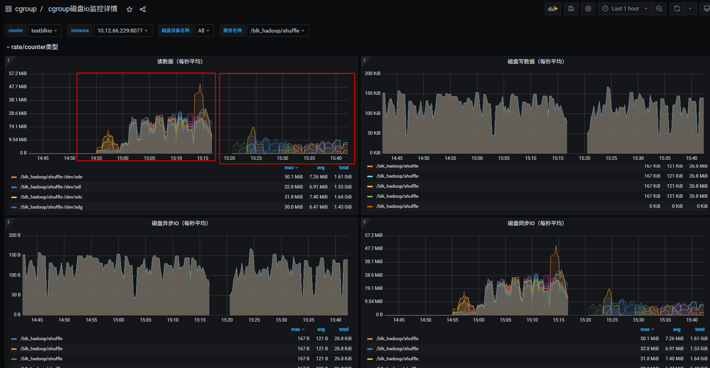

<div class="post-date">
  <span class="calendar-icon">📅</span>
  <span class="date-label">发布：</span>
  <time datetime="2025-10-20" class="date-value">2025-10-20</time>
</div>

<div class="outline" style="background:#f6f8fa;padding:1em 1.5em 1em 1.5em;margin-bottom:2em;border-radius:8px;">
  <strong>大纲：</strong>
  <ul id="outline-list" style="margin:0;padding-left:1.2em;"></ul>
</div>

# 磁盘io隔离&监控

## 需求背景
  目前我们hadoop集群是混部署方式，一台服务器上有dn,nm,shuffle服务，经常在作业高峰期的时候，出现集群服务器磁盘io使用100%的情况，  
但又没有日志可以追踪到是那个服务引起的，或那个作业引起的。这样就会导致这台物理机上的所有服务有读写100% io磁盘的数据时，都会卡顿，互相影响。  
  所以我们需要启用cgroup来隔离使用磁盘io的限制，并采集到磁盘使用数据，来对服务进行优化。
  - 例：磁盘io 100%后，无法知道是什么服务干的，没有优化的入口。
  

## cgroup blkio 文档参考
### kernel内核文档
https://docs.kernel.org/admin-guide/cgroup-v1/index.html
### alibaba cgroup参数参考
https://www.alibabacloud.com/help/zh/alinux/support/differences-between-cgroup-v1-and-cgroup-v2
### NM中启用cgroups
https://github.com/apache/hadoop/blob/trunk/hadoop-yarn-project/hadoop-yarn/hadoop-yarn-api/src/main/java/org/apache/hadoop/yarn/conf/YarnConfiguration.java#L1798
- 目前此配置是私有不稳定的
- 此设置用于控制磁盘操作的资源处理是否启用。
- 正在开发中：此配置参数未来可能会被修改/删除。


## 实现方案
### 确定服务器磁盘信息
```
lsblk -o NAME,MAJ:MIN,SIZE,TYPE,MOUNTPOINT  | grep disk | grep -v 8:0
sdf      8:80    3.7T disk 
sdd      8:48    3.7T disk 
sdm      8:192   3.7T disk 
sdb      8:16    3.7T disk 
sdk      8:160   3.7T disk 
sdi      8:128   3.7T disk 
sdg      8:96    3.7T disk 
sde      8:64    3.7T disk 
sdc      8:32    3.7T disk 
sdl      8:176   3.7T disk 
sdj      8:144   3.7T disk 
sdh      8:112   3.7T disk
```
### 配置cgroup blkio
#### 权重
- weight权重只在IO资源争用时起作用：当磁盘空闲时，任何进程都可以使用100%的IO,只有当多个进程同时请求IO时，权重才决定分配比例
-  blkio.weight 目前允许的权重范围是 1 到 1000，仅靠权重(blkio.weight)无法限制单个服务占满磁盘的情况
#### 读写bps_device
blkio.throttle.read_bps_device 此参数用于设定设备执行“写”操作次数的上限。“写”的操作率用“字节/秒”来表示。条目有三个字段：major、minor 和 bytes_per_second。major 和 minor 是〈Linux 分配的设备〉指定的设备类型和节点数。bytes_per_second 是“写”操作可被执行的上限率。例如，让 /dev/sda 设备执行“写”操作的最大比率为 10 MBps，请运行：
首先，测试磁盘的最大IO性能（使用fio或dd等工具）。    
blkio.throttle.write_bps_device 写操作，和读结束一致。  
#### 确定磁盘最大性能
-- 首先，测试磁盘的最大IO性能（使用fio或dd等工具）。  
```shell
fio --name=test --filename=/data1/test.file --size=1G --readwrite=readwrite --bs=1M --direct=1 --rw=randrw --ioengine=libaio --iodepth=64 --numjobs=1 --runtime=60 --time_based --group_reporting
```

cgroup基于bw值的限制  ：
-- bw (Bandwidth) - 带宽  
-- io (I/O) - 输入/输出总量  
-- 计算公式  
bw = io / run_time  
67.2 MiB/s = 4065 MiB / 60.529 s  
4065 ÷ 60.529 ≈ 67.2 ✓  

#### 配置
有了上面的介绍和相关数据，就可以根据情况进行配置  

```shell
echo "8:0 10485760" > /cgroup/blkio/test/blkio.throttle.write_bps_device
```

**配置效果**  


**完整的自动配置脚本参考：**  
安装配置：https://github.com/liangrui198/groups-blkio/blob/main/cgroupv1/hadoop_cg_blkio_init.sh  
移除：https://github.com/liangrui198/groups-blkio/blob/main/cgroupv1/remove_cg.sh  
自动识别服务&加入cgroup: https://github.com/liangrui198/groups-blkio/blob/main/cgroupv1/set_pid_blkio_cg.sh  
部署&监控指标采集： https://github.com/liangrui198/groups-blkio/blob/main/cgroupv1/deploy.sh 


## 效果展示
### 主要采集到的blkio监控指标信息
https://yunlzheng.gitbook.io/prometheus-book/part-ii-prometheus-jin-jie/exporter/commonly-eporter-usage/use-prometheus-monitor-container

```promql
# IO服务字节数（读写量）
container_blkio_device_usage_total{operation="Read"}   # 读取字节数
container_blkio_device_usage_total{operation="Write"}  # 写入字节数
container_blkio_device_usage_total{operation="Async"}  # 异步IO
container_blkio_device_usage_total{operation="Sync"}   # 同步IO

# IO操作次数
container_blkio_io_serviced_total{operation="Read"}    # 读操作次数
container_blkio_io_serviced_total{operation="Write"}   # 写操作次数

# IO队列和时间
container_blkio_io_queue_total     # IO队列大小
container_blkio_io_service_time_total # IO服务时间
container_blkio_io_wait_time_total    # IO等待时间
```

### 配置到grafana
- 这里可以查看hadoop相关服务的每块磁盘的读/写/同步/异步值

- 这里可以统计出磁盘读写TOP排行

- 其它可以根据自已的需求进行配置

## 测试
- shuufle 跑满
- ys13_8机器压力测试：（fio测试是70MB/s）  
第一组数据测试：  
cgroup配置限制  读56MB/写46MB时，发现还是会把物理机磁盘打满。  
第二组数据测试：  
cgroup配置限制  读10MB/写10MB时，这时候（读/秒）明显下降，说明cgroup确实起到了限制作用，对应的物理机也没有到100%，  shuufle服务fetch时间有下降，但没有异常出现。  
cgroup监控：56MB/s限制时看上去最大确实没有超过56MB/s 第二组测试数据(10MB/s)  的效果明显降低    


 物理机监控：第一组测试数据（56MB/s）：磁盘io 100% VS  第二组测试数据(10MB/s)  
PS:这台机当前服务上还有其它进程，当我们看到运维监控的磁盘100%后，再查看cgroup监控，就可以确定是shuufle导致的磁盘io 100%了，如是是dn和nm导致的，原理是一样的。   

运维监控是ioutil,这个公式较为复杂：  
磁盘I/O相关的性能指标，如“磁盘使用率”(Disk Utilization)，而非一个特定的计算公式。磁盘I/O性能的计算公式主要有：吞吐量（吞吐量= 读写数据总量/ 时间）、IOPS（IOPS = 每秒I/O请求数，即读请求数+ 写请求数/ 时间）、平均数据大小（平均数据大小= 吞吐量/ IOPS）和平均服务时间（平均服务时间= 寻道时间+ 旋转延迟+ 数据传输时间）等。  


shuufle服务监控：当前指标看上去没有太明显变化，也没有异常导致作失败  

## 测试
- 每小时跑作业，跑满测试集群，作业正常。
- 机器压力测试：（fio测试是70MB/s）  
**第一组数据测试：**  
cgroup配置限制  读56MB/写46MB时，发现还是会把物理机磁盘打满。  
**第二组数据测试：**  
cgroup配置限制  读10MB/写10MB时，这时候（读/秒）明显下降，说明cgroup确实起到了限制作用，对应的物理机也没有到100%，shuufle服务fetch时间有下降，但没有异常出现。  
cgroup监控：56MB/s限制时看上去最大确实没有超过56MB/s 第二组测试数据(10MB/s)  的效果明显降低 ,但写是o_drict方式写磁盘，这里cgroup v1是元法监控到限制的，只能看到磁盘的总写入量。 
  
 **物理机监控：第一组测试数据（56MB/s）：磁盘io 100% VS  第二组测试数据(10MB/s)**  
- PS:这台机当前服务上还有其它进程，当我们看到运维监控的磁盘100%后，再查看cgroup监控，就可以确定是shuufle导致的磁盘io 100%了，如是是dn和nm导致的，原理是一样的。  
当前限制设置的很大（56MB/s），后面线上如果还是有互相影响其它服务，可以调小这个值
 **监控是ioutil ,这个公式较为复杂：**
```
磁盘I/O相关的性能指标，如“磁盘使用率”(Disk Utilization)，而非一个特定的计算公式。磁盘I/O性能的计算公式主要有：吞吐量（吞吐量= 读写数据总量/ 时间）、IOPS（IOPS = 每秒I/O请求数，即读请求数+ 写请求数/ 时间）、平均数据大小（平均数据大小= 吞吐量/ IOPS）和平均服务时间（平均服务时间= 寻道时间+ 旋转延迟+ 数据传输时间）等。
```

这里虽然shuufle服务没有到读磁盘（read_bps_device）的数据限制，但是ioutil也会到100%，2个计算公式不一样，可能的情况如下：
高IOPS可能性大，全是小量的shuufle读，小数据频繁io连接读。  
所以如果限制shuufle这种高iops的话，后面还要需要下调read_bps_device（当前56MB/s）这个值。  
从TCP连接数可以看出，他的请求量确实很大10K-15K个连接数在读数据  


## 缺点
- 目前我们系统比较老，默认系统是cgroup v1,存在以下缺点。  
**1：两种限制策略的分离与不完整**  
如果你想使用权重分配（比如让两个 cgroup 按 3：1 的比例共享磁盘带宽），你必须使用 CFQ 调度器。但 CFQ 可能因为性能问题或不被推荐而已被弃用。  
如果你为了性能使用none或mq-deadline调度器，那么你只能使用throttling策略来设置上限，而无法实现按比例分配。这对于共享环境下的服务质量保障是一个巨大的缺陷。  
**2：对 Buffered Write 的限制不完善**  
通过blkio.throttle.write_bps_device设置的写带宽上限对于 Buffered Write 基本上是无效的。只有 Direct I/O 或者因为内存压力触发的同步写入才会被准确限制。这导致了一个 cgroup 可以通过大量缓冲写入轻松耗尽磁盘带宽，而限制形同虚设。  

**总结与 Cgroup v2 的改进**    
以上限制不严格的缺点在cgroup v2中有改进，但升级系统内核服务需要运维支持，这个先不考虑，我们主要是能够获取服务读写磁盘的监控数据来优化服务为目的。  


Cgroup v1 的blkio子系统是一个在其历史背景下产生的、带有明显设计妥协的方案。它的主要缺点源于其控制策略的分离性以及对缓存写入限制的失效性。这些问题在高性能、高隔离需求的容器化环境中变得尤为突出。  

<script src="/assets/blog.js"></script>
<link rel="stylesheet" href="/assets/blog.css">

## ubuntu22.04 启用 cgroup v2
### 系统查看和启用

- 查看 /sys/fs/cgroup 类型是v1 还是 v2
```mount | grep cgroup ```

- 如果是v1,改为系统配置
```shell
vim /etc/default/grub 
GRUB_CMDLINE_LINUX="....,systemd.unified_cgroup_hierarchy=1"
# 更新 GRUB 配置
sudo update-grub
# 重启系统
sudo reboot
```
### hadoop相关进程 自动脚本处理cgroup v2
安装配置：https://github.com/liangrui198/groups-blkio/blob/main/cgroupv2/hadoop_cg_blkio_init.sh  
移除：https://github.com/liangrui198/groups-blkio/blob/main/cgroupv2/remove_cg.sh  
自动识别服务&加入cgroup: https://github.com/liangrui198/groups-blkio/blob/main/cgroupv2/set_pid_blkio_cg.sh  
部署&监控指标采集： https://github.com/liangrui198/groups-blkio/blob/main/cgroupv2/deploy.sh 

### 注意事项
**需要考虑当前服务器其它服务是否有用cgroup v1,两都版本差别很大，需要做兼容处理。**    
我们当前环境中是yarn启用了cgroup v1，改了代码支持超配内存，所以不能大量用cgroup v2做监控磁盘写数据。  
yarn的cgroup v2当前时间还是补丁中，hadoop3.5.0才会上全。  
详见：https://issues.apache.org/jira/browse/YARN-11669  

## 线上监控发现问题并修复案例

### 问题发现
从监控上看，发现这台服务器的/data9磁盘 02:00-02:05之间卡顿了5分钟的ioutil 100%,服务的读写磁盘都很小,但iops偏高。  

发生了什么呢？从运维系统上的监控啥都不知道，打开我们内部的监控，可以精确到服务的读写磁盘数据。发现磁盘的数据很低的,10M/s以下。
但是iops的指标较高，对应的服务是datanode服务。   
  
 各种调试，各种调试.....略过过程  
### 问题定位
突然发现iotop中的时而出现一个root用户 du -sk /data*/xx datanode数据磁盘目录的统计。  
```shell
# 以千字节为单位，汇总显示指定目录（及其包含的所有内容）所占用的总磁盘空间。
du -sk  /data3/hadoop/dfs/data/current/BP-1056920250-10.21.118.31-1568114378684  
```
这是个啥玩意？各种猜测,各种调试.....................
  
手动写了一个监控脚本，出现后找到对应的父进程。发现是指向datanode服务？  
  
在hadoop源码里发现这个诡异的操作，在社区补丁里也找到了对应的修复bug  
  
### 问题修复
对应的补丁修复：（我们的hdfs当前版本3.1.1） 
   
https://issues.apache.org/jira/browse/HDFS-14313  
causes to 14313  
https://issues.apache.org/jira/browse/HDFS-14986  

合并后单元测试成功 
  
测试环境已验证，服务没有问题  
配置项：
```
# fs.du.interval =600000  #默认10分钟   当前线上3600000 1小时。
# fs.getspaceused.classname=org.apache.hadoop.fs.DU(default),
# fs.getspaceused.jitterMillis=60000  #1分钟

# update 减少统计频率到10分钟统计一次，并使用hdfs内部副本内存中统计已用空间
fs.getspaceused.jitterMillis=600000    
fs.getspaceused.classname=org.apache.hadoop.hdfs.server.datanode.fsdataset.impl.ReplicaCachingGetSpaceUsed   
```  
最终修复后上线成功     

<!--菜单栏-->
  <nav class="blog-nav">
    <button class="collapse-btn" onclick="toggleBlogNav()">☰</button>
    
 </nav>