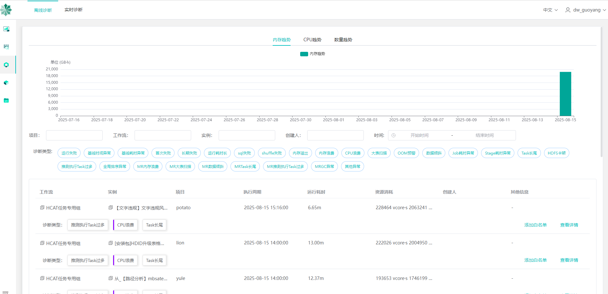

<div class="post-date">
  <span class="calendar-icon">📅</span>
  <span class="date-label">发布：</span>
  <time datetime="2025-08-18" class="date-value">2025-08-15</time>
</div>

<script src="https://cdn.jsdelivr.net/npm/mermaid@10/dist/mermaid.min.js"></script>
<script>
  mermaid.initialize({ startOnLoad: true });
</script>

<div class="outline" style="background:#f6f8fa;padding:1em 1.5em 1em 1.5em;margin-bottom:2em;border-radius:8px;">
  <strong>大纲：</strong>
  <ul id="outline-list" style="margin:0;padding-left:1.2em;"></ul>
</div>


# compass诊断平台模块分析
应用文档可以直接查看：<a href="https://github.com/cubefs/compass "> compassGithub</a>
因:调度系统是自研的，mysql平台不支持canal采集,这里对源码做了分析，进行了数据对接和转换


<div class="mermaid">
flowchart TD
  A[canal<br>同步调度数据表到compass表] --> B[task syncer<br>消费mysqldata转存为compass表<br>写kafka: task-instance]
  B --> C[task application<br>消费task-instance<br>日志提取app_id<br>写mysql: task_application<br>发kafka: task-application]
  C --> D[flink模块<br>消费task-application]
  B --> E[task-detect<br>消费task-instance<br>异常检测<br>写ES: compass-job-instance<br>写Redis: delayed:task]
  C --> F[task parser<br>消费Redis: parser:processing<br>引擎层异常检测]
  E --> G[task portal<br>前端接口<br>报告总览/调度列表/离线列表/诊断]
  F --> G
  C --> G

  subgraph DolphinScheduler
    H[flow<br>工作流定义表]
    I[task<br>任务定义表]
    J[task_instance<br>任务实例表]
    H --> I
    I --> J
  end
</div>


## canal作用
通过kafka 主题为:mysqldata, 进行同步调度数据表到compass表  
adapter主要是适配不同调度表数据，主要配置srcDataSources:源调度的数据源， canalAdapters:目标数据源
具体表转换规则在：task-canal-adapter/src/main/adapter/conf/rdb/xx.yml 进行配置

## task metadata
主要是同步spark yarn 的作业元数据

## task syncer
通过消费 kafka主题:mysqldata的调度mysql表数据，转存为compass表 
并且写kafka入信息(xx_task_instance表)：消费topic：mysqldata  ->  发送 topic:task-instance

## task application
将工作流层与引擎层元数据关联  
消费 kafka主题:task-instance, 通过task_instance.id从task_instance表中查询出实例信息  
通过解析日志文件，使用正则表达式匹配提取出来找到对应的application_id,->rules.extractLog.name
转换数据后写入mysql -> compass.task_application表中，
并将TaskApplication信息发送到kafka -> 主题为:task-application ->flink模块进行消费


## task-detect
模块进行工作流层异常任务检测，例如运行失败、基线耗时异常等  
DetectedTask通过消费kafka主题：task-instance进行处理逻辑,取到的是task实例信息，  
再通过projectName,flowName,taskName,executionTime去mysql表：task_application查询出app信息，  
然后把诊断结果写入  
ES -> (compass-job-instance)   
延迟的实例处理（缺少appid）   
Redis -> ({lua}:delayed:task)    
DelayedTask延迟任务处理，通过spingBoot->CommandLineRunner实现启动时运行  


## task parser
进行引擎层异常任务检测，例如SQL失败、Shuffle失败等 
从redis中消费->{lua}:parser:processing 

## task portal
前端页面展示相关接口模块
报告总览      ReportController -> /api/v1/report  
调度列表入口为 AppController -> /api/v1/app/list  -> 查询ES索引compass-task-app*   
离线列表入口为 JobController -> /api/v1/job/list  -> 查询ES索上compass-job-analysis*  
离线诊断入口  /openapi/offline/app/metadata -> redis:{lua}:log:record ->| task-parser -> RedisConsumer数据消费  redis:{lua}:log:record 


## dolphinScheduler主要表关系
flow 表（工作流定义表）  
task 表（任务定义表）  
task_instance 表（任务实例表）  

### 三者的关系   
#### 层级关系：
  一个 flow（工作流）包含多个 task（任务节点）  
  当工作流被执行时，会生成工作流实例，同时为每个任务节点生成 task_instance  
#### 数据流向：
  用户先定义 flow（工作流）  
  在 flow 中添加多个 task（任务节点）并设置依赖关系  
  调度或手动触发时，系统根据 flow 和 task 定义生成 task_instance 执行  
#### 生命周期：
  flow 和 task 是静态定义，一般不随执行改变  
  task_instance 是动态生成的，每次执行都会创建新记录  


# 自定义调度系统表转换流程
这里采用了spark每小时采集自定义调度系统和kyuubi表信息，找到调度->实例->application相关信息，批量清洗完数据后，统一批次发送到kafka,  
诊断系统（task-detect）会消费kafka消息，来进行自动诊断，把结果存入ES进行展示，这里就直接跳过了task-canal和task-applicaion项目处理的逻辑。
 

<div class="mermaid">
graph TD
  A[源MySQL数据库] -->|1. 读取数据| B[Spark Session]
  C[Kyuubi MySQL] -->|2. 读取应用ID| B
  B -->|3. 数据转换| D[临时DataFrame]
  D -->|4.1 写入目标MySQL| E[目标MySQL task_instance表]
  D -->|4.2 写入目标MySQL| F[目标MySQL task_application表]
  D -->|5. 过滤有app_id的数据| G[Kafka生产数据]
  G -->|6. 发送消息| H[Kafka主题 task-instance]
</div>
  

# 流程步骤说明

## 数据源读取
###  源MySQL：
表：JOB_INST_1（实例信息）、JOB_DESC（任务描述）、HOST_GROUP_DEF（主机组:调度没有flow概念，只有依赖拓扑关系，占时用这个代替，后面再清先转换）  
 SQL条件：筛选指定时间范围（dateStartHour到当日23:59:59）且任务类型为99或96的记录。  

### Kyuubi MySQL：
表：sqlmetadata   获取Spark任务的application_id，按时间范围过滤并去重。  

## 数据转换

### UDF处理：
getTaskType：将数字任务类型转换为字符串（如99→SPARK）。  
getTaskState：将状态码转为文本（如1→success）。  
getTriggerType：区分触发类型（schedule或manual）。  
getExecutionTime：规范化时间格式。  
### 字段映射：
#### 字段映射逻辑：参考代码注释中的海猫（源系统）与Compass（目标系统）字段对应关系。
源字段（如BUSI_GRP）→目标字段（如project_name）...等
数据写入目标MySQL
task_instance表：
使用临时表+ON DUPLICATE KEY UPDATE实现幂等写入（按id更新）。
task_application表：
关联实例数据与application_id，写入任务应用信息。  
...
## Kafka消息生产
数据过滤：仅选择包含application_id的实例记录。
### 消息格式：    
```
{
  "rawData": null,
  "body": {
    "id": "实例ID",
    "projectName": "项目名",
    "flowName": "流名称",
    ...
  },
  "eventType": "INSERT",
  "table": "task_instance"
}
```
### 最终效果预览


# 诊断逻辑解析
 默认诊断配置:compass\task-parser\src\main\resources\application.yml  

## cpu浪费计算
### executor计算
##### 任务实际使用的计算资源（毫秒）
spark所有的job 执行时间相加
inJobComputeMillisUsed= (for-> spark.job.executorRunTime++)

##### 任务可用的计算资源（毫秒）
totalCores=executorCores*maxExecutors（最大并发executor数）
inJobComputeMillisAvailable = totalCores * jobTime;

##### cpu浪费比例
 executorWastedPercentOverAll = (inJobComputeMillisAvailable - inJobComputeMillisUsed) / inJobComputeMillisAvailable * 100%
##### 判断是否浪费
 阈值:executorThreshold=50%(默认)
if (cpu浪费比例45% < 阈值50%)=> 正常
##### 备注
这里如果启用了spark 动态分配设置(spark.dynamicAllocation.enabled)，计算完的executor会关闭，安这种方式计算，会把关闭后的executor也会算为在应用cpu， 这样的话计算是不合理的

### driver计算
- 主要是计算 dirver中间卡顿没有计算的比例，比如调度下一个job时没有资源可用
- appTotalTime 表示整个Spark应用的总运行时间   
- jobTime 表示所有Spark作业实际执行时间的总和   
 driverComputeMillisWastedJobBased = driverTimeJobBased * totalCores  
 driverTimeJobBased = appTotalTime - jobTime （应用总时间减去作业时间）  
 appComputeMillisAvailable = totalCores * appTotalTime （总核心数乘以应用总时间）  
 ### driver cpu浪费比例
 driverWastedPercentOverAll =
                ((float) driverComputeMillisWastedJobBased / appComputeMillisAvailable) * 100;
在Spark应用中， appTotalTime 和 jobTime 差距较大的情况主要有以下几种：

### appTotalTime和jobTime的差距区别 说明
1. 资源等待 ：     
   - 启动Driver后YARN没有可用资源时
   - 作业执行过程中资源被抢占或释放后重新申请
2. 作业间隔期 ：   
   - 当一个作业完成到下一个作业开始提交之间的间隔时间
   - 这个间隔期会计入 appTotalTime 但不会计入 jobTime
3. 其他情况 ：   
   - Driver初始化时间（加载依赖、注册应用等）
   - 作业调度延迟（特别是在动态资源分配模式下）
   - 数据倾斜导致的某些任务长时间运行，而其他资源处于空闲状态  
   
## 我们当前的环境
- 我们目前没有启用严格cpu分配和限制
- 启用saprk动态分配后和计算逻辑冲突 
- spark kyuubi机器就是存在浪费cpu和内存常驻进程机器来换取加速启动进程，会存在浪费情况 

**综合以上考虑，这个诊断对我们目前不适用，屏蔽这个诊断逻辑。**
 executorThreshold=95  


## Task长尾
### 诊断描述
 概念   | 产生方式             | 数量                      | 规划者         | 执行者
 ------ | -------------------- | ------------------------- | -------------- | ---------------
 Job    | 一个 Action 算子     | 1个Application包含多个Job | Driver         | (整体)
 Stage  | 根据 宽依赖 划分      | 1个Job包含多个Stage       | DAGScheduler   | (阶段)
 Task   | 与 RDD分区 一一对应   | 1个Stage包含多个Task      | TaskScheduler  | Executor  

- **Task：** 一个 Stage 会根据其分区数（Partitions）被拆分成多个 Task。Task 是 Spark 中最基本的工作单元和执行单元，每个 Task 在一个 Executor 的一个核心上处理一个分区的数据。一个 Stage 的所有 Task 执行的计算逻辑是完全一样的，只是处理的数据不同。  
- stage中存在task最大运行耗时远大于中位数的任务为异常

### 计算方式
```java
// 计算每个task的最大执行时间与中位数的比值
ratio = max_duration / median_duration
// taskDurationConfig.threshold default:10
当 ratio > threshold 时（threshold来自配置），判定为长尾异常
```
### 建议优化
#### 首先确认是数据倾斜还是计算倾斜
- 如果某个 Task 的 Shuffle Read 数据量远大于其他 Task，基本可以断定是数据倾斜。如果处理的数据量差不多，但执行时间差别大，可能是计算倾斜（例如某个分区的数据导致了更复杂的计算逻辑，如深层循环）。
#### 优化方向一：应对数据倾斜 (Data Skewness)
 **这是最常见的原因，即某些 Key 对应的数据量远大于其他 Key。**
 **a) 预处理数据源**
 - **理想方案**：如果可能，直接从数据源端进行预处理，将热点数据打散。例如在 Hive ETL 阶段就对频繁使用的 Key 进行加盐或打散。
 **b) 过滤倾斜的Key**  
 **方案**：如果某些热点 Key 不是业务分析所必需的（例如爬虫抓取的异常 NULL 值、测试账号的数据），可以直接在作业中过滤掉它们。
 **命令示例：**
 ```scala
 // 假设 'key' 列中存在一些我们不需要的异常大Key
val filteredRDD = originalRDD.filter(row => row.getAs[String]("key") != "异常Key值")  
 ```
 
- c) 两阶段聚合（加盐/打散 -> 聚合 -> 去盐 -> 最终聚合）  
**场景：**适用于 reduceByKey, groupByKey, agg 等聚合类 Shuffle 操作。  
**步骤：**  
**- 打散：**给每个 Key 加上一个随机前缀（盐），将一个大 Key 拆分成多个小 Key。  

```scala
// 第一步：加盐局部聚合
val saltedPairRDD = originalPairRDD.map{ case (key, value) =>
  val salt = (new util.Random).nextInt(numSalts) // numSalts 是随机范围，例如 10
  (s"$salt-$key", value)
}
val partialAggRDD = saltedPairRDD.reduceByKey(_ + _) // 局部聚合
```

**- 去盐：**去掉随机前缀，恢复原始 Key。
```scala
// 第二步：去盐
val removedSaltRDD = partialAggRDD.map{ case (saltedKey, value) =>
  val originalKey = saltedKey.substring(saltedKey.indexOf("-") + 1)
  (originalKey, value)
}
```

**- 最终聚合：**对恢复后的原始 Key 进行全局聚合。
```scala
// 第三步：全局聚合
val finalAggRDD = removedSaltRDD.reduceByKey(_ + _)
```
**效果：**将原本由一个 Task 处理的一个大 Key 的计算压力，分摊给了多个 Task，完美解决倾斜。

 - d) 使用随机Key实现扩容join  
  - **场景：**适用于大表 Join 倾斜维表（维度表中有热点 Key），即 Skew Join。
  - **步骤：**
    - 从大表中筛选出导致倾斜的热点 Key 列表。
    - 打散大表：将大表中热点 Key 的数据加上随机前缀，从而扩容。
    - 扩容维表：将维表中热点 Key 的数据复制多份（笛卡尔积），每份对应一个随机前缀。
    - Join：将处理后的两个表进行 Join，由于热点 Key 被扩容后可以匹配上，非热点 Key 正常 Join。
- 代码思路复杂，Spark 3.2+ 已原生支持 SKEW JOIN 优化，可通过 Hint 实现：
  ```scala
  spark.sql("""
  SELECT /*+ SKEW('table_name', 'skewed_column') */ *
  FROM table_name
  """)

  ```
***在低版本中，通常需要手动实现上述逻辑。***

#### 优化方向二：调整分区与并行度
- a) 提高Shuffle并行度
  **方案：**通过设置 spark.sql.shuffle.partitions（默认200）来增加 Shuffle 后的分区数。  
  **原理：**让数据被分配到更多个 Task 中去处理，即使有数据倾斜，更大的分区数也可能让倾斜程度相对降低。这是一个简单但可能有效的“缓兵之计”。   
```scala
  spark.conf.set("spark.sql.shuffle.partitions", "1000") // 根据数据量调整
   // 或者在 reduceByKey 等操作中直接指定分区数
  rdd.reduceByKey(_ + _, 1000)
```
- b) 使用自定义Partitioner
**方案：**如果业务逻辑清晰，可以自定义分区规则，避免某些分区落入过多数据。
**场景：**例如，你明确知道某些 Key 是热点，可以编写自己的 Partitioner 类，将这些 Key 强制分配到多个特定的分区中去。


#### 优化方向三：检查计算逻辑与资源
- 如果不是数据问题，而是计算问题：
  - **检查UDF（用户自定义函数）**:你的 UDF 中是否存在低效操作（如频繁创建对象、递归过深）？是否在某些特定数据上会触发低效路径？优化你的代码逻辑。
  - **检查资源竞争**:
    - **GC（垃圾回收）**:长尾 Task 可能因为处理的数据量大，触发了频繁的 Full GC。在 Spark UI 中检查该 Task 的 GC 时间。考虑使用 G1GC 并调整堆内存和 GC 参数。
    - **Executor 负载不均**:可能某个 Executor 所在的物理机负载本身就很高（CPU、磁盘IO、网络IO被其他进程占用），导致上面的所有 Task 都变慢。需要从集群监控层面排查。

### 优化总结与流程
- 定位：使用 Spark UI 确定是数据倾斜还是计算倾斜。
- 首选：如果能过滤掉倾斜Key，这是最直接的方法。
- 核心手段：对于聚合操作，优先考虑两阶段聚合（加盐）；对于 Join 操作，优先看能否使用 Spark 3.2+ 的 SKEW JOIN Hint。
- 通用技巧：尝试增加 Shuffle 分区数 (spark.sql.shuffle.partitions)。
- 深度优化：考虑自定义分区器或优化UDF 代码和 JVM 参数。
- 长尾问题的优化通常是上述多种方法结合使用、反复迭代的过程。核心思想永远是：将集中在一处的计算和存储压力，尽可能地分散到多个并行单元中去。


# 基线时间异常
相对于历史正常结束时间，提前结束或晚点结束的任务  


## 待补充更多的诊断逻辑分析


# 后续优化
  默认诊断不符合当前效果，后续需要结合实际场景，给出优化建议


<script>
// 支持点击二级标题时，收起其下所有内容（包括三级及更深标题和内容）
// 并自动生成大纲目录
document.addEventListener('DOMContentLoaded', function() {
  // 折叠功能
  function getFoldContent(header) {
    let content = [];
    let el = header.nextElementSibling;
    while (el && !(el.tagName && /^H[1-6]$/.test(el.tagName) && el.tagName <= header.tagName)) {
      content.push(el);
      el = el.nextElementSibling;
    }
    return content;
  }
  document.querySelectorAll('h2, h3, h4').forEach(function(h) {
    h.classList.add('fold-title');
    let content = getFoldContent(h);
    if (content.length) {
      content.forEach(e => e.classList.add('fold-content'));
      h.addEventListener('click', function() {
        const collapsed = !h.classList.contains('collapsed');
        content.forEach(e => e.classList.toggle('collapsed', collapsed));
        h.classList.toggle('collapsed', collapsed);
      });
    }
  });
  // 大纲功能
  var outline = document.getElementById('outline-list');
  if (outline) {
    document.querySelectorAll('h2').forEach(function(h, i) {
      var txt = h.textContent.replace(/^#+/, '').trim();
      // 过滤掉“博客记录”或其它不想显示的大纲项
      if (txt === '博客记录') return;
      if (!h.id) h.id = 'outline-h2-' + i;
      var li = document.createElement('li');
      var a = document.createElement('a');
      a.href = '#' + h.id;
      a.textContent = txt;
      li.appendChild(a);
      outline.appendChild(li);
    });
  }
});
</script>


<link rel="stylesheet" href="/assets/blog.css">
<script>
function toggleBlogNav() {
  var nav = document.querySelector('.blog-nav');
  nav.classList.toggle('collapsed');
}
</script>

  <nav class="blog-nav">
    <button class="collapse-btn" onclick="toggleBlogNav()">☰</button>
    
</nav>