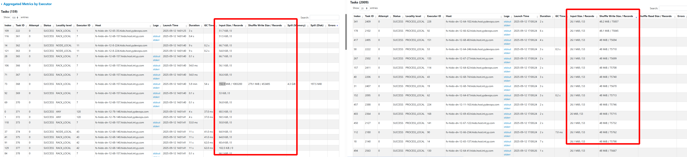
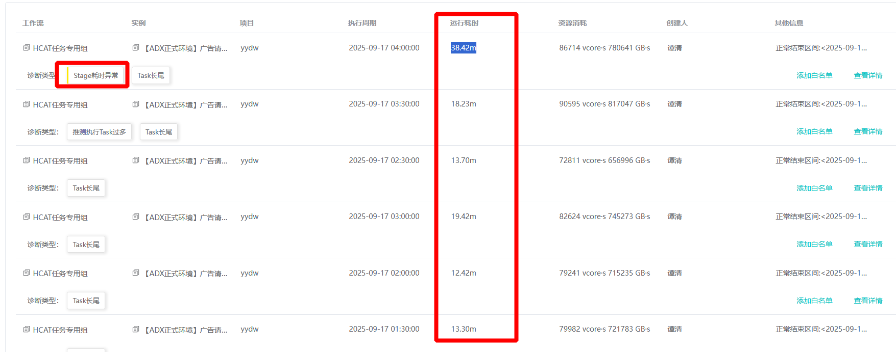

<div class="post-date">
  <span class="calendar-icon">📅</span>
  <span class="date-label">发布：</span>
  <time datetime="2025-08-18" class="date-value">2025-08-15</time>
</div>

<script src="https://cdn.jsdelivr.net/npm/mermaid@10/dist/mermaid.min.js"></script>
<script>
  mermaid.initialize({ startOnLoad: true });
</script>

<div class="outline" style="background:#f6f8fa;padding:1em 1.5em 1em 1.5em;margin-bottom:2em;border-radius:8px;">
  <strong>大纲：</strong>
  <ul id="outline-list" style="margin:0;padding-left:1.2em;"></ul>
</div>


# compass诊断平台模块分析
应用文档可以直接查看：<a href="https://github.com/cubefs/compass "> compassGithub</a>
因:调度系统是自研的，mysql平台不支持canal采集,这里对源码做了分析，进行了数据对接和转换


<div class="mermaid">
flowchart TD
  A[canal<br>同步调度数据表到compass表] --> B[task syncer<br>消费mysqldata转存为compass表<br>写kafka: task-instance]
  B --> C[task application<br>消费task-instance<br>日志提取app_id<br>写mysql: task_application<br>发kafka: task-application]
  C --> D[flink模块<br>消费task-application]
  B --> E[task-detect<br>消费task-instance<br>异常检测<br>写ES: compass-job-instance<br>写Redis: delayed:task]
  C --> F[task parser<br>消费Redis: parser:processing<br>引擎层异常检测]
  E --> G[task portal<br>前端接口<br>报告总览/调度列表/离线列表/诊断]
  F --> G
  C --> G

  subgraph DolphinScheduler
    H[flow<br>工作流定义表]
    I[task<br>任务定义表]
    J[task_instance<br>任务实例表]
    H --> I
    I --> J
  end
</div>

## compass服务模块作用
- **canal作用**  
通过kafka 主题为:mysqldata, 进行同步调度数据表到compass表  
adapter主要是适配不同调度表数据，主要配置srcDataSources:源调度的数据源， canalAdapters:目标数据源
具体表转换规则在：task-canal-adapter/src/main/adapter/conf/rdb/xx.yml 进行配置
- **task metadata**  
主要是同步spark yarn 的作业元数据
- **task syncer**  
通过消费 kafka主题:mysqldata的调度mysql表数据，转存为compass表 
并且写kafka入信息(xx_task_instance表)：消费topic：mysqldata  ->  发送 topic:task-instance

- **task application**  
将工作流层与引擎层元数据关联  
消费 kafka主题:task-instance, 通过task_instance.id从task_instance表中查询出实例信息  
通过解析日志文件，使用正则表达式匹配提取出来找到对应的application_id,->rules.extractLog.name
转换数据后写入mysql -> compass.task_application表中，
并将TaskApplication信息发送到kafka -> 主题为:task-application ->flink模块进行消费

- **task-detect**  
模块进行工作流层异常任务检测，例如运行失败、基线耗时异常等  
DetectedTask通过消费kafka主题：task-instance进行处理逻辑,取到的是task实例信息，  
再通过projectName,flowName,taskName,executionTime去mysql表：task_application查询出app信息，  
然后把诊断结果写入  
ES -> (compass-job-instance)   
延迟的实例处理（缺少appid）   
Redis -> ({lua}:delayed:task)    
DelayedTask延迟任务处理，通过spingBoot->CommandLineRunner实现启动时运行  


- **task parser**  
进行引擎层异常任务检测，例如SQL失败、Shuffle失败等 
从redis中消费->{lua}:parser:processing 

- **task portal**  
前端页面展示相关接口模块
报告总览      ReportController -> /api/v1/report  
调度列表入口为 AppController -> /api/v1/app/list  -> 查询ES索引compass-task-app*   
离线列表入口为 JobController -> /api/v1/job/list  -> 查询ES索上compass-job-analysis*  
离线诊断入口  /openapi/offline/app/metadata -> redis:{lua}:log:record ->| task-parser -> RedisConsumer数据消费  redis:{lua}:log:record 

- **异常统计ES**  
  - 异常列表：JobController -> /jobDiagnoseInfo -> ES索引:compass-detector-${date}->数据格式:DetectorStorage->BigTableScanService 处理后生成->展示作业异常信息


## dolphinScheduler主要表关系
flow 表（工作流定义表）  
task 表（任务定义表）  
task_instance 表（任务实例表）  

### 三者的关系   
#### 层级关系：
  一个 flow（工作流）包含多个 task（任务节点）  
  当工作流被执行时，会生成工作流实例，同时为每个任务节点生成 task_instance  
#### 数据流向：
  用户先定义 flow（工作流）  
  在 flow 中添加多个 task（任务节点）并设置依赖关系  
  调度或手动触发时，系统根据 flow 和 task 定义生成 task_instance 执行  
#### 生命周期：
  flow 和 task 是静态定义，一般不随执行改变  
  task_instance 是动态生成的，每次执行都会创建新记录  


# 自定义调度系统表转换流程
这里采用了spark每小时采集自定义调度系统和kyuubi表信息，找到调度->实例->application相关信息，批量清洗完数据后，统一批次发送到kafka,  
诊断系统（task-detect）会消费kafka消息，来进行自动诊断，把结果存入ES进行展示，这里就直接跳过了task-canal和task-applicaion项目处理的逻辑。
 

<div class="mermaid">
graph TD
  A[源MySQL数据库] -->|1. 读取数据| B[Spark Session]
  C[Kyuubi MySQL] -->|2. 读取应用ID| B
  B -->|3. 数据转换| D[临时DataFrame]
  D -->|4.1 写入目标MySQL| E[目标MySQL task_instance表]
  D -->|4.2 写入目标MySQL| F[目标MySQL task_application表]
  D -->|5. 过滤有app_id的数据| G[Kafka生产数据]
  G -->|6. 发送消息| H[Kafka主题 task-instance]
</div>
  

# 流程步骤说明

## 数据源读取
###  源MySQL：
表：JOB_INST_1（实例信息）、JOB_DESC（任务描述）、HOST_GROUP_DEF（主机组:调度没有flow概念，只有依赖拓扑关系，占时用这个代替，后面再清先转换）  
 SQL条件：筛选指定时间范围（dateStartHour到当日23:59:59）且任务类型为99或96的记录。  

### Kyuubi MySQL：
表：sqlmetadata   获取Spark任务的application_id，按时间范围过滤并去重。  

## 数据转换

### UDF处理：
getTaskType：将数字任务类型转换为字符串（如99→SPARK）。  
getTaskState：将状态码转为文本（如1→success）。  
getTriggerType：区分触发类型（schedule或manual）。  
getExecutionTime：规范化时间格式。  
### 字段映射：
#### 字段映射逻辑：参考代码注释中的海猫（源系统）与Compass（目标系统）字段对应关系。
源字段（如BUSI_GRP）→目标字段（如project_name）...等
数据写入目标MySQL
task_instance表：
使用临时表+ON DUPLICATE KEY UPDATE实现幂等写入（按id更新）。
task_application表：
关联实例数据与application_id，写入任务应用信息。  
...
## Kafka消息生产
数据过滤：仅选择包含application_id的实例记录。
### 消息格式：    
```
{
  "rawData": null,
  "body": {
    "id": "实例ID",
    "projectName": "项目名",
    "flowName": "流名称",
    ...
  },
  "eventType": "INSERT",
  "table": "task_instance"
}
```
### 最终效果预览


## 诊断逻辑解析

 默认诊断配置:compass\task-parser\src\main\resources\application.yml  

图解流程(spark中的job->stage->task的流程)
假设我们有如下代码：  

```scala
//RDD is resilient distributed dataset
val textFile = sc.textFile("hdfs://...")          // RDD A
val words = textFile.flatMap(line => line.split(" ")) // RDD B
val mappedWords = words.map(word => (word, 1))       // RDD C
val wordCounts = mappedWords.reduceByKey(_ + _)     // RDD D
wordCounts.saveAsTextFile("hdfs://...output")      // Action!
```
其执行流程的 DAG 和 Stage 划分如下图所示  

<div class="mermaid">
flowchart TD
    subgraph Application [Application - 应用程序]
        direction TB
        A[textFile RDD A] --> B[flatMap RDD B]
        B --> C[map RDD C]
        C -- Wide Dependency<br>Shuffle! --> D[reduceByKey RDD D]
        D --> Action[saveAsTextFile Action]
    end

    Application --> Job

    subgraph Job [Job - 作业]
        direction TB
        S1[Stage 1<br>ShuffleMapStage] -- Shuffle Data --> S2[Stage 2<br>ResultStage]
    end

    Job --> Stage

    subgraph Stage1 [Stage 1 内部]
        direction LR
        T1_1[Task 1]
        T1_2[Task 2]
        T1_3[...]
        T1_4[Task N]
    end

    subgraph Stage2 [Stage 2 内部]
        direction LR
        T2_1[Task 1]
        T2_2[Task 2]
        T2_3[...]
        T2_4[Task M]
    end

    Stage --> Task

    T1_1 --> E1[Executor Core]
    T1_2 --> E2[Executor Core]
    T1_4 --> E3[Executor Core]
</div>

**流程解释 (对应上图数字)：**
- 执行 saveAsTextFile (Action)，触发一个 Job。  
- DAGScheduler 从 RDD D 反向回溯，发现 reduceByKey 是一个宽依赖。  
- 在宽依赖处划开，reduceByKey 之后的操作（本例中没有）属于 Stage 2 (Result Stage)，之前的所有操作 (textFile, flatMap, map) 属于 Stage 1 (Shuffle Map Stage)。
- Stage 1 启动。假设源文件被划分为 N 个分区，则 Stage 1 会创建 N 个 ShuffleMapTask。这些 Task 被分配到各个 Executor 上，读取 HDFS 数据块，执行 flatMap 和 map 操作，然后为 reduceByKey 做准备（对- 数据进行分区和本地聚合），最后将结果写入本地磁盘（Shuffle 文件）。
- Stage 1 全部执行完毕后，Stage 2 启动。reduceByKey 默认的分区器（通常是 HashPartitioner）会产生 M 个分区（默认和父 RDD 分区数一致），所以 Stage 2 会创建 M 个 ResultTask。
- 这些 ResultTask 会去拉取 (Fetch) Stage 1 中输出的、属于自己分区的 Shuffle 数据，然后在 Executor 上执行最终的聚合（_ + _）操作，最后将结果保存到 HDFS。

**总结**

 概念   | 产生方式             | 数量                      | 规划者         | 执行者
 ------ | -------------------- | ------------------------- | -------------- | ---------------
 Job    | 一个 Action 算子     | 1个Application包含多个Job | Driver         | (整体)
 Stage  | 根据 宽依赖 划分      | 1个Job包含多个Stage       | DAGScheduler   | (阶段)
 Task   | 与 RDD分区 一一对应   | 1个Stage包含多个Task      | TaskScheduler  | Executor  

- **Task：** 一个 Stage 会根据其分区数（Partitions）被拆分成多个 Task。Task 是 Spark 中最基本的工作单元和执行单元，每个 Task 在一个 Executor 的一个核心上处理一个分区的数据。一个 Stage 的所有 Task 执行的计算逻辑是完全一样的，只是处理的数据不同。  
- stage中存在task最大运行耗时远大于中位数的任务为异常

## 诊断逻辑案例分析

### cpu浪费计算
#### executor计算
- 任务实际使用的计算资源（毫秒）
  spark所有的job 执行时间相加:  inJobComputeMillisUsed= (for-> spark.job.executorRunTime++)

- 任务可用的计算资源（毫秒）
  totalCores=executorCores*maxExecutors（最大并发executor数）
  inJobComputeMillisAvailable = totalCores * jobTime;

- cpu浪费比例  
  executorWastedPercentOverAll = (inJobComputeMillisAvailable - inJobComputeMillisUsed) / inJobComputeMillisAvailable * 100%
- 判断是否浪费
  if (cpu浪费比例45% < 阈值50%)=> 正常
**备注:**这里如果启用了spark 动态分配设置(spark.dynamicAllocation.enabled)，计算完的executor会关闭，安这种方式计算，会把关闭后的executor也会算为在应用cpu， 这样的话计算是不合理的

#### driver计算
- 主要是计算 dirver中间卡顿没有计算的比例，比如调度下一个job时没有资源可用
- appTotalTime 表示整个Spark应用的总运行时间   
- jobTime 表示所有Spark作业实际执行时间的总和   
 driverComputeMillisWastedJobBased = driverTimeJobBased * totalCores  
 driverTimeJobBased = appTotalTime - jobTime （应用总时间减去作业时间）  
 appComputeMillisAvailable = totalCores * appTotalTime （总核心数乘以应用总时间）  
 ##### driver cpu浪费比例
 driverWastedPercentOverAll =
                ((float) driverComputeMillisWastedJobBased / appComputeMillisAvailable) * 100;
在Spark应用中， appTotalTime 和 jobTime 差距较大的情况主要有以下几种：

#### appTotalTime和jobTime的差距区别 说明
1. 资源等待 ：     
   - 启动Driver后YARN没有可用资源时
   - 作业执行过程中资源被抢占或释放后重新申请
2. 作业间隔期 ：   
   - 当一个作业完成到下一个作业开始提交之间的间隔时间
   - 这个间隔期会计入 appTotalTime 但不会计入 jobTime
3. 其他情况 ：   
   - Driver初始化时间（加载依赖、注册应用等）
   - 作业调度延迟（特别是在动态资源分配模式下）
   - 数据倾斜导致的某些任务长时间运行，而其他资源处于空闲状态  
   
##### 我们当前的环境
- 我们目前没有启用严格cpu分配和限制
- 启用saprk动态分配后和计算逻辑冲突 
- spark kyuubi机器就是存在浪费cpu和内存常驻进程机器来换取加速启动进程，会存在浪费情况 

**综合以上考虑，这个诊断对我们目前不适用，调大这人阈值到95**  
- executorThreshold: 95   
- driverThreshold: 95  


### Task长尾 
 **诊断描述** ：map/reduce task最大运行耗时远大于中位数的任务  
#### 计算方式
```java
// 计算每个task的最大执行时间与中位数的比值
ratio = max_duration / median_duration
// taskDurationConfig.threshold default:10
当 ratio > threshold 时（threshold来自配置），判定为长尾异常
```
#### 建议优化
##### 首先确认是数据倾斜还是计算倾斜
- 如果某个 Task 的 Shuffle Read 数据量远大于其他 Task，基本可以断定是数据倾斜。如果处理的数据量差不多，但执行时间差别大，可能是计算倾斜（例如某个分区的数据导致了更复杂的计算逻辑，如深层循环）。
##### 优化方向一：应对数据倾斜 (Data Skewness)
 **这是最常见的原因，即某些 Key 对应的数据量远大于其他 Key。**
 **a) 预处理数据源**
 - **理想方案**：如果可能，直接从数据源端进行预处理，将热点数据打散。例如在 Hive ETL 阶段就对频繁使用的 Key 进行加盐或打散。
 **b) 过滤倾斜的Key**  
 **方案**：如果某些热点 Key 不是业务分析所必需的（例如爬虫抓取的异常 NULL 值、测试账号的数据），可以直接在作业中过滤掉它们。
 **命令示例：**
 ```scala
 // 假设 'key' 列中存在一些我们不需要的异常大Key
val filteredRDD = originalRDD.filter(row => row.getAs[String]("key") != "异常Key值")  
 ```
 
- c) 两阶段聚合（加盐/打散 -> 聚合 -> 去盐 -> 最终聚合）  
**场景：**适用于 reduceByKey, groupByKey, agg 等聚合类 Shuffle 操作。  
**步骤：**  
**- 打散：**给每个 Key 加上一个随机前缀（盐），将一个大 Key 拆分成多个小 Key。  

```scala
// 第一步：加盐局部聚合
val saltedPairRDD = originalPairRDD.map{ case (key, value) =>
  val salt = (new util.Random).nextInt(numSalts) // numSalts 是随机范围，例如 10
  (s"$salt-$key", value)
}
val partialAggRDD = saltedPairRDD.reduceByKey(_ + _) // 局部聚合
```

**- 去盐：**去掉随机前缀，恢复原始 Key。
```scala
// 第二步：去盐
val removedSaltRDD = partialAggRDD.map{ case (saltedKey, value) =>
  val originalKey = saltedKey.substring(saltedKey.indexOf("-") + 1)
  (originalKey, value)
}
```

**- 最终聚合：**对恢复后的原始 Key 进行全局聚合。
```scala
// 第三步：全局聚合
val finalAggRDD = removedSaltRDD.reduceByKey(_ + _)
```
**效果：**将原本由一个 Task 处理的一个大 Key 的计算压力，分摊给了多个 Task，完美解决倾斜。

 - d) 使用随机Key实现扩容join  
  - **场景：**适用于大表 Join 倾斜维表（维度表中有热点 Key），即 Skew Join。
  - **步骤：**
    - 从大表中筛选出导致倾斜的热点 Key 列表。
    - 打散大表：将大表中热点 Key 的数据加上随机前缀，从而扩容。
    - 扩容维表：将维表中热点 Key 的数据复制多份（笛卡尔积），每份对应一个随机前缀。
    - Join：将处理后的两个表进行 Join，由于热点 Key 被扩容后可以匹配上，非热点 Key 正常 Join。
- 代码思路复杂，Spark 3.2+ 已原生支持 SKEW JOIN 优化，可通过 Hint 实现：
  ```scala
  spark.sql("""
  SELECT /*+ SKEW('table_name', 'skewed_column') */ *
  FROM table_name
  """)

  ```
***在低版本中，通常需要手动实现上述逻辑。***

##### 优化方向二：调整分区与并行度
- a) 提高Shuffle并行度
  **方案：**通过设置 spark.sql.shuffle.partitions（默认200）来增加 Shuffle 后的分区数。  
  **原理：**让数据被分配到更多个 Task 中去处理，即使有数据倾斜，更大的分区数也可能让倾斜程度相对降低。这是一个简单但可能有效的“缓兵之计”。   
```scala
  spark.conf.set("spark.sql.shuffle.partitions", "1000") // 根据数据量调整
   // 或者在 reduceByKey 等操作中直接指定分区数
  rdd.reduceByKey(_ + _, 1000)
```
- b) 使用自定义Partitioner
**方案：**如果业务逻辑清晰，可以自定义分区规则，避免某些分区落入过多数据。
**场景：**例如，你明确知道某些 Key 是热点，可以编写自己的 Partitioner 类，将这些 Key 强制分配到多个特定的分区中去。


##### 优化方向三：检查计算逻辑与资源
- 如果不是数据问题，而是计算问题：
  - **检查UDF（用户自定义函数）**:你的 UDF 中是否存在低效操作（如频繁创建对象、递归过深）？是否在某些特定数据上会触发低效路径？优化你的代码逻辑。
  - **检查资源竞争**:
    - **GC（垃圾回收）**:长尾 Task 可能因为处理的数据量大，触发了频繁的 Full GC。在 Spark UI 中检查该 Task 的 GC 时间。考虑使用 G1GC 并调整堆内存和 GC 参数。
    - **Executor 负载不均**:可能某个 Executor 所在的物理机负载本身就很高（CPU、磁盘IO、网络IO被其他进程占用），导致上面的所有 Task 都变慢。需要从集群监控层面排查。

##### 优化总结与流程
- 定位：使用 Spark UI 确定是数据倾斜还是计算倾斜。
- 首选：如果能过滤掉倾斜Key，这是最直接的方法。
- 核心手段：对于聚合操作，优先考虑两阶段聚合（加盐）；对于 Join 操作，优先看能否使用 Spark 3.2+ 的 SKEW JOIN Hint。
- 通用技巧：尝试增加 Shuffle 分区数 (spark.sql.shuffle.partitions)。
- 深度优化：考虑自定义分区器或优化UDF 代码和 JVM 参数。
- 长尾问题的优化通常是上述多种方法结合使用、反复迭代的过程。核心思想永远是：将集中在一处的计算和存储压力，尽可能地分散到多个并行单元中去。

#### task长尾案例
这里有个运行时长为20.03m，中位只有0.90s  

spark这里也能明确看出来

```
...  
WHERE   dt = '20250910' and hour >= '13' and hour < '14' 
...  
-- sql语法的条件为 hour非分区,分钟分区为hm,这里会扫描20250910全分区的数据，所以只有几秒的task其实是读了非13 14分区的文件，但没有任何数据input,属于浪费资源空跑。  

container日志：  
25/09/10 15:01:40 INFO FileScanRDD: Reading File path: hdfs://xxcluster01/hive_warehouse/xx.db/tab/dt=20250910/hm=0529/bc_27_merge_1757453497469_0.zlib, range: 268435456-378628974, partition values: [20250910,0529]  
```
**解决方案：**  
1: 和业务确认了hm和hour是对等关系，所以只需要换成hm即可。如果非对等关系，需要其它优化手段    
2: 这里对原数据重新分区，避免底层数据倾斜,这里没有指定分区数，避免最小改动原则，会用全局统计配置是500(spark.sql.shuffle.partitions=500)，业务可以根据自已的数据量合理的设置，例：/*+ REPARTITION(200) */  
```
SELECT   /*+ REPARTITION */
 col1,col2.... from tab
```
3：显式缓存表 有多次重复查询,例：
```
CACHE TABLE details_data OPTIONS ('storageLevel' = 'DISK_ONLY') AS SELECT * FROM details_data_view;
```  
**优化效果**
- 原任务45分左右，优化后6分左右跑完
- 内存时优化前1053474.5	优化后：249052.08 
- 优化后的task对比 原task严重倾斜，优化后可以平均处理input shuufle数据     
 

#### task长尾案例2
- compass 上看出时间相差很多，显示task长尾问题

- 通过spark sql执行计化找出时间最大的stage,  

通过执行计化已经很明显看出是AQE分区coalesced了：number of coalesced partitions: 4  
再关联性找到sql执行片段  

- 优化问题
  - 1：手动分区，避免AQE coalesced
  - 2：coalesce 不会谓词下推（Predicate Pushdown），导致会多读出很多数据
   

```sql
-- hdid is not null and hdid != '' 写法生成的执行计化
PushedFilters: [In(mtr_src_type, [三方,官方]), IsNotNull(hdid), Not(EqualTo(hdid,))]

-- coalesce(hdid, '') <> ''  写法的执行计化
PushedFilters: [In(mtr_src_type, [三方,官方])]

-- 这里已经很明确的看出orc文件不知道coalesce是啥玩意，就会把hdid全部数据提出来，你自已去coalesce过滤，性能差
```

- 优化前后对比，优化前1小时左右，优化后21分钟跑完   


#### task长尾案例3
1： 这里显示job[17].stage[18].task[2423]运行耗时48.22s 中位值为0.08s  

- 查看对应的sql执行计化，这里发现read的时候源表只一个2k左右的文件，确实是一个分区

- 找到对应的sql执行段，这里union后面的表的时候,有个group by,这时候会触发shuufle重分区进行去重，会按当前默认500分区进行切，但对于kb几倍的切500分区，是浪费的，需要手动分区 
```select  /*+ REPARTITION(1) */ ...```


2： job[26].stage[34].task[4911]运行耗时1.98m 中位值为1.25s  
- 找到执行计划和对应的sql，这种写法没能谓词下推，从执行计化图中可以明显示看出,有68,360,440条数据被ColumnarToRow 进行fliter


```sql
-- 这里明显是没有进行 PushedFilters 
(104) Scan orc pub_dw.pub_dwv_live_view_btype_view_dr_di
Output [8]: [live_prod_name#9455, aid#9459L, uid#9466L, suid#9467, view_prod_name#9468, view_dr#9476, bste_act_type#9479, dt#9490]
Batched: true
Location: InMemoryFileIndex [hdfs://yycluster02/hive_warehouse/pub_dw.db/pub_dwv_live_view_btype_view_dr_di/dt=2025-09-18]
PartitionFilters: [isnotnull(dt#9490), (dt#9490 = 2025-09-18)]
PushedFilters: [IsNotNull(bste_act_type), EqualTo(bste_act_type,0)]
ReadSchema: struct<live_prod_name:string,aid:bigint,uid:bigint,suid:string,view_prod_name:string,view_dr:int,bste_act_type:int>

 -- 优化sql写法

-- and a.live_prod_name in ('YY',if(a.dt < '2022-04-06','bdgame','bdsdk'),'sdk_voiceroom')
  AND (
    -- 替代 live_prod_name IN 的动态逻辑
    a.live_prod_name = 'YY'
    OR a.live_prod_name = 'sdk_voiceroom'
    OR (
      a.dt < '2022-04-06' AND a.live_prod_name = 'bdgame'
    )
    OR (
      a.dt >= '2022-04-06' AND a.live_prod_name = 'bdsdk'
    )
  )

-- 优化后的执行计化，live_prod_name成功谓词下推,
(107) Scan orc pub_dw.pub_dwv_live_view_btype_view_dr_di
Output [8]: [live_prod_name#9467, aid#9471L, uid#9478L, suid#9479, view_prod_name#9480, view_dr#9488, bste_act_type#9491, dt#9502]
Batched: true
Location: InMemoryFileIndex [hdfs://yycluster02/hive_warehouse/pub_dw.db/pub_dwv_live_view_btype_view_dr_di/dt=2025-09-18]
PartitionFilters: [isnotnull(dt#9502), (dt#9502 = 2025-09-18)]
PushedFilters: [IsNotNull(bste_act_type), Or(Or(EqualTo(live_prod_name,YY),EqualTo(live_prod_name,sdk_voiceroom)),Or(EqualTo(live_prod_name,bdgame),EqualTo(live_prod_name,bdsdk))), EqualTo(bste_act_type,0)]

ReadSchema: struct<live_prod_name:string,aid:bigint,uid:bigint,suid:string,view_prod_name:string,view_dr:int,bste_act_type:int>

```
and (include('SDK_PROD',a.view_prod_name) = 1or a.view_prod_name = 'bdbaizhan')  
这种因为使用了UDF函数，也不能谓词下推，从执行计化里可以看到有(output rows-filter=68,360,440)条数据被ColumnarToRow，UDF逻辑只有业务清楚，如果需要更优化的性能，需要业务进行先 view_prod_name in(xx,xx)再进行udf转换过滤。  
**UDF使用提示：**
黑盒设计：UDF的设计初衷是为了允许用户扩展Spark的功能，但从Spark的角度来看，UDF是一个黑盒。Spark引擎无法理解UDF内部的计算逻辑，也就无法进行深入的优化。  
无法利用Spark的内部优化：:UDF在Spark看来是一个黑盒，它无法理解UDF内部的计算逻辑，因此无法对UDF进行如代码优化、向量化等操作，从而错失了利用Spark引擎的优化能力。  
**替代方案：**
为了克服这些缺陷，可以考虑使用以下方案：  
* 使用Spark 内置函数：优先使用Spark提供的内置函数，它们通常已经经过高度优化，性能远高于UDF。  
* 使用Scala/Java UDF：如果必须自定义函数，可以优先使用Scala或Java编写的UDF，因为它们不需要进行跨语言的序列化/反序列化，性能会好很多。  
* 使用Pandas UDF(Vectorized UDF)：对于Python UDF，可以使用Pandas UDF，它以Apache Arrow为基础，将数据打包成Pandas Series/DataFrame，然后一次性进行处理，避免了行级别的序列化和反序列化开销，性能有所提升。  


- 优化后时间对比 43 vs 11


#### task长尾案例4
- task 2212 7分钟，output和shuufle数据量还小
- task 2211 5分钟， output和shuufle数据量大，但时间还快。这不正常 
  
spark 写入的2个task文件 

```text
46.3 M  138.8 M  hdfs://xx/hive_warehouse/xx.db/livevip_dws_entity_eqmt_mtr_mall_stat_180d_di/dt=2025-09-18/part-00000-c407b8f4-c9be-462f-90dd-2e32ba9a6df1-c000
46.3 M  138.9 M  hdfs://xx/hive_warehouse/xx.db/livevip_dws_entity_eqmt_mtr_mall_stat_180d_di/dt=2025-09-18/part-00001-c407b8f4-c9be-462f-90dd-2e32ba9a6df1-c000

10.12.68.133 task 快 spark task 2 写入
57:10-52:06=5:04
25/09/19 03:52:06 INFO WriterImpl: ORC writer created for path: hdfs://xx/hive_warehouse/xx.db/livevip_dws_entity_eqmt_mtr_mall_stat_180d_di/.hive-staging_hive_2025-09-19_03-28-47_267_4485193128334077227-1/-ext-10000/_temporary/0/_temporary/attempt_202509190351587536033476281976156_0068_m_000002_2214/part-00002-c407b8f4-c9be-462f-90dd-2e32ba9a6df1-c000 with stripeSize: 67108864 options: Compress: SNAPPY buffer: 65536
25/09/19 03:57:10 INFO FileOutputCommitter: Saved output of task 'attempt_202509190351587536033476281976156_0068_m_000002_2214' to hdfs://xx/hive_warehouse/xx.db/livevip_dws_entity_eqmt_mtr_mall_stat_180d_di/.hive-staging_hive_2025-09-19_03-28-47_267_4485193128334077227-1/-ext-10000
25/09/19 03:57:10 INFO SparkHadoopMapRedUtil: attempt_202509190351587536033476281976156_0068_m_000002_2214: Committed
25/09/19 03:57:10 INFO Executor: Finished task 2.0 in stage 68.0 (TID 2214). 19524 bytes result sent to driver

10.12.68.18 慢spark task 1 写入日志
58:59-52:15=6:34
25/09/19 03:52:15 INFO WriterImpl: ORC writer created for path: hdfs://xx/hive_warehouse/x.db/livevip_dws_entity_eqmt_mtr_mall_stat_180d_di/.hive-staging_hive_2025-09-19_03-28-47_267_4485193128334077227-1/-ext-10000/_temporary/0/_temporary/attempt_202509190351584893227535942616307_0068_m_000001_2212/part-00001-c407b8f4-c9be-462f-90dd-2e32ba9a6df1-c000 with stripeSize: 67108864 options: Compress: SNAPPY buffer: 65536
25/09/19 03:58:59 INFO FileOutputCommitter: Saved output of task 'attempt_202509190351584893227535942616307_0068_m_000001_2212' to hdfs://xx/hive_warehouse/xx.db/livevip_dws_entity_eqmt_mtr_mall_stat_180d_di/.hive-staging_hive_2025-09-19_03-28-47_267_4485193128334077227-1/-ext-10000
25/09/19 03:58:59 INFO SparkHadoopMapRedUtil: attempt_202509190351584893227535942616307_0068_m_000001_2212: Committed
25/09/19 03:58:59 INFO Executor: Finished task 1.0 in stage 68.0 (TID 2212). 19524 bytes result sent to driver

慢的文件
hdfs fsck hdfs://xx/hive_warehouse/xx.db/livevip_dws_entity_eqmt_mtr_mall_stat_180d_di/dt=2025-09-18/part-00001-c407b8f4-c9be-462f-90dd-2e32ba9a6df1-c000 -files -blocks -locations
Connecting to namenode via http://fs-hiido-xx-yynn2.hiido.host.int.yy.com:53070/fsck?ugi=hdfs&files=1&blocks=1&locations=1&path=%2Fhive_warehouse%2Fxx.db%2Flivevip_dws_entity_eqmt_mtr_mall_stat_180d_di%2Fdt%3D2025-09-18%2Fpart-00001-c407b8f4-c9be-462f-90dd-2e32ba9a6df1-c000
FSCK started by hdfs (auth:KERBEROS_SSL) from /10.12.68.182 for path /hive_warehouse/xx.db/livevip_dws_entity_eqmt_mtr_mall_stat_180d_di/dt=2025-09-18/part-00001-c407b8f4-c9be-462f-90dd-2e32ba9a6df1-c000 at Fri Sep 19 10:52:55 CST 2025
/hive_warehouse/xx.db/livevip_dws_entity_eqmt_mtr_mall_stat_180d_di/dt=2025-09-18/part-00001-c407b8f4-c9be-462f-90dd-2e32ba9a6df1-c000 48551864 bytes, replicated: replication=3, 1 block(s):  OK
0. BP-1159253446-10.21.118.29-1568116770575:blk_5688236938_4994280941 len=48551864 Live_repl=3  [DatanodeInfoWithStorage[10.12.64.3:1019,DS-13c2dcdc-a665-4729-9e21-cffa544b5906,DISK], DatanodeInfoWithStorage[10.12.64.74:1019,DS-a4d7b2a7-ddda-4ddc-9ae0-ca9639836a63,DISK], DatanodeInfoWithStorage[10.12.68.18:1019,DS-2a82ab06-9482-4363-9360-d67681206333,DISK]]

ip:10.12.68.18
2025-09-19 03:52:39,146 INFO  datanode.DataNode (DataXceiver.java:writeBlock(738)) - Receiving BP-1159253446-10.21.118.29-1568116770575:blk_5688236938_4994280941 src: /10.12.68.18:37166 dest: /10.12.68.18:1019
2025-09-19 03:58:59,645 INFO  DataNode.clienttrace (BlockReceiver.java:finalizeBlock(1533)) - src: /10.12.68.18:37166, dest: /10.12.68.18:1019, bytes: 48551864, op: HDFS_WRITE, cliID: DFSClient_attempt_202509190351584893227535942616307_0068_m_000001_2212_1350099200_47, offset: 0, srvID: 7141b89d-984a-4f49-a211-2a29c33c603c, blockid: BP-1159253446-10.21.118.29-1568116770575:blk_5688236938_4994280941, duration(ns): 380461993891
2025-09-19 03:58:59,645 INFO  datanode.DataNode (BlockReceiver.java:run(1506)) - PacketResponder: BP-1159253446-10.21.118.29-1568116770575:blk_5688236938_4994280941, type=HAS_DOWNSTREAM_IN_PIPELINE, downstreams=2:[10.12.64.74:1019, 10.12.64.3:1019] terminating

ip:10.12.64.74
2025-09-19 03:52:39,156 INFO  datanode.DataNode (DataXceiver.java:writeBlock(738)) - Receiving BP-1159253446-10.21.118.29-1568116770575:blk_5688236938_4994280941 src: /10.12.68.18:39452 dest: /10.12.64.74:1019
2025-09-19 03:58:59,628 INFO  DataNode.clienttrace (BlockReceiver.java:finalizeBlock(1533)) - src: /10.12.68.18:39452, dest: /10.12.64.74:1019, bytes: 48551864, op: HDFS_WRITE, cliID: DFSClient_attempt_202509190351584893227535942616307_0068_m_000001_2212_1350099200_47, offset: 0, srvID: 71b081c8-3cd9-4bf8-be76-12961de006da, blockid: BP-1159253446-10.21.118.29-1568116770575:blk_5688236938_4994280941, duration(ns): 380462834937
2025-09-19 03:58:59,628 INFO  datanode.DataNode (BlockReceiver.java:run(1506)) - PacketResponder: BP-1159253446-10.21.118.29-1568116770575:blk_5688236938_4994280941, type=HAS_DOWNSTREAM_IN_PIPELINE, downstreams=1:[10.12.64.3:1019] terminating

ip:10.12.64.3
2025-09-19 03:52:39,171 INFO  datanode.DataNode (DataXceiver.java:writeBlock(738)) - Receiving BP-1159253446-10.21.118.29-1568116770575:blk_5688236938_4994280941 src: /10.12.64.74:28970 dest: /10.12.64.3:1019
2025-09-19 03:58:59,642 INFO  DataNode.clienttrace (BlockReceiver.java:finalizeBlock(1533)) - src: /10.12.64.74:28970, dest: /10.12.64.3:1019, bytes: 48551864, op: HDFS_WRITE, cliID: DFSClient_attempt_202509190351584893227535942616307_0068_m_000001_2212_1350099200_47, offset: 0, srvID: 9f591b64-46d5-40fe-8b65-177a13a2aba8, blockid: BP-1159253446-10.21.118.29-1568116770575:blk_5688236938_4994280941, duration(ns): 380465797665
2025-09-19 03:58:59,642 INFO  datanode.DataNode (BlockReceiver.java:run(1506)) - PacketResponder: BP-1159253446-10.21.118.29-1568116770575:blk_5688236938_4994280941, type=LAST_IN_PIPELINE terminating

```
part-00001-c407b8f4-c9be-462f-90dd-2e32ba9a6df1-c000 ，(2025-09-19 03:52:39.xx)接收,同秒钟(2025-09-19 03:58:59.xx)finalize 
从时间上看，管道建立阶段是差不多的，数据完成时间也是差不多的，那就可以证明问题出在客户端上，客户端就是第一个写入datanode的节点10.12.68.18，查看这台服务器的监控指标，发现刚好这个时间点上的某几块磁盘io 100%。说以导致写文件变慢。
因为一台服务器上同时部署有dn\nm\shuufle服务，不能确定是那个服务导致io 100%的问题，这个只能实现用cgroup来隔离磁盘io,待优化


### 数据倾斜

 **描述:** 数据倾斜诊断规则如下  
   1、任务总耗时>30min  
   2、stage耗时/任务总耗时>45%  
   3、shuffle read的数据量满足一下条件之一：  

  ```yaml
  # 0w-5w
  - start: 0
    end: 50000
    threshold: 0
  # 5w-10w
  - start: 50000
    end: 100000
    threshold: 100
  # 10w-100w
  - start: 100000
    end: 1000000
    threshold: 50
  # 100w-500w
  - start: 1000000
    end: 5000000
    threshold: 10
  # 500w-2000w
  - start: 5000000
    end: 20000000
    threshold: 5
  # 2000w-3000w
  - start: 20000000
    end: 30000000
    threshold: 3.5
  # 3000w-4000w
  - start: 30000000
    end: 40000000
    threshold: 3
  # 4000w-5000w
  - start: 40000000
    end: 50000000
    threshold: 2.25
  # 5000w
  - start: 50000000
    end: 0
    threshold: 2
  ```
#### 计算公式    

  - Spark数据倾斜的计算公式主要是通过比较每个stage中task的shuffle read数据量的最大值(max)和中位数(median)的比值来判断。  
    具体公式为：数据倾斜比例 = max(shuffle_read) / median(shuffle_read)
  - 举例说明：
    - 假设某个stage有5个task，它们的shuffle read数据量分别为：[1000, 1200, 1100, 1050, 5000]
    - 中位数median为1100，最大值max为5000
    - 数据倾斜比例 = 5000/1100 ≈ 4.55
    - 如果配置的阈值是3，那么这个stage就会被标记为存在数据倾斜(abnormal)
  - 诊断平台阈值

#### 建议优化
**针对Spark数据倾斜问题，常见的优化方法包括：**  
  - 增加分区数 ：通过 repartition 或 coalesce 增加分区数量，使数据分布更均匀
  - 使用随机前缀 ：对倾斜的key添加随机前缀，分散数据到不同分区
  - 广播小表 ：对于join操作中的小表，使用广播变量避免shuffle
  - 两阶段聚合 ：先对倾斜key进行局部聚合，再进行全局聚合
  - 过滤倾斜key ：单独处理倾斜key，再合并结果
  - 调整并行度 ：通过 spark.sql.shuffle.partitions 参数调整shuffle并行度
  - 另参考 *   [优化方向一：应对数据倾斜 (Data Skewness)](#优化方向一：应对数据倾斜 (Data Skewness))  
  例：把个saprk sql 识别出数据倾斜，把执行计化丢给AI  
  
    

  优化后的sql:  
  这里是根据session_id分组求 path最长的一条，所以null值也只会取一条，这里可以直接干掉，或把null值单独去求一个max  
  
  ```sql
  select
    xxx,
    row_number() over(partition by session_id  order by    length(path) desc ) as row_id
  from   raw_expand_data where session_id is not null
  ```

 **代码实现示例：**  
 ```java
 // 增加分区数
Dataset<Row> repartitioned = dataset.repartition(200);
// 广播小表
Dataset<Row> smallTable = ...;
Dataset<Row> bigTable = ...;
Dataset<Row> joined = bigTable.join(broadcast(smallTable), "key");
// 两阶段聚合
Dataset<Row> stage1 = dataset.groupBy("key").agg(sum("value"));
Dataset<Row> stage2 = stage1.groupBy("key").agg(sum("sum(value)"));
 ```

### 大表扫描
找到对应的表sql，看是否有异常  


### 推测执行过多分析
**Stage中推测执行任务数超过20个，即可判定为推测执行过多**


**当前spark3.2.1**
```sql
spark.speculation	true
spark.speculation.interval	5s
spark.speculation.multiplier	2
--3.2.1默认值 
spark.speculation.multiplier 1.5 //一项任务的速度要比平均速度慢多少倍，才能被纳入推测执行的范围之内。
spark.speculation.quantile	0.75 //在为特定阶段启用推测之前必须完成的任务比例。
```

**建议优化**
- 提高乘数因子 (spark.speculation.multiplier=3)  
  使判断标准更严格，只有明显慢于平均水平的任务才会触发推测执行  
- 提高任务完成比例阈值 (spark.speculation.quantile=0.9)
  需要90%的任务完成后再开始判断，确保有足够样本计算有意义的平均时间  
- spark4.0最新版本值也是deepseek建议的值  
```
spark.speculation.multiplier	3
spark.speculation.quantile 0.9
```


### Stage耗时异常分析
**Stage空闲时间 (stage运行时间-任务运行时间) 与stage运行时间的占比超过30.0%，即判定为Stage耗时异常**
#### 案列解析
- job[1].stage[1]空闲时间与该Stage总时间的占比为：30.59%，超过阈值30.0，该stage耗时异常。请及时关注平台运行状态。
- 观察到发生stage空闲时间异常时，对应的spark显示有was preempted异常，是触发了资源抢占
- 目前集群为capacity scheduler,有最低资源和预分配置弹性使用，发果占用了集群弹性资源，其它业务需要最低保证资源时，就会触发收回弹性资源部分。


- 同时还被诊断有task长尾，主要是数据分区不均衡，部分task会有内存溢出,日志如下
```
java.lang.OutOfMemoryError: Java heap space
Dumping heap to /data3/hadoop/yarn/logs/application_1755049813097_2317447/container_e256_1755049813097_2317447_01_000011/executor_dump.out ...
Heap dump file created [8192319570 bytes in 11.452 secs]
#
# java.lang.OutOfMemoryError: Java heap space
# -XX:OnOutOfMemoryError="kill %p"
#   Executing /bin/sh -c "kill 6326"...
25/09/17 04:53:40 WARN TransportChannelHandler: Exception in connection from /10.12.8.90:52636
java.lang.OutOfMemoryError: Java heap space
	at java.nio.HeapByteBuffer.<init>(HeapByteBuffer.java:57)
	at java.nio.ByteBuffer.allocate(ByteBuffer.java:335)
	at org.apache.spark.serializer.SerializerManager.$anonfun$dataSerializeWithExplicitClassTag$1(SerializerManager.scala:192)
```
**解决方案**
发现这里有大量的cache，使用大量内存，：
- sql写法去掉不必要的cache,有些表只用了一次，没必要加cache
```sql
cache a as(...); -- cache会触发计算，并占用executor资源
-- 这里省略大片sql逻辑
select * from b
left join a on b.id=a.id;  -- 再次从cache了数据，如果没有drop cahce，不会主动释放cache的executor资源
-- 优化后
create temporary view a as(...);  --不会触发action,不会占用资源
-- 这里省略大片sql逻辑
select * from b
left join a on b.id=a.id;   --这里才会触发action算子进行计算
```
- 调 有多次重复查询的表,为磁盘cache。例：
```
CACHE TABLE data_source1 OPTIONS ('storageLevel' = 'DISK_ONLY') AS SELECT * FROM data_source1_view;
```
-- 手动对源表进行分区
```
-- n 为指定分区数
/*+repartition(n) */
```
- 优化后从正常的sql逻辑执行也会变短一些，周时也会消除晚上高峰期被资源抢占导致重算的风险，重算后时间会在20-30分钟上。


### 基线时间异常
相对于历史正常结束时间，提前结束或晚点结束的任务  

### hdfs卡顿分析  
 **计算Stage中每个任务的处理速率(读取数据量与耗时的比值), 当处理速率的中位值与最小值的比大于10.00,即判定为HDFS卡顿**  
 - 这个看起就是task长尾，但计算结果和这个差不多一样的问题，读相关很大是文件切片问题

spark日志 有些task共用一个executor,日志会输出在一个文件中

```text
task 1
25/09/09 11:06:41 INFO FileScanRDD: Reading File path: hdfs://yycluster01/hive_warehouse/hiidodw.db/yy_lpfplayerfirstaccess_original/dt=20250909/hm=1029/bc_124_merge_1757385248862_0.zlib, range: 0-121518116, partition values: [20250909,1029]
25/09/09 11:06:41 INFO FileScanRDD: Reading File path: hdfs://yycluster01/hive_warehouse/hiidodw.db/yy_lpfplayerfirstaccess_original/dt=20250909/hm=1044/bc_124_merge_1757386148166_0.zlib, range: 0-121518116, partition values: [20250909,1044]
task 2
25/09/09 11:06:41 INFO FileScanRDD: Reading File path: hdfs://yycluster01/hive_warehouse/hiidodw.db/yy_lpfplayerfirstaccess_original/dt=20250909/hm=1029/bc_124_merge_1757385248862_0.zlib, range: 0-121518116, partition values: [20250909,1029]
25/09/09 11:06:41 INFO FileScanRDD: Reading File path: hdfs://yycluster01/hive_warehouse/hiidodw.db/yy_lpfplayerfirstaccess_original/dt=20250909/hm=1044/bc_124_merge_1757386148166_0.zlib, range: 0-121518116, partition values: [20250909,1044]
task 3
25/09/09 11:06:49 INFO FileScanRDD: Reading File path: hdfs://yycluster01/hive_warehouse/hiidodw.db/yy_lpfplayerfirstaccess_original/dt=20250909/hm=1014/bc_124_merge_1757384348136_0.zlib, range: 0-112774706, partition values: [20250909,1014]
25/09/09 11:06:49 INFO FileScanRDD: Reading File path: hdfs://yycluster01/hive_warehouse/hiidodw.db/yy_lpfplayerfirstaccess_original/dt=20250909/hm=1059/bc_124_merge_1757387049011_0.zlib, range: 0-109471027, partition values: [20250909,1059]
task 4
25/09/09 11:06:49 INFO FileScanRDD: Reading File path: hdfs://yycluster01/hive_warehouse/hiidodw.db/yy_lpfplayerfirstaccess_original/dt=20250909/hm=1014/bc_124_merge_1757384348136_0.zlib, range: 0-112774706, partition values: [20250909,1014]
25/09/09 11:06:49 INFO FileScanRDD: Reading File path: hdfs://yycluster01/hive_warehouse/hiidodw.db/yy_lpfplayerfirstaccess_original/dt=20250909/hm=1059/bc_124_merge_1757387049011_0.zlib, range: 0-109471027, partition values: [20250909,1059]
task 5
25/09/09 11:06:50 INFO FileScanRDD: Reading File path: hdfs://yycluster01/hive_warehouse/hiidodw.db/yy_lpfplayerfirstaccess_original/dt=20250909/hm=1044/bc_124_merge_1757386148166_0.zlib, range: 121518116-123307681, partition values: [20250909,1044]
```
#### 原因分析

- 文件格式：ORC + zlib压缩
- 文件大小：123,307,681字节 (约117MB)
- HDFS块大小：268,435,456字节 (256MB)
- 行数：586,304行
- **这里省略一大堆的调试分析....**

**真正原因：**
- 造成task返回null值的原因是原始文件数据倾斜，切到文件末尾最后一点是空行数据， spark QAE主要是在shuufle join中进行重新分区优化，对于原始数据倾斜是没有效果的。
- spark切块逻辑，按切块来分区进行task
```text
20250910  10点分区文件
hdfs dfs -du    hdfs://yycluster01/hive_warehouse/xx.db/yy_lpfplayerfirstaccess_original/dt=20250909/hm=10*
112774706  338324118  hdfs://yycluster01/hive_warehouse/xx.db/yy_lpfplayerfirstaccess_original/dt=20250909/hm=1014/bc_124_merge_1757384348136_0.zlib
123741835  371225505  hdfs://yycluster01/hive_warehouse/xx.db/yy_lpfplayerfirstaccess_original/dt=20250909/hm=1029/bc_124_merge_1757385248862_0.zlib
123307681  369923043  hdfs://yycluster01/hive_warehouse/xx.db/yy_lpfplayerfirstaccess_original/dt=20250909/hm=1044/bc_124_merge_1757386148166_0.zlib
109471027  328413081  hdfs://yycluster01/hive_warehouse/xx.db/yy_lpfplayerfirstaccess_original/dt=20250909/hm=1059/bc_124_merge_1757387049011_0.zlib

minPartitionNum=leafNodeDefaultParallelism -> spark.default.parallelism= -> (execoutor * core) -> 4
469295249+4194304*4=486072465
520249602/4=121518116.25

    val defaultMaxSplitBytes = sparkSession.sessionState.conf.filesMaxPartitionBytes
    val openCostInBytes = sparkSession.sessionState.conf.filesOpenCostInBytes
    val minPartitionNum = sparkSession.sessionState.conf.filesMinPartitionNum
      .getOrElse(sparkSession.leafNodeDefaultParallelism)
    val totalBytes = selectedPartitions.flatMap(_.files.map(_.getLen + openCostInBytes)).sum
    val bytesPerCore = totalBytes / minPartitionNum
    Math.min(defaultMaxSplitBytes, Math.max(openCostInBytes, bytesPerCore))
	
defaultMaxSplitBytes:256MB
Math.min(256MB, Math.max(4096, 121518116))
```

- 最终spark日志输出为：range: 0-121518116  

**优化方案**
例： 
```sql
select c1,c2...各种列组合转换 from tab where dt=xx ..
group by cl,c2...;
-- 优化后 对原始表进行重分区，/*+ REPARTITION(12) */ 是一个明确的优化器提示，告诉 Spark 必须将数据重新分区为 12 个分区
-- 小提示.慎用这个：DISTRIBUTE BY CAST(rand() * 24 AS INT) 是一个逻辑表达式，Spark 的优化器可能会对其进行优化或重写
create temporary table tmp_tab  as
select  select /*+ REPARTITION(24) */
* from tab where dt=xx ..;
select c1,c2...各种列组合转换 from tmp_tab where dt=xx ..
group by cl,c2...;
```

**效果**
- 没有优化前，task只有5个，其中一个是空值，input数据也相关很大，优化后3.6 MiB / 19516	数据很平均，分区数需要根据自已数据量来调整


### Job耗时异常分析
**Job中空闲时间 (job总时间 - stage累计时间) 与总时间的占比超过30.00%%，即判定为Job耗时异常**


## 异常排名统计 
 - 诊断结果存在ES,非标准统一格式的json，很难通过ES sql统计出来，偿试用spark read ES直接分析，spark推到结构失败，json结构过于复杂和不一致导致。  
 - 这里只能通过导出ES json文件到HDFS上，spark读取HDFS json文件进行解析，解析代码如下：  


<div class="code-collapse-header" onclick="toggleCodeCollapse(this)">点击展开spark解析代码 <span class="toggle-icon">▼</span></div>

```scala
package com.aengine.spark.app.compass
import com.aengine.spark.utils.ResourcesUtils
import org.apache.commons.lang.StringUtils
import org.apache.spark.sql.{DataFrame, SparkSession, functions}
import org.apache.spark.sql.functions._
import org.apache.spark.sql.types.{ArrayType, BooleanType, FloatType, IntegerType, LongType, StringType, StructField, StructType}
import java.text.SimpleDateFormat
import java.util.{Calendar, Locale}

/**
 * read ES JSON DATA parese json data to detect result order by max values TOP_N
 * create by liangrui on 20250904
 *
 * es json data to hdfs by spark  stat top
 * es_date=2025-09-07
 * elasticdump   --input=http://xx:2949/compass-detector-app-$es_date --output=/data/es/compass-detector-app-$es_date.json  --type=data
 * hdfs dfs -put  /data/es/compass-detector-app-$es_date.json /data/es/
 *
 */
object ReadEsJosnFile {
  //解析json规则
  //dataSewk  -> ratio
  //stageDurationAbnormal  -> ratio
  //jobDurationAbnormal  -> ratio
  //taskDurationAbnormal  -> ratio
  //hdfsStuck  -> ratio
  //speculativeTask  -> speculativeCount
  //largeTableScan   -> rows


  def main(args: Array[String]): Unit = {

    var Array(argDate, other) = (args ++ Array(null, null)).slice(0, 2)
    val dateFormatter = new SimpleDateFormat("yyyy-MM-dd", Locale.US)
    val calendar = Calendar.getInstance
    //calendar.add(Calendar.HOUR_OF_DAY, -1) // 减去1小时
    val currentDate = dateFormatter.format(calendar.getTime)
    var es_index_file = ""
    if (StringUtils.isBlank(argDate)) {
      es_index_file = s"/data/es/compass-detector-app-$currentDate.json"
      argDate = currentDate
    } else {
      es_index_file = s"/data/es/compass-detector-app-$argDate.json"
    }
    println("es_index:" + es_index_file)
    val spark = SparkSession.builder()
      .appName("com.aengine.spark.app.compass.SparkReadES")
      .getOrCreate()
    val df = spark.read.json(es_index_file)
    df.printSchema()
    df.show()
    val newDF = df.select("_source.applicationId", "_source.taskName", "_source.executionTime", "_source.dataList", "_source.projectName", "_source.flowName")
      .filter(col("dataList").isNotNull && functions.size(col("dataList")) > 0)

    val df_parsed = newDF.select(
      col("applicationId"),
      col("taskName"),
      col("executionTime"),
      col("projectName"),
      col("flowName"),
      explode(col("dataList")).alias("dataListItem"))

    //# 提取dataList中的字段
    // 首先检查dataListItem的schema来确定tables字段是否存在
    val dataListItemColumns = df_parsed.select(col("dataListItem")).schema.head.dataType.asInstanceOf[org.apache.spark.sql.types.StructType].fieldNames.toSet

    val expandedDF = if (dataListItemColumns.contains("tables")) {
      // 如果tables字段存在，正常提取
      df_parsed.select(
        col("applicationId"),
        col("taskName"),
        col("executionTime"),
        col("projectName"),
        col("flowName"),
        col("dataListItem.abnormal").alias("abnormal"),
        col("dataListItem.appCategory").alias("appCategory"),
        col("dataListItem.data").alias("data"),
        col("dataListItem.tables").alias("tables")
      )
    } else {
      // 如果tables字段不存在，添加空数组
      df_parsed.select(
        col("applicationId"),
        col("taskName"),
        col("executionTime"),
        col("projectName"),
        col("flowName"),
        col("dataListItem.abnormal").alias("abnormal"),
        col("dataListItem.appCategory").alias("appCategory"),
        col("dataListItem.data").alias("data"),
        lit(null).cast("string").alias("tables")
      )
    }
    println("expandedDF print====")
    expandedDF.printSchema()
    expandedDF.show()
    // 定义Schema
    val dataSkewSchema = StructType(Seq(
      StructField("abnormal", BooleanType, true),
      // StructField("attemptNumber", LongType, true),
      //StructField("duration", LongType, true),
      // StructField("jobId", LongType, true),
      // StructField("maxShuffleReadBytes", LongType, true),
      //StructField("maxShuffleReadRecords", LongType, true),
      //StructField("medianRecords", LongType, true),
      StructField("ratio", FloatType, true),
      //StructField("stageId", FloatType, true),
      StructField("threshold", FloatType, true)
    ))
    val dataSchema = ArrayType(dataSkewSchema) // 定义为数组类型
    // ration column 的解析逻辑
    val RatioDF = expandedDF.
      filter(
        """
          |abnormal=true
          | and appCategory
          | in('dataSkew','stageDurationAbnormal','jobDurationAbnormal','taskDurationAbnormal','hdfsStuck') """
          .stripMargin).
      withColumn("data_array", from_json(col("data"), dataSchema,
        Map("mode" -> "PERMISSIVE", "allowNumericLeadingZeros" -> "true")))
    val RatioResultDF = getRatioDF(spark, RatioDF, "ratio")

    // rows column 的解析逻辑
    val rowsStructSchema = StructType(Seq(
      StructField("abnormal", BooleanType, true),
      StructField("rows", LongType, true),
      StructField("threshold", FloatType, true)
    ))
    val rowsSchema = ArrayType(rowsStructSchema) // 定义为数组类型
    val RowsDF = expandedDF.filter("abnormal=true and appCategory = 'largeTableScan'").
      withColumn("data_array", from_json(col("data"), rowsSchema,
        Map("mode" -> "PERMISSIVE", "allowNumericLeadingZeros" -> "true")))
    val RowsResultDF = getRatioDF(spark, RowsDF, "rows")

    // speculativeCount column 的解析逻辑
    val speculativeCountStructSchema = StructType(Seq(
      StructField("abnormal", BooleanType, true),
      StructField("speculativeCount", IntegerType, true),
      StructField("threshold", FloatType, true)
    ))
    val speculativeCountSchema = ArrayType(speculativeCountStructSchema) // 定义为数组类型
    val speculativeCountDF = expandedDF.filter("abnormal=true and appCategory = 'speculativeTask'").
      withColumn("data_array", from_json(col("data"), speculativeCountSchema,
        Map("mode" -> "PERMISSIVE", "allowNumericLeadingZeros" -> "true")))
    val speculativeCountResultDF = getRatioDF(spark, speculativeCountDF, "speculativeCount")

    //union
    val ResultDF = RatioResultDF.union(RowsResultDF).union(speculativeCountResultDF).
      withColumn("es_index", lit(argDate)).
      withColumn("create_date", lit(currentDate))
    ResultDF.show(false)

    //wirter mysql
    val jdbc_conf = ResourcesUtils.getProperties("jdbc.properties")
    val targetJdbcUrl = jdbc_conf.getProperty("compass_url")
    val targetJdbcUsername = jdbc_conf.getProperty("compass_user")
    val targetJdbcPassword = jdbc_conf.getProperty("compass_password")
    //delete
    deleteMysql(targetJdbcUrl, targetJdbcUsername, targetJdbcPassword, argDate)
    ResultDF.write
      .format("jdbc")
      .option("url", targetJdbcUrl)
      .option("driver", "com.mysql.jdbc.Driver")
      .option("dbtable", "detect_top")
      .option("user", targetJdbcUsername)
      .option("password", targetJdbcPassword)
      .mode("append")
      .save()

    spark.stop()
  }


  /**
   * get  column max value order by to top
   *
   * @param spark
   * @param RatioDF
   * @return
   */
  def getRatioDF(spark: SparkSession, RatioDF: DataFrame, columnName: String): DataFrame = {
    println("finalDF print====")
    RatioDF.printSchema()
    RatioDF.show(10, false)
    RatioDF.select(
      col("applicationId"),
      col("taskName"),
      col("executionTime"),
      col("projectName"),
      col("flowName"),
      col("abnormal"),
      col("appCategory"),
      explode(col("data_array")).alias("data_element")
    ).select(
      col("applicationId"),
      col("taskName"),
      col("executionTime"),
      col("projectName"),
      col("flowName"),
      col("abnormal"),
      col("appCategory"),
      col("data_element.abnormal").alias("data_abnormal"), // 提取结构体内的字段
      //col(s"data_element.$columnName").alias("data_col"),
      col(s"data_element.$columnName").cast("float").alias("data_col"),
      col("data_element.threshold").alias("threshold"),
      // col("data_element.jobId").alias("jobId"),
      //col("data_element.stageId").alias("stageId")
    ).filter("data_abnormal=true").createOrReplaceTempView("tmp_result")

    spark.sql(
      s"""
         |with ranked_data as (
         |  select
         |    projectName as project_name,
         |    flowName as flow_name,
         |    taskName as task_name,
         |    applicationId as application_id,
         |    executionTime as execution_time,
         |    appCategory as app_category,
         |    ROUND(max(data_col),2) as max_detect,
         |    ROUND(sum(data_col),2) as sum_detect,
         |    ROW_NUMBER() OVER (PARTITION BY appCategory ORDER BY ROUND(max(data_col),2) DESC) as rn
         |  from tmp_result
         |  group by
         |    projectName,flowName,taskName,applicationId,executionTime,appCategory
         |)
         |select 
         |  project_name,
         |  flow_name,
         |  task_name,
         |  application_id,
         |  execution_time,
         |  app_category,
         |  max_detect,
         |  sum_detect
         |from ranked_data
         |where rn <= 100
         |order by app_category, max_detect desc
         |""".stripMargin)
  }

  def deleteMysql(jdbcUrl: String, jdbcUsername: String, jdbcPassword: String, es_index: String): Unit = {
    import java.sql.{Connection, DriverManager, PreparedStatement}
    var connection: Connection = null
    var preparedStatement: PreparedStatement = null

    try {
      // 注册驱动，建立连接
      Class.forName("com.mysql.jdbc.Driver")
      //Class.forName("com.mysql.cj.jdbc.Driver")
      println(s"Connecting to database: $jdbcUrl")
      connection = DriverManager.getConnection(jdbcUrl, jdbcUsername, jdbcPassword)
      println("Database connection established successfully.")

      // 构建参数化的DELETE SQL语句
      val sql = "DELETE FROM detect_top WHERE es_index = ?"
      println(s"Preparing SQL: $sql with parameter: $es_index")
      preparedStatement = connection.prepareStatement(sql)

      // 设置参数
      preparedStatement.setString(1, es_index)

      // 执行删除（不使用事务，直接提交）
      val affectedRows = preparedStatement.executeUpdate()
      println(s"Delete operation completed. Affected rows: $affectedRows")

      if (affectedRows > 0) {
        println(s"Successfully deleted $affectedRows rows from detect_top where es_index = '$es_index'")
      } else {
        println(s"No rows found with es_index = '$es_index' in detect_top table")
      }
    } catch {
      case e: Exception =>
        println(s"Error occurred during delete operation: ${e.getMessage}")
        e.printStackTrace()
    } finally {
      // 关闭资源
      if (preparedStatement != null) preparedStatement.close()
      if (connection != null) connection.close()
    }
  }
}  

```
{: .scala-code-block style="display: none;"}

<script src="/assets/blog.js"></script>
<link rel="stylesheet" href="/assets/blog.css">


  <nav class="blog-nav">
    <button class="collapse-btn" onclick="toggleBlogNav()">☰</button>
    
</nav>