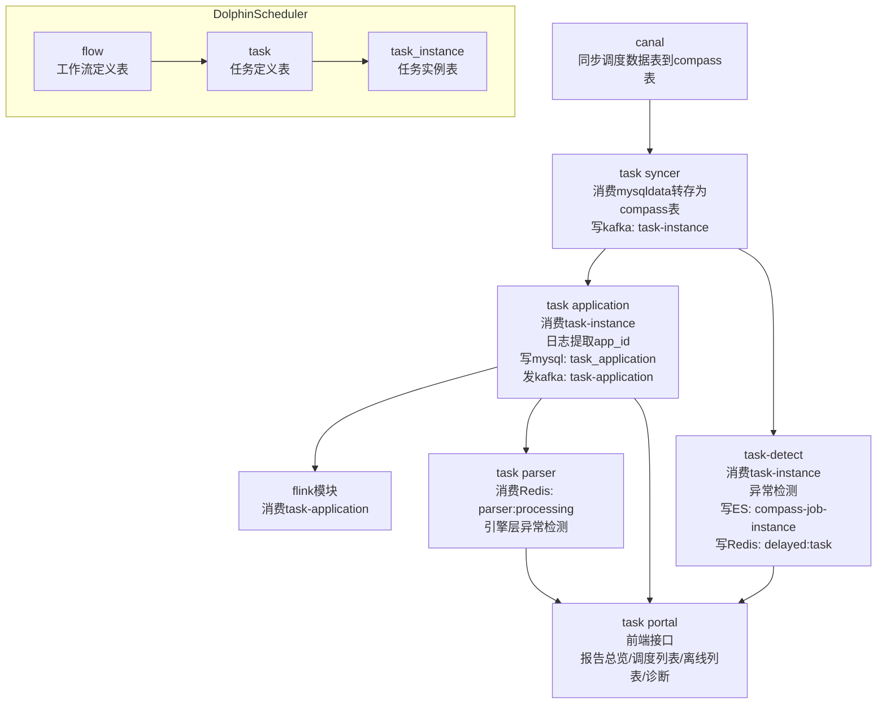
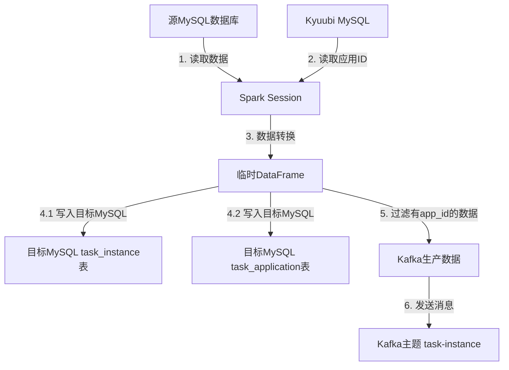

<script src="https://cdn.jsdelivr.net/npm/mermaid@10/dist/mermaid.min.js"></script>
<script>
  mermaid.initialize({ startOnLoad: true });
</script>

<div class="outline" style="background:#f6f8fa;padding:1em 1.5em 1em 1.5em;margin-bottom:2em;border-radius:8px;">
  <strong>大纲：</strong>
  <ul id="outline-list" style="margin:0;padding-left:1.2em;"></ul>
</div>


# compass诊断平台模块分析
应用文档可以直接查看：https://github.com/cubefs/compass   
因:调度系统是自研的，mysql平台不支持canal采集,这里对源码做了分析，进行了数据对接和转换



## canal作用
通过kafka 主题为:mysqldata, 进行同步调度数据表到compass表  
adapter主要是适配不同调度表数据，主要配置srcDataSources:源调度的数据源， canalAdapters:目标数据源
具体表转换规则在：task-canal-adapter/src/main/adapter/conf/rdb/xx.yml 进行配置

## task metadata
主要是同步spark yarn 的作业元数据

## task syncer
通过消费 kafka主题:mysqldata的调度mysql表数据，转存为compass表 
并且写kafka入信息(xx_task_instance表)：消费topic：mysqldata  ->  发送 topic:task-instance

## task application
将工作流层与引擎层元数据关联  
消费 kafka主题:task-instance, 通过task_instance.id从task_instance表中查询出实例信息  
通过解析日志文件，使用正则表达式匹配提取出来找到对应的application_id,->rules.extractLog.name
转换数据后写入mysql -> compass.task_application表中，
并将TaskApplication信息发送到kafka -> 主题为:task-application ->flink模块进行消费


## task-detect
模块进行工作流层异常任务检测，例如运行失败、基线耗时异常等  
DetectedTask通过消费kafka主题：task-instance进行处理逻辑,取到的是task实例信息，  
再通过projectName,flowName,taskName,executionTime去mysql表：task_application查询出app信息，  
然后把诊断结果写入  
ES -> (compass-job-instance)   
延迟的实例处理（缺少appid）   
Redis -> ({lua}:delayed:task)    
DelayedTask延迟任务处理，通过spingBoot->CommandLineRunner实现启动时运行  


## task parser
进行引擎层异常任务检测，例如SQL失败、Shuffle失败等 
从redis中消费->{lua}:parser:processing 

## task portal
前端页面展示相关接口模块
报告总览      ReportController -> /api/v1/report  
调度列表入口为 AppController -> /api/v1/app/list  -> 查询ES索引compass-task-app*   
离线列表入口为 JobController -> /api/v1/job/list  -> 查询ES索上compass-job-analysis*  
离线诊断入口  /openapi/offline/app/metadata -> redis:{lua}:log:record ->| task-parser -> RedisConsumer数据消费  redis:{lua}:log:record 


## dolphinScheduler主要表关系
flow 表（工作流定义表）  
task 表（任务定义表）  
task_instance 表（任务实例表）  

### 三者的关系   
#### 层级关系：
  一个 flow（工作流）包含多个 task（任务节点）  
  当工作流被执行时，会生成工作流实例，同时为每个任务节点生成 task_instance  
#### 数据流向：
  用户先定义 flow（工作流）  
  在 flow 中添加多个 task（任务节点）并设置依赖关系  
  调度或手动触发时，系统根据 flow 和 task 定义生成 task_instance 执行  
#### 生命周期：
  flow 和 task 是静态定义，一般不随执行改变  
  task_instance 是动态生成的，每次执行都会创建新记录  


# 自定义调度系统表转换流程
这里采用了spark每小时采集定义调度系统和kyuubi表信息，找到调度->实例->application相关信息，批量清洗完数据后，统一批次发送到kafka,  
诊断系统（task-detect）会消费kafka消息，来进行自动诊断，把结果存入ES进行展示，这里就直接跳过了task-canal和task-applicaion项目处理的逻辑。
 



流程步骤说明
数据源读取

## 数据源读取
###  源MySQL：
表：JOB_INST_1（实例信息）、JOB_DESC（任务描述）、HOST_GROUP_DEF（主机组:调度没有flow概念，只有依赖拓扑关系，占时用这个代替，后面再清先转换）  
 SQL条件：筛选指定时间范围（dateStartHour到当日23:59:59）且任务类型为99或96的记录。  

### Kyuubi MySQL：
表：sqlmetadata   获取Spark任务的application_id，按时间范围过滤并去重。  


## 数据转换

### UDF处理：
getTaskType：将数字任务类型转换为字符串（如99→SPARK）。  
getTaskState：将状态码转为文本（如1→success）。  
getTriggerType：区分触发类型（schedule或manual）。  
getExecutionTime：规范化时间格式。  
### 字段映射：
#### 字段映射逻辑：参考代码注释中的海猫（源系统）与Compass（目标系统）字段对应关系。
源字段（如BUSI_GRP）→目标字段（如project_name）...等
数据写入目标MySQL
task_instance表：
使用临时表+ON DUPLICATE KEY UPDATE实现幂等写入（按id更新）。
task_application表：
关联实例数据与application_id，写入任务应用信息。  
...
## Kafka消息生产
数据过滤：仅选择包含application_id的实例记录。
### 消息格式：    
```
{
  "rawData": null,
  "body": {
    "id": "实例ID",
    "projectName": "项目名",
    "flowName": "流名称",
    ...
  },
  "eventType": "INSERT",
  "table": "task_instance"
}
```
### 最终效果预览


# 后续优化
  默认诊断不符合当前效果，后续需要结合实际场景，给出优化建议

<script>
// 支持点击二级标题时，收起其下所有内容（包括三级及更深标题和内容）
// 并自动生成大纲目录
document.addEventListener('DOMContentLoaded', function() {
  // 折叠功能
  function getFoldContent(header) {
    let content = [];
    let el = header.nextElementSibling;
    while (el && !(el.tagName && /^H[1-6]$/.test(el.tagName) && el.tagName <= header.tagName)) {
      content.push(el);
      el = el.nextElementSibling;
    }
    return content;
  }
  document.querySelectorAll('h2, h3, h4').forEach(function(h) {
    h.classList.add('fold-title');
    let content = getFoldContent(h);
    if (content.length) {
      content.forEach(e => e.classList.add('fold-content'));
      h.addEventListener('click', function() {
        const collapsed = !h.classList.contains('collapsed');
        content.forEach(e => e.classList.toggle('collapsed', collapsed));
        h.classList.toggle('collapsed', collapsed);
      });
    }
  });
  // 大纲功能
  var outline = document.getElementById('outline-list');
  if (outline) {
    document.querySelectorAll('h2').forEach(function(h, i) {
      var txt = h.textContent.replace(/^#+/, '').trim();
      // 过滤掉“博客记录”或其它不想显示的大纲项
      if (txt === '博客记录') return;
      if (!h.id) h.id = 'outline-h2-' + i;
      var li = document.createElement('li');
      var a = document.createElement('a');
      a.href = '#' + h.id;
      a.textContent = txt;
      li.appendChild(a);
      outline.appendChild(li);
    });
  }
});
</script>


<link rel="stylesheet" href="/assets/blog.css">
<script>
function toggleBlogNav() {
  var nav = document.querySelector('.blog-nav');
  nav.classList.toggle('collapsed');
}

</script>
  <nav class="blog-nav">
    <button class="collapse-btn" onclick="toggleBlogNav()">☰</button>
    
</nav>