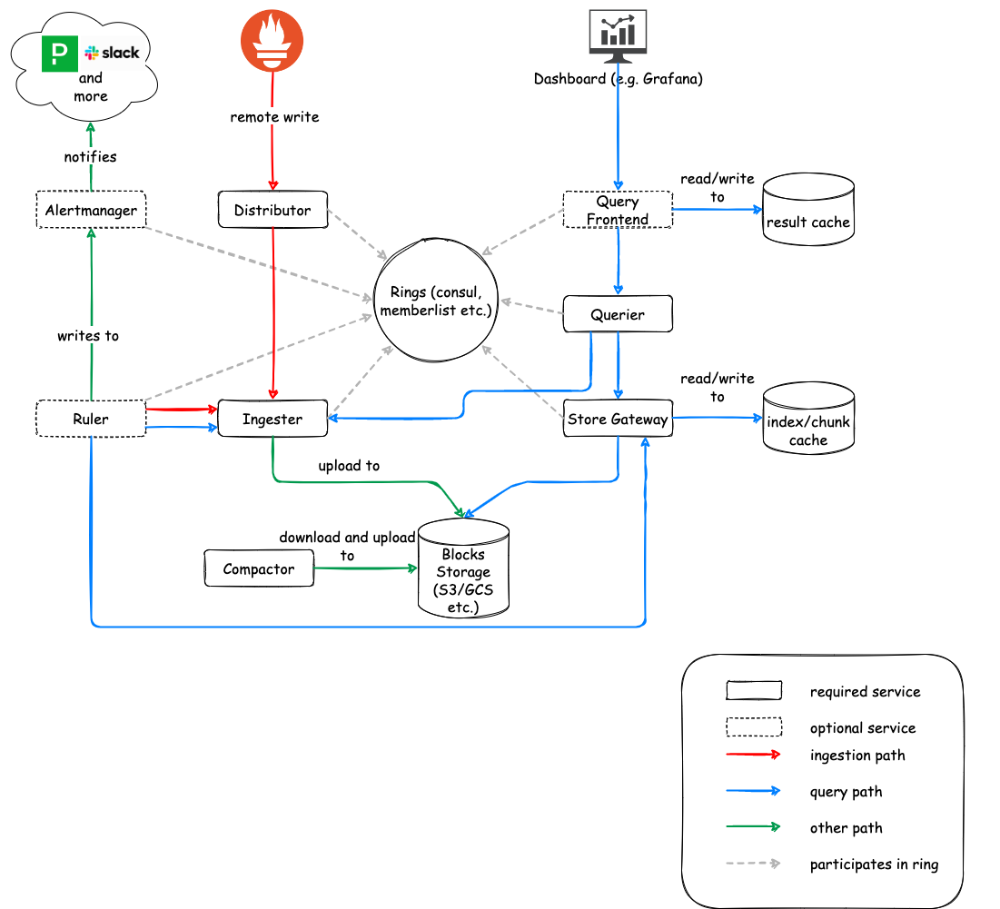
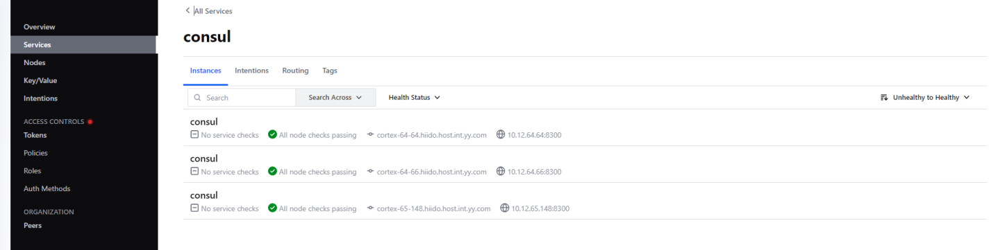
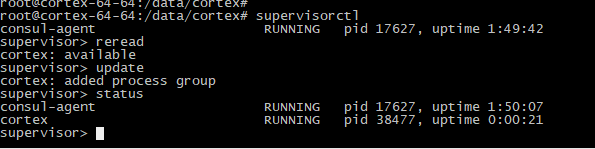

<div class="post-date">
  <span class="calendar-icon">📅</span>
  <span class="date-label">发布：</span>
  <time datetime="2025-07-20" class="date-value">2025-11-20</time>
</div>

<div class="outline" style="background:#f6f8fa;padding:1em 1.5em 1em 1.5em;margin-bottom:2em;border-radius:8px;">
  <strong>大纲：</strong>
  <ul id="outline-list" style="margin:0;padding-left:1.2em;"></ul>
</div>

# cortex统一存储prometheus

## 参考文档
官方文档:https://cortexmetrics.io/docs/architecture/  
AWS服务化：https://aws.amazon.com/cn/prometheus/  
cortex 架构图  


## cortex部署
### 说明
  - 目前cortex生产会推荐存在云盘上，没有对本地磁盘做远端存储开发副本功能。因些需要手动搭建一个nfs磁盘共享，并备份功能。
 - cortex主要实现了Prometheus远端存储，集群复制数据功能。
 - 目前是用本地磁盘存储，cortex建议存放在AWS S3或都其它运存储服务上，让数据从本地管理中解脱出来，这个后期有需求在接入。

### consul部署
cortex需要consul做分布式协调 
配置文件：/etc/consul.d/consul.hcl
```
# Copyright (c) HashiCorp, Inc.
# SPDX-License-Identifier: MPL-2.0

# Full configuration options can be found at https://www.consul.io/docs/agent/config
datacenter = "bigdata-dc-1"
data_dir = "/data/consul"
#client_addr = "0.0.0.0"
client_addr = "{{ GetPrivateInterfaces | exclude \"type\" \"ipv6\" | join \"address\" \" \" }} {{ GetAllInterfaces | include \"flags\" \"loopback\" | join \"address\" \" \" }}"

# ui
ui_config{
  enabled = true
}
# server
server = true
# Bind addr
bind_addr = "10.12.65.148" # Listen on all IPv4
bootstrap_expect=3
retry_join = ["cortex-64-64.hiido.host.int.xx.com", "cortex-64-66.hiido.host.int.xx.com"]

```
服务状态 
基于supversior进行管理 
  


 ### cortex启动脚本  
 onsul.hostname需要配置LSV    
 ```
 [program:cortex]
command=/data/cortex/cortex -config.file=/data/cortex/conf/consul-config-blocks-local.yaml  -distributor.ring.instance-interface-names=bond0 
    -ingester.lifecycler.interface=bond0 
    -frontend.instance-interface-names=bond0 
    -ruler.ring.instance-interface-names=bond0 
    -alertmanager.sharding-ring.instance-interface-names=bond0 
    -compactor.ring.instance-interface-names=bond0 
    -store-gateway.sharding-ring.instance-interface-names=bond0
    -ring.store=consul 
    -consul.hostname=cortex-65-148.hiido.host.int.xx.com:8500 
    -distributor.replication-factor=3     
autostart=true
autorestart=true
startretries=5
stderr_logfile=/data/logs/cortex/stderr.log
stderr_logfile_maxbytes=50MB
stdout_logfile=/data/logs/cortex/stdout.log
stdout_logfile_maxbytes=50MB
 ```
### supervisor管理
ubuntu 安装supervisor服务
```bash
apt-get update -y 
apt-get remove supervisor -y
apt install python-pip -y
pip install supervisor

/usr/local/bin/supervisord 
echo_supervisord_conf > /etc/supervisord.conf
-- add files = /etc/supervisor/conf.d/*.conf
supervisord -c /etc/supervisord.conf

supervisorctl status
```
 

## 使用
### prometheus接入 

X-Scope-OrgID不可重复，fake是默认的  
需要定义一个规则例：项目名_服务名_自定义区分  
cortex会根据这个名字来分不同目录存储，实现租户数据隔离  

```
remote_write:
  - url: http://10.12.xx.3:9009/api/v1/push
    headers:
      X-Scope-OrgID: fake

#Read data from Cortex.
remote_read:
  - url: http://10.12.xx.3:9009/prometheus/api/v1/read
    headers:
      X-Scope-OrgID: fake
```
### 关于查询加速
如果查询量很大，需要考虑启用cache来加速查询，可配置为redis或memcahce,详细启用参考  
https://cortexmetrics.io/docs/configuration/configuration-file/#redis_config

### 磁盘存储
#### 介绍
 没有云存储预算，这里是基于磁盘NFS功能做统一存储  
 NFS文档：https://ubuntu.com/server/docs/service-nfs
 ```
apt install nfs-kernel-server
exportfs -a
sudo echo /data1/nfs/cortex  *(rw,sync,no_subtree_check,no_root_squash) >> /etc/exports

# client
apt install nfs-common
sudo mkdir -p /data/nfs_client/cortex
usermod -a -G execute root

# mount 
sudo mount fs-dn-12-65-xx.xx.com:/data1/nfs/cortex/ /data/nfs_client/cortex

sudo mount -t nfs fs-dn-12-65-xx.xx.com:/data1/nfs/cortex/ /data/nfs_client/cortex
 ```

#### 远程同步 备份数据
```
nohup rsync -rav --append --delete  cornfs@fs-hiido-dn-12-65-xx.xx.com:/data1/nfs/cortex/  /data1/nfs/cortex/ >> /data1/nfs/rsync.log 2>&1  &

-----软链
mkdir -p /data2/nfs/cortex/tsdb/
chown -R cornfs:root /data2/nfs/cortex
mv    /data1/nfs/cortex/tsdb/yarn_app_finish /data2/nfs/cortex/tsdb/
ln -s /data2/nfs/cortex/tsdb/yarn_app_finish    /data1/nfs/cortex/tsdb/yarn_app_finish
```


<!--菜单栏-->
  <nav class="blog-nav">
    <button class="collapse-btn" onclick="toggleBlogNav()">☰</button>
    
 </nav>

 <script src="/assets/blog.js"></script>
<link rel="stylesheet" href="/assets/blog.css">