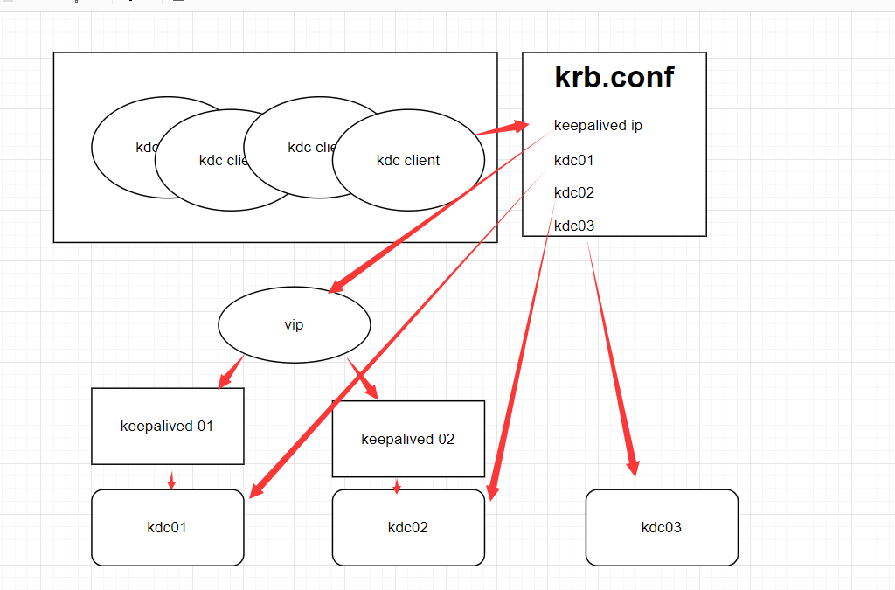

# 服务HA说明
**HA:高可用性(High Availability)**    
&nbsp;&nbsp; 一个节点挂了，另一台节点切为主节点。hdfs namenode 和yarn resouceManager 服务主要是通过zk来实现的HA主从，namenode还有一个zkfc的服务来检测主从状态，进行切换。客户端是通过配置来找主节点，客户端也是先偿试nn1,如果nn1是主点就直接连接例用,如果nn2为主节点，nn1会返回主从状态，客户端再偿试nn2的连接。   
&nbsp;&nbsp; KDC服务将数据库存储在LDAP的情况下（原则上是可以做分布式访问，做负载均衡，不像namenode那样只允许一台主节点来保证数据一强一致性。并发控制交给LDAP服务处理）
   但是有一个致命的问题，就是发现krb5.conf里面配置多个kdc服务的时候，不某台kdc服务进程还在，但会卡住的情况下，或者某台kdc服务下线后，客户端还是会连接那台KDC服务做认证，通过debug调试可以看到。这是一个致命的问题，因此需要手动处理这种问题，就是用keepalived来实现自己检测来切换。


## keepalived 实现KDC HA
### keepalived简介
&nbsp;&nbsp;Keepalived 实现了一系列检查器，用于根据服务器的健康状况动态自适应地维护和管理负载均衡的服务器池。另一方面，高可用性是通过 VRRP协议实现的。VRRP 是路由器故障转移的基础。此外，Keepalived 还实现了一组 VRRP 有限状态机的钩子，以提供底层和高速的协议交互。为了提供最快的网络故障检测，Keepalived 实现了BFD协议。VRRP 状态转换可以考虑 BFD 提示，从而实现快速状态转换。Keepalived 的各个框架可以独立使用，也可以组合使用，以构建弹性基础设施  
### 安装部署
下载：<a href="https://www.keepalived.org/download.html"> keepalived</a>

**配置示例**
```
global_defs {
   router_id keep_kinit
}

vrrp_script chk_kinit {

    script "/data/keep/script/chk_kinit.sh"    # 示例为检查sshd服务是否运行中

    interval 5         # 检查间隔时间
    weight -50          # 检查失败降低的权重
        rise 5                          # 成功多少次重新上线
        fall 2                          # 失败多少次标记为失败
        timeout 4                       # 脚本超时时间

}


# VRRP实例 定义对外提供服务的VIP区域及其相关属性
vrrp_instance VI_1 {

    state MASTER           # 状态只有 MASTER 和 BACKUP 两种，并且要大写，MASTER 为工作状态，BACKUP 是备用状态
    interface bond0         # 节点固有IP(非VIP)的网卡，用来发VRRP包
    virtual_router_id 69   # 虚拟路由标识，同一个 vrrp_instance 的 MASTER 和 BACKUP 的 vitrual_router_id 需要一致
    priority 100           # 优先级，同一个 vrrp_instance 的 MASTER 优先级必须比 BACKUP 高
    advert_int 1           # MASTER 与 BACKUP 负载均衡器之间同步检查的时间间隔，单位为秒

    authentication {       # 设置认证
        auth_type PASS     # 认证方式，支持 PASS 和 HA 
        auth_pass 11111     # 证密码为明文，同一 vrrp 实例 MASTER 与 BACKUP 使用相同的密码才能正常通信
    }

    virtual_ipaddress {    # 虚拟IP地址(VIP)，可以有多个地址，每个地址占一行
        10.12.100.100
    }

    track_script {         # 自定义健康检查脚本
        chk_kinit           # 配置上面自定义的vrrp脚本调用名
    }

        notify /data/keep/script/notify.sh
}

```  
说明： virtual_ipaddress:10.12.100.100 是VIP，可同时绑定到多台物理机，实现ip飘逸。通过自定检查脚本来控制权限，实现切换主从物理ip。    
例如初始状态：
```
节点A（MASTER）：
  - 实际 IP：10.12.11.100
  - 持有 VIP：10.12.100.100
  - 优先级：90

节点B（BACKUP）：
  - 实际 IP：10.12.11.101
  - 优先级：80
```

故障发生时：
```bash
# 节点A执行健康检查失败
$ /home/joey/script/chk_kinit.sh
# 返回非0，检测失败

# 节点A发送 VRRP 通告，携带降低后的优先级：40
# 节点B收到通告，发现自己的优先级 80 > 40

# 节点B成为新的 MASTER
# 节点B执行：
ip addr add VIP：10.12.100.100/32 dev eth1
arping -c 3 -U -I eth1 VIP：10.12.100.100
```


**自定义检查切换脚本**
`/data/keep/script/chk_kinit.sh`
```shell
#!/bin/bash
DIR=/data/keep/kdc/data
test -d $DIR || mkdir -p $DIR
export KRB5CCNAME=DIR:$DIR
date >>/data/keep/script/chk.log
kinit dev_op -kt /data/keep/kdc/dev_op.keytab >>/data/keep/script/chk.log 2>&1
```
**异常切主从触发告警**
`/data/keep/script/notify.sh`
```
#!/bin/bash

TYPE=$1
NAME=$2
STATE=$3
ID=xx
SID=xx
MSG_MASTER="ipa4_3 Keepalived state on $HOSTNAME change to MASTER!!"
MSG_BACKUP="ipa4_3 Keepalived state on $HOSTNAME change to BACKUP!!"
MSG_FAULT="ipa4_3 Keepalived state on $HOSTNAME change to FAULT!!"
MSG_UNKNOWN="ipa4_3 Keepalived state on $HOSTNAME change to UNKNOWN!!"
PY_SCRIPT=/home/xx/yyms/yymp/yymp_report_script/yymp_report_alarm.py 
case $STATE in
        "MASTER") $PY_SCRIPT "id=$ID&sid=$SID&msg=$MSG_MASTER"
                  exit 0
                  ;;
        "BACKUP") $PY_SCRIPT "id=$ID&sid=$SID&msg=$MSG_BACKUP"
                  exit 0
                  ;;
        "FAULT")  $PY_SCRIPT "id=$ID&sid=$SID&msg=$MSG_FAULT"
                  exit 0
                  ;;
        *)        $PY_SCRIPT "id=$ID&sid=$SID&msg=$MSG_UNKNOWN"
                  exit 1
                  ;;
esac
```
##  监控建议

### 查看 keepalived 相关状态
```bash 
keepalived -h  # 查看帮助
sbin/keepalived  -D # 以守护进程（daemon）启动
sbin/keepalived  -f /etc/keepalived/keepalived.conf  -D # 指定配置文件

ip addr show eth1           # 查看VIP绑定
keepalived -v               # 查看版本
systemctl status keepalived # 查看服务状态

# 2. 查看VRRP状态
cat /proc/net/vrrp

# 3. 测试VIP可达性
ping 10.12.11.168

# 4. 查看ARP表
arp -n | grep 10.12.11.168

# 5. 手动切换测试（在BACKUP节点）
killall keepalived

```

例：ip addr show bond0  会有多个ip,vip在那台就说明那台是主节点。   
``` 
bond0: <BROADCAST,MULTICAST,MASTER,UP,LOWER_UP> mtu 1500 qdisc noqueue state UP group default qlen 1000
    link/ether 24:6e:96:73:66:20 brd ff:ff:ff:ff:ff:ff
    inet 10.12.65.189/24 brd 10.12.65.255 scope global bond0
       valid_lft forever preferred_lft forever
    inet 10.12.100.100/32 scope global bond0
       valid_lft forever preferred_lft forever
    inet6 fe80::266e:96ff:fe73:6620/64 scope link 
       valid_lft forever preferred_lft forever
```     
**配置效果图**   
客户端从第一个 KDC 开始尝试,即使第一个kdc服务卡死了，但通过我们的keepalived检查脚本，会发现kinit不行了，就会立刻切换到另一台kdc服务，而不是让客户端一直处理卡顿状态，客户端无感知的，还是一样的连接vip的虚拟ip。    
    

## 扩展知识:HAProxy结合Keepalived
- HAProxy和Keepalived是两个互补的组件，它们结合使用可以构建高可用、高性能的负载均衡解决方案。    
- 这种可以通过ha-proxy服务来管理多个keepalived，ha-proxy分发流量管理,keeplived来实现自己的ip飘逸。    

### HAProxy
专业的负载均衡器:<a href="https://www.haproxy.org/">官方文档</a>  
专注于请求分发、流量管理  
支持TCP/HTTP/HTTPS等多种协议  
提供健康检查、SSL终止、会话保持等高级功能  
### Keepalived
专业的高可用性管理器  
专注于故障转移和IP地址管理  
实现VRRP协议，管理虚拟IP（VIP）  
监控服务健康状态并触发切换  

### 典型架构  
```
客户端请求
     ↓
 虚拟IP (VIP: 192.168.1.100)
     ↓
┌─────────────────────┐
│   HAProxy主节点     │ ←─┐
│ (Keepalived Master) │   │
└─────────────────────┘   │ Keepalived VRRP协议
     ↓                    │ 实现VIP漂移
后端服务器集群             │
(Web/App/Database)       │
                         │
┌─────────────────────┐   │
│   HAProxy备节点     │ ←─┘
│ (Keepalived Backup) │
└─────────────────────┘
```


<div class="post-date">
  <span class="calendar-icon">📅</span>
  <span class="date-label">发布：</span>
  <time datetime="2025-12-04" class="date-value">2025-12-04</time>
</div>

<div class="outline" style="background:#f6f8fa;padding:1em 1.5em 1em 1.5em;margin-bottom:1em;border-radius:8px;">
  <strong>大纲：</strong>
  <ul id="outline-list" style="margin:0;padding-left:1.2em;"></ul>
</div>

<!--菜单栏-->
  <nav class="blog-nav">
    <button class="collapse-btn" onclick="toggleBlogNav()">☰</button>
    
 </nav>

 <script src="/assets/blog.js"></script>
<link rel="stylesheet" href="/assets/blog.css">