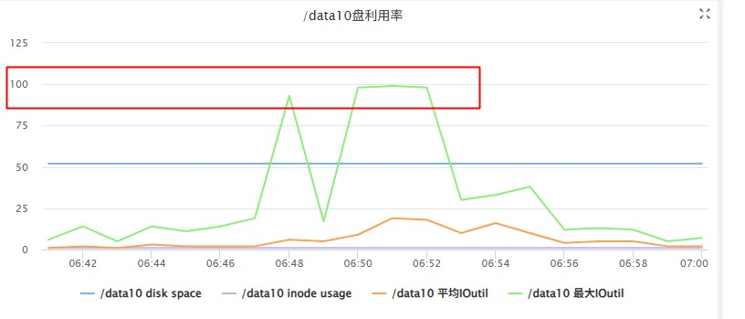
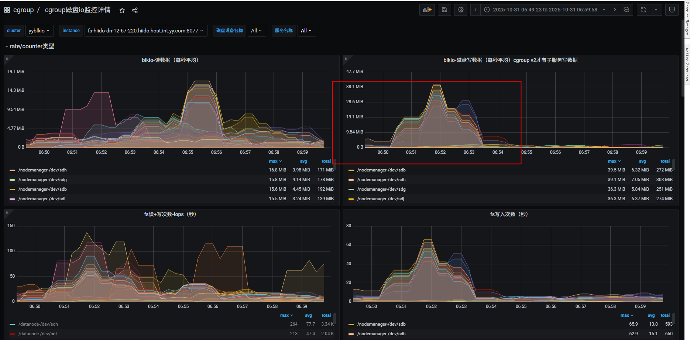
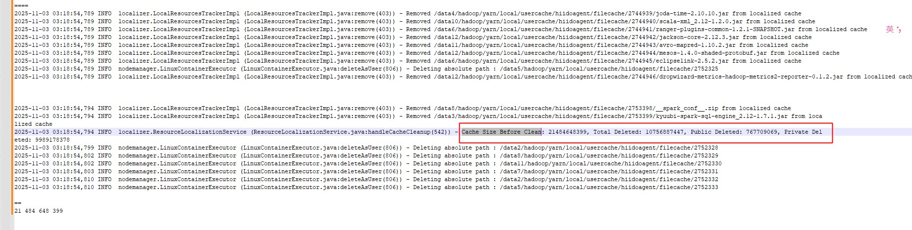
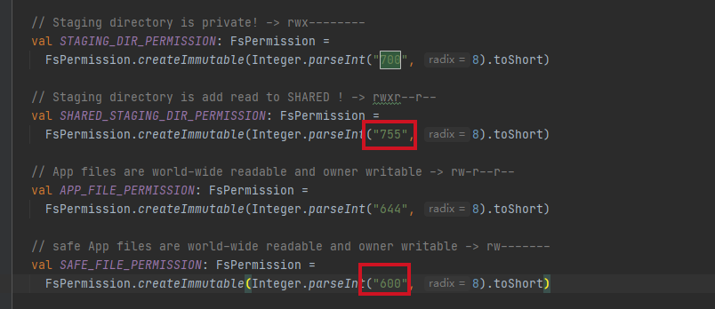
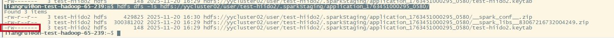

<div class="post-date">
  <span class="calendar-icon">📅</span>
  <span class="date-label">发布：</span>
  <time datetime="2025-11-20" class="date-value">2025-11-20</time>
</div>

<div class="outline" style="background:#f6f8fa;padding:1em 1.5em 1em 1.5em;margin-bottom:2em;border-radius:8px;">
  <strong>大纲：</strong>
  <ul id="outline-list" style="margin:0;padding-left:1.2em;"></ul>
</div>

# YARN共享缓存
## 需求背景
  目前我们hadoop集群是混部署方式，一台服务器上有dn,nm,shuffle服务，经常在作业高峰期的时候，出现集群服务器磁盘io使用100%的情况，  
  通过磁盘监控，发现nodemanger也会存在偶你磁盘读写很大，把iotuil打满的情况。
  <a href="https://liangrui198.github.io/blog/bigdata/ops/blkio.html">磁盘io隔离监控</a>  
  
  
 

## 问题排查
通过日志定位到是这短时间有大量delete /datax/xx/logs/application_xx  
通过分析，发现日志目录不正常，过于大，超过限制10G就会触发删除日志，不断的再删除日志。
日志中看到，yarn locl目录到20G大小，超过了10G（默认配置），发起了删除操作，  
```
2025-11-03 03:18:54,794 INFO  localizer.ResourceLocalizationService (ResourceLocalizationService.java:handleCacheCleanup(542)) - Cache Size Before Clean: 21484648399, Total Deleted: 10756887447, Public Deleted: 767709069, Private Deleted: 9989178378
```  

发现kyuubi-spark-sql-engine_2.12-1.7.1.jar有很多个，没有作业共享共用这个jar,还有其它业务自己的作业第三方jar
备注：其它spark作业依懒的jar我们是以本地形式提交放到服务器上管理的，避免每次进行上传下载。这个kyuubi包特殊，需要用到本地文件方便管理。

spark配置
```
sun.java.command=org.apache.spark.deploy.yarn.ApplicationMaster --class org.apache.kyuubi.engine.spark.SparkSQLEngine --jar file:/data/services/kyuubi_package-t10141512.56c0a726.r/apache-kyuubi-1.7.1-bin/externals/engines/spark/kyuubi-spark-sql-engine_2.12-1.7.1.jar --properties-file /data4/hadoop/yarn/local/usercache/hiidoagent/appcache/application_1759116679106_2472664/container_e258_1759116679106_2472664_01_000002/__spark_conf__/__spark_conf__.properties --dist-cache-conf /data4/hadoop/yarn/local/usercache/hiidoagent/appcache/application_1759116679106_2472664/container_e258_1759116679106_2472664_01_000002/__spark_conf__/__spark_dist_cache__.properties
```

## 解决方案
### spark共享缓存实现：  
https://hadoop.apache.org/docs/r3.1.1/hadoop-yarn/hadoop-yarn-site/SharedCache.html  
https://issues.apache.org/jira/browse/YARN-1492  


### zip文件问题 
 共享缓存第二阶段：https://issues.apache.org/jira/browse/YARN-7282  
 压缩文件异常：(这个补丁只是解决上传解压后的文件，没有意义，因为spark提交的时候是以压缩文件对比md5值，自己已优化成可配置进行压缩后上传，但压缩后的文件md5值会变，这个设置了开关是否进行上传)
 https://issues.apache.org/jira/browse/YARN-9616  
 添加对目录的支持（目前社区没有实现）：目录指的是zip解压后的目录，

#### 实现进行压缩后进行上传  
 增加配置（是否启用zip压缩后上传，默认false）：yararn.sharedcache.zip-enabled=true  
 https://issues.apache.org/jira/browse/YARN-6097  

 异常示例： 
 ```
nodemanger日志：
2025-11-18 15:47:28,962 WARN  sharedcache.SharedCacheUploader (SharedCacheUploader.java:call(173)) - Exception while uploading the file __spark_conf__.zip
java.io.FileNotFoundException: File /data2/hadoop/yarn/local/usercache/test-hiido2/filecache/45/__spark_conf__.zip/__spark_conf__.zip does not exist
        at org.apache.hadoop.fs.RawLocalFileSystem.deprecatedGetFileStatus(RawLocalFileSystem.java:641)
        at org.apache.hadoop.fs.RawLocalFileSystem.getFileLinkStatusInternal(RawLocalFileSystem.java:930)
        at org.apache.hadoop.fs.RawLocalFileSystem.getFileStatus(RawLocalFileSystem.java:631)
        at org.apache.hadoop.fs.FilterFileSystem.getFileStatus(FilterFileSystem.java:454)
        at org.apache.hadoop.fs.ChecksumFileSystem$ChecksumFSInputChecker.<init>(ChecksumFileSystem.java:146)
        at org.apache.hadoop.fs.ChecksumFileSystem.open(ChecksumFileSystem.java:347)
        at org.apache.hadoop.fs.FileSystem.open(FileSystem.java:899)
        at org.apache.hadoop.yarn.server.nodemanager.containermanager.localizer.sharedcache.SharedCacheUploader.computeChecksum(SharedCacheUploader.java:257)
        at org.apache.hadoop.yarn.server.nodemanager.containermanager.localizer.sharedcache.SharedCacheUploader.call(SharedCacheUploader.java:128)
        at org.apache.hadoop.yarn.server.nodemanager.containermanager.localizer.sharedcache.SharedCacheUploader.call(SharedCacheUploader.java:55)
        at java.util.concurrent.FutureTask.run(FutureTask.java:266)
        at java.util.concurrent.ThreadPoolExecutor.runWorker(ThreadPoolExecutor.java:1149)
        at java.util.concurrent.ThreadPoolExecutor$Worker.run(ThreadPoolExecutor.java:624)
        at java.lang.Thread.run(Thread.java:748)
		
local file:
root@test-hadoop-65-19:/home/liangrui# ll /data2/hadoop/yarn/local/usercache/test-hiido2/filecache/45/__spark_conf__.zip
total 192
drwx------ 2 test-hiido2 test-hiido2   4096 Nov 18 15:47 __hadoop_conf__
-r-x------ 1 test-hiido2 test-hiido2   2472 Nov 18 15:47 log4j.properties
-r-x------ 1 test-hiido2 test-hiido2    913 Nov 18 15:47 __spark_conf__.properties
-r-x------ 1 test-hiido2 test-hiido2    832 Nov 18 15:47 __spark_dist_cache__.properties
-r-x------ 1 test-hiido2 test-hiido2 179644 Nov 18 15:47 __spark_hadoop_conf__.xml		
```

## 配置相关
### yarnSharedCache服务端和 nodemanger   
 nodemanger只需要少量节点开启即可，主要用于上传本地文件，如果已存在，不必要检查和上传。  
 SCM节点服务需要通过配置vip的方法做HA主备节点，如果运维的vip不支持kerberos的话，需要用私有的keepalived  
 ``` 
 yarn.sharedcache.enabled=true
 yarn.sharedcache.client-server.address=test-nn-hadoop-76-180.hiido.host.int.yy.com:8045
 yarn.sharedcache.admin.address=test-nn-hadoop-76-180.hiido.host.int.yy.com:8047
 yarn.sharedcache.uploader.server.address=test-nn-hadoop-76-180.hiido.host.int.yy.com:8046
 yarn.sharedcache.webapp.address=test-nn-hadoop-76-180.hiido.host.int.yy.com:8788
 
 # kerberos
  yarn.sharedcache.principal=
  yarn.sharedcache.keytab=
 # ACL默认 *
 security.sharedcachemanager.client.protocol.acl=
 security.sharedcachemanager.admin.protocol.acl=
 security.sharedcachemanager.uploader.protocol.acl=
 ```
 ### spark端
 spark原码中没有实现SCM对接，自已代码实现SCM服务的对接功能，增加以下配置：  
  ```
  默认值如下，可选择关闭
  spark.yarn.sharedCache.enable=true    # 开启SCM共享缓存功能
  spark.yarn.sharedCache.kerberos.enabled=true   #SCM没有kerberos认证的情况下，关闭kerberos认证

  ```

## 权限和认证问题

### kerberos认证问题
1:SCM源码里没有实现kerberos认证，导致启用kerberos连接不上，需要修复这个补丁： https://issues.apache.org/jira/browse/YARN-2774
2: spark和nodemanger也需要修复hadoop yarn-api包
spark:/data/kyuubi/spark3/hadoop-client-api-3.2.4.jar
nodemanger:/usr/hdp/3.1.0.0-78/hadoop-yarn/hadoop-yarn-api-3.1.1.3.1.0.0-78.jar


### 权限问题
#### spark硬编码staging目录是700  
不让任何人访问，私有目录，导致yarn会根据这个参数，对其目录也会私有化用户cache目录下的文件，yarn用户自己也不能读取  
https://github.com/apache/spark/blob/59a2a7474e813b9a6b4c0ec38d01b0fcf2ec38e1/resource-managers/yarn/src/main/scala/org/apache/spark/deploy/yarn/Client.scala#L1432  

```
  // Staging directory is private! -> rwx--------
  val STAGING_DIR_PERMISSION: FsPermission =
    FsPermission.createImmutable(Integer.parseInt("700", 8).toShort)

 // 日志和文件信息：
java.io.FileNotFoundException: /data4/hadoop/yarn/local/usercache/test-hiido2/filecache/27/spark-examples_2.12-3.2.1.jar (Permission denied)
at java.io.FileInputStream.open0(Native Method)
at java.io.FileInputStream.open(FileInputStream.java:195)
at java.io.FileInputStream.<init>(FileInputStream.java:138)
at org.apache.hadoop.fs.RawLocalFileSystem$LocalFSFileInputStream.<init>(RawLocalFileSystem.java:110)
at org.apache.hadoop.fs.RawLocalFileSystem.open(RawLocalFileSystem.java:212)
at org.apache.hadoop.fs.ChecksumFileSystem$ChecksumFSInputChecker.<init>(ChecksumFileSystem.java:147)
at org.apache.hadoop.fs.ChecksumFileSystem.open(ChecksumFileSystem.java:347)
at org.apache.hadoop.fs.FileSystem.open(FileSystem.java:899)
at org.apache.hadoop.yarn.server.nodemanager.containermanager.localizer.sharedcache.SharedCacheUploader.computeChecksum(SharedCacheUploader.java:257)
at org.apache.hadoop.yarn.server.nodemanager.containermanager.localizer.sharedcache.SharedCacheUploader.call(SharedCacheUploader.java:128)
at org.apache.hadoop.yarn.server.nodemanager.containermanager.localizer.sharedcache.SharedCacheUploader.call(SharedCacheUploader.java:55)
at java.util.concurrent.FutureTask.run(FutureTask.java:266)
at java.util.concurrent.ThreadPoolExecutor.runWorker(ThreadPoolExecutor.java:1149)
at java.util.concurrent.ThreadPoolExecutor$Worker.run(ThreadPoolExecutor.java:624)
at java.lang.Thread.run(Thread.java:748)
2025-11-17 16:35:04,713 WARN  sharedcache.SharedCacheUploader (SharedCacheUploader.java:call(173)) - Exception while uploading the file mysql-connector-java-5.1.49.jar
java.io.FileNotFoundException: /data6/hadoop/yarn/local/usercache/test-hiido2/filecache/28/mysql-connector-java-5.1.49.jar (Permission denied)   \n root@test-hadoop-65-19:/home/liangrui# ll  /data4/hadoop/yarn/local/usercache/test-hiido2/filecache/27/
total 1528
-r-x------ 1 test-hiido2 test-hiido2 1560862 Nov 17 16:34 spark-examples_2.12-3.2.1.jar
```
#### 解决
判断是否开启了共享配置 spark.yarn.sharedCache.enable=true的时候，把目录设置为755，其它用户可读，但keyetab重要文件，单独设置为600,其它安全性文件如有也需要设置为600  



## 最终效果
### 优化前
例spark作业：--jars  /home/liangrui/spark/mysql-connector-java-5.1.49.jar
```
/home/liangrui/spark/bin/spark-submit \
--class org.apache.spark.examples.SparkPi \
--conf spark.dynamicAllocation.enabled=false  \
--jars  /home/liangrui/spark/mysql-connector-java-5.1.49.jar \
--conf spark.yarn.am.nodeLabelExpression="test" \
--conf spark.yarn.executor.nodeLabelExpression="test" \
--master yarn --deploy-mode cluster --executor-memory 1G  --driver-memory 1G \
--principal test-hiido2 --keytab /home/liangrui/test-hiido2.keytab --name SparkPi   \
--queue manual --num-executors 2 /home/liangrui/spark/examples/jars/spark-examples_2.12-3.2.1.jar 1000
```

这里会把所认本地依懒上传到hdfs上的tmp目录->下载到nm本地->因为每次application_176344801455_xx不同，导致nm本地每次都会下载->local满了(10G)->批量删除所有文件->一直循环这种操作。

备注:__spark_libs的产生是因为没有手动指定依懒库目录，线上已指向本地（已提前放到服务器本地）
### 优化后
```
25/11/21 11:53:20 INFO Client: local resources use SCM cachedUrl=port: -1 file: "/sharedcache/0/7/1/0713f173852bf33451f3cc69d1f6b46972b12d382610328639ad883a1536f2b9/spark-examples_2.12-3.2.1.jar" linkname=__app__.jar resType=FILE
25/11/21 11:53:20 INFO Client: local resources use SCM cachedUrl=port: -1 file: "/sharedcache/3/9/d/39d77a8f9189dc88a57b551c90353bbb8d1a3a958dcb5c239a1f47c5926cd825/mysql-connector-java-5.1.49.jar" linkname=mysql-connector-java-5.1.49.jar resType=FILE
25/11/21 11:53:20 INFO Client: Uploading resource file:/tmp/spark-62d11926-ce7e-420c-9444-c8e2d68abcf7/__spark_conf__3847913610584909480.zip -> hdfs://yycluster02/user/test-hiido2/.sparkStaging/application_1763451000295_0775/__spark_conf__.zip
```

看日志和tmp目录上mysql-connector-java-5.1.49.jar和spark-examples_2.12-3.2.1.jar都是跳过了上传，并且如果nm本地发现sharedcache/0/7/1/0713f173852bf33451f3cc69d1f6b46972b12d382610328639ad883a1536f2b9/spark-examples_2.12-3.2.1.jar路径一致会做为本地缓存key，也不会从hdfs上重复下载，直接使用上一次cache的文件。
增加启动时间和减少不必要的开销。

### 流程图说明


## 手动上传共享文件到共享库
如果有些文件想要直接到共享库，不经过nm的本地化进行上传，可手动上传，需要编写相应的脚本实现，待验证：
```bash
#!/bin/bash
# upload_to_shared_cache.sh

FILE_PATH=$1
SHARED_CACHE_BASE="/sharedcache"

# 计算MD5
MD5=$(md5sum "$FILE_PATH" | awk '{print $1}')
echo "MD5 checksum: $MD5"

# 生成目录路径（取前3个字符作为目录层级）
DIR1=${MD5:0:1}
DIR2=${MD5:1:1}
DIR3=${MD5:2:1}
TARGET_DIR="$SHARED_CACHE_BASE/$DIR1/$DIR2/$DIR3/$MD5"

echo "Target directory: $TARGET_DIR"

# 创建目录并上传文件
hadoop fs -mkdir -p "$TARGET_DIR"
hadoop fs -put "$FILE_PATH" "$TARGET_DIR/$(basename "$FILE_PATH")"

# 设置权限
hadoop fs -chmod -R 755 "$TARGET_DIR"

echo "File uploaded to shared cache successfully!"
```

## 后续优化

 1：少量 RPC 调用来设置文件状态组： https://issues.apache.org/jira/browse/SPARK-44306  
    这个是linked in那边提交的补丁，是和启用共享缓存后，这个目录对hdfs的压力优化。
    https://engineering.linkedin.com/blog/2023/reducing-apache-spark-application-dependencies-upload-by-99-
 2：zip如何让其内容相同，压缩后文件的验校值也一样的问题，看看压缩规则能不能做到一致性


<!--菜单栏-->
  <nav class="blog-nav">
    <button class="collapse-btn" onclick="toggleBlogNav()">☰</button>
    
 </nav>