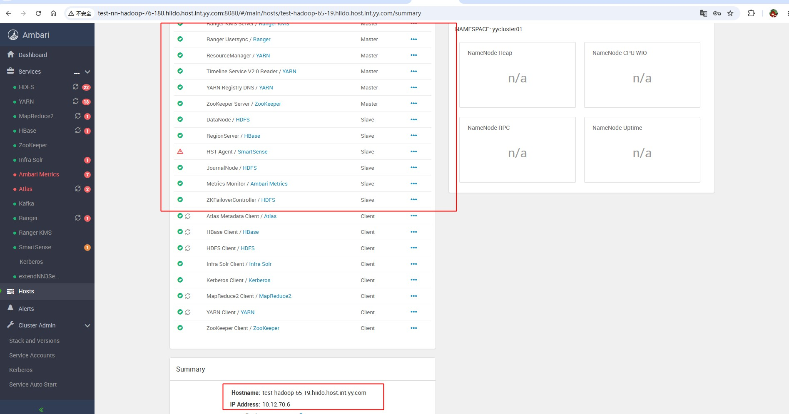

# YARN RM更换服务器
## 需求背景
YARN RM服务是调度全部NM服务资源管理，很重要，当前服务器比较老，是10年前的服务，存在挂机风险。  
当前的服务器机架也需要搬迁，老机器搬迁也存在很大风险，可能搬迁后无法启动，因此需要更换新的服务器。  
 

## 更换步骤
1：直接用一台新的服务器安装好ambari+hadoop环境，  
2：用数据同步的方式同步文件，主要包括 RM jar包依懒和keytab文件。  
3：更换掉hostname，使原来的hostname域名映身到新的ip上，完整机器更换保留原来的域名，所有服务无感知，不需要做任何操作。  

## 测试流程验证
测试环境RM服务在：10.12.65.2  (测试环境上混部署服务太多，线上只有RM，这里一起全部做了服务更换验证)  
新服务器:10.12.70.6  

```shell 

#2台机器停止
ambari-agent stop 
ambari-agent stop 

#10.12.70.6上同步用户数据

从远程下载keytab   并保留权限一致
# 切换到 root 用户或使用 sudo
# -c: 创建归档
# -v: 显示过程
# -p: 保留权限和所有者信息
# -z: 使用 gzip 压缩
# -f: 指定文件名
# --xattrs: 保留扩展属性（Hadoop/Kerberos 有时会用到）
tar -cvpzf keytabs.tar.gz -C / etc/security/keytabs --xattrs
scp -P 32200   liangrui06@10.12.65.2:/etc/security/keytabs.tar.gz    /home/liangrui06/
#在根目录解决，保留一样的权限和标识
mv /etc/security/keytabs /etc/security/keytabs_back202606
cd /
sudo tar -xvpzf /home/liangrui06/keytabs.tar.gz --same-owner --xattrs


##从远程下载hadoop配置和jar 并保留权限一致
# sudo tar -cvpzf hdp_backup.tar.gz -C / usr/hdp --xattrs
cd /
sudo tar -cvpzf /home/liangrui06/hdp_ultimate_backup.tar.gz -C / usr/hdp etc/hadoop  --xattrs
scp -P 32200   liangrui06@10.12.65.2:/home/liangrui06/hdp_ultimate_backup.tar.gz   /home/liangrui06/


### 解压
mv /usr/hdp /usr/hdp_back202606
### --same-owner: 尝试还原文件的原始所有者（必须以 root 身份执行）
cd /
tar -xvpzf /home/liangrui06/hdp_ultimate_backup.tar.gz --same-owner --xattrs


# journal 数据同步
sudo mkdir /data/hdfs/
sudo chown -R liangrui06:hadoop /data/hdfs
rsync -avz -e "ssh -p 32200"  --rsync-path="sudo rsync"   liangrui06@10.12.65.2:/data/hdfs/  /data/hdfs/ 
sudo chown -R hdfs:hadoop /data/hdfs

#zk and namenode 数据同步
sudo mkdir -p /data/hadoop
sudo chown -R liangrui06:hadoop /data/hadoop
rsync -avz -e "ssh -p 32200"  --rsync-path="sudo rsync"   liangrui06@10.12.65.2:/data/hadoop/  /data/hadoop/  
sudo chown -R zookeeper:hadoop /data/hadoop/zookeeper
sudo chown -R hdfs:hadoop /data/hadoop/hdfs
# hdfs namenode -bootstrapStandby -force


#solr 数据同步
sudo mkdir -p /data/lib/ambari-infra-solr
sudo chown liangrui06:hadoop /data/lib/ambari-infra-solr
rsync -avz -e "ssh -p 32200"  --rsync-path="sudo rsync"   liangrui06@10.12.65.2:/data/lib/ambari-infra-solr  /data/lib/ambari-infra-solr
sudo chown -R  infra-solr:hadoop /data/lib/ambari-infra-solr

sudo chown liangrui06:hadoop /usr/lib/ambari-infra-solr
rsync -avz -e "ssh -p 32200"  --rsync-path="sudo rsync"   liangrui06@10.12.65.2:/usr/lib/ambari-infra-solr/  /usr/lib/ambari-infra-solr/
sudo chown -R  infra-solr:hadoop /usr/lib/ambari-infra-solr


#usersync  
sudo mkdir  /etc/ranger-usersync
sudo chown liangrui06:hadoop  /etc/ranger-usersync
rsync -avz -e "ssh -p 32200"  --rsync-path="sudo rsync"   liangrui06@10.12.65.2:/etc/ranger-usersync/  /etc/ranger-usersync/
sudo chown -R  ranger:hadoop /etc/ranger-usersync/

#ranger kms
sudo mkdir  /etc/ranger/kms
sudo chown liangrui06:hadoop  /etc/ranger/kms
rsync -avz -e "ssh -p 32200"  --rsync-path="sudo rsync"   liangrui06@10.12.65.2:/etc/ranger/kms/  /etc/ranger/kms/
sudo chown -R  kms:kms /etc/ranger/kms


#hbase
sudo chown liangrui06:hadoop  /etc/hbase
rsync -avz -e "ssh -p 32200"  --rsync-path="sudo rsync"   liangrui06@10.12.65.2:/etc/hbase/  /etc/hbase/
sudo chown -R  hbase:hadoop /etc/hbase/

#atlas 数据同步 是存在Hbase上无需同步本地
sudo chown liangrui06:hadoop  /etc/atlas
rsync -avz -e "ssh -p 32200"  --rsync-path="sudo rsync"   liangrui06@10.12.65.2:/etc/atlas/  /etc/atlas/
sudo chown -R  atlas:hadoop /etc/atlas/

#kafka有数据恢复机制，不需要同步


#启动ambari-agent
ambari-agent start 

#启动进程
/usr/hdp/current/hadoop-hdfs-namenode/bin/hdfs --daemon start  namenode
/usr/hdp/current/hadoop-hdfs-namenode/bin/hdfs --daemon start  journalnode
/usr/hdp/current/hadoop-yarn-resourcemanager/bin/yarn --daemon start resourcemanager

#中间如果缺少相关配置，可以用rsync同步即可
```

## 最终效果
全部完成服务迁移，服务启动正常，新机器为:10.12.70.6  


## 回滚方案
如果有任何问题，直接切换域名映射到老ip，重启服务即可，老服务器上不动任何改动，只更换域名映射。  


<div class="post-date">
  <span class="calendar-icon">📅</span>
  <span class="date-label">发布：</span>
  <time datetime="2026-06-03" class="date-value">2026-06-03</time>
</div>

<div class="outline" style="background:#f6f8fa;padding:1em 1.5em 1em 1.5em;margin-bottom:2em;border-radius:8px;">
  <strong>大纲：</strong>
  <ul id="outline-list" style="margin:0;padding-left:1.2em;"></ul>
</div>

<!--菜单栏-->
  <nav class="blog-nav">
    <button class="collapse-btn" onclick="toggleBlogNav()">☰</button>
    
 </nav>

 <script src="/assets/blog.js"></script>
<link rel="stylesheet" href="/assets/blog.css">
<!--评论区-->
<div id="giscus-comments" style="max-width:900px;margin:2em auto 0 auto;padding:0 1em;"></div>
<script>
  insertGiscusComment('giscus-comments');
</script>