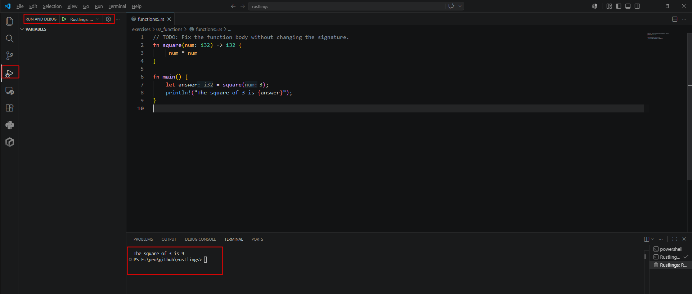
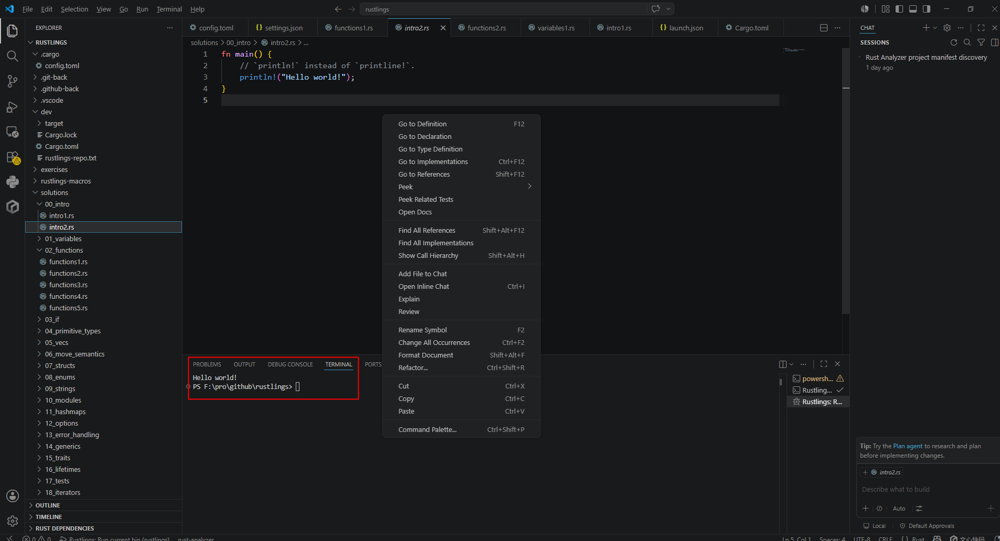

# rust环境和编译
Rust 速度极快，内存效率高：由于没有运行时环境或垃圾回收器，它可以为性能关键型服务提供支持，  
官方文档： https://rust-lang.org/ 
学习资源：https://rust-lang.org/learn

## rust开发环境
官方推荐的开发IDE https://rust-lang.org/zh-CN/tools/    
VS code+rust-analyzer插件（推荐-不收费）
RustRover不推荐，是收费的。 

一个简单的例子： 
```rust
fn main() {
    println!("Hello, world!");
}
```
### 用命令编译运行的例子  
https://doc.rust-lang.org/book/ch02-00-guessing-game-tutorial.html#setting-up-a-new-project  

## 编译环境构建
### windows上例子
使用WSL新建一个machine  
```shell
# 例出可用系统
wsl --list -online

# 查看当前已有的系统
wsl -l -v

# 手动进入系统
wsl -d Ubuntu-22.04

# 或者默认发行版：即可进入 Linux shell。
wsl
wsl -l

# 如果没有需要安装ubuntu22.04 会默认mnt当前目录
wsl --install -d Ubuntu-22.04


# 在ubuntu22.04里进行rust环境
sudo apt update
sudo apt install build-essential curl -y
curl --proto '=https' --tlsv1.2 -sSf https://sh.rustup.rs | sh
. "$HOME/.cargo/env"
cd /mnt/f/pro/testRust
cargo build --release

# error: error calling dlltool 'dlltool.exe': program not found   
# 改用 MSVC 工具链构建
rustup default stable-x86_64-pc-windows-msvc
# 如果只想这个项目用 MSVC
rustup override set stable-x86_64-pc-windows-msvc
cargo build

# 执行二进制文件 会输出Hello, world!
./release/testRust
```
## rust语言学习例子  
https://github.com/rust-lang/rustlings

### 运行rust例子
rustlings里面有2个文件夹，一个是exercises(练习题，里面是错误码代码),一个是solutions(答案)
例:修复好exercises/00_intro/intro2.rs代码进行run    
这里以VS code为例，VS code用的是rust-analyzer插件，对于子目录下的Cargo.toml配置支持的不是很友好， 界面上没的run按钮。   
点击run面板，点击绿色的run按钮， 需要配置.vscode/launch.json文件，在里面配置好rust的运行环境。
 

或者快捷健进行run也行。  
常用几个快捷键：
F5：开始调试 / 运行  
Ctrl+F5：不调试直接运行  
Shift+F5：停止运行  
Ctrl+Shift+P：打开命令面板  
F9：打断点  
F10：单步跳过  
F11：单步进入   



<div class="post-date">
  <span class="calendar-icon">📅</span>
  <span class="date-label">发布：</span>
  <time datetime="2026-06-16" class="date-value">2026-06-03</time>
</div>

<div class="outline" style="background:#f6f8fa;padding:1em 1.5em 1em 1.5em;margin-bottom:2em;border-radius:8px;">
  <strong>大纲：</strong>
  <ul id="outline-list" style="margin:0;padding-left:1.2em;"></ul>
</div>

<!--菜单栏-->
  <nav class="blog-nav">
    <button class="collapse-btn" onclick="toggleBlogNav()">☰</button>
    
 </nav>

 <script src="/assets/blog.js"></script>
<link rel="stylesheet" href="/assets/blog.css">
<!--评论区-->
<div id="giscus-comments" style="max-width:900px;margin:2em auto 0 auto;padding:0 1em;"></div>
<script>
  insertGiscusComment('giscus-comments');
</script>