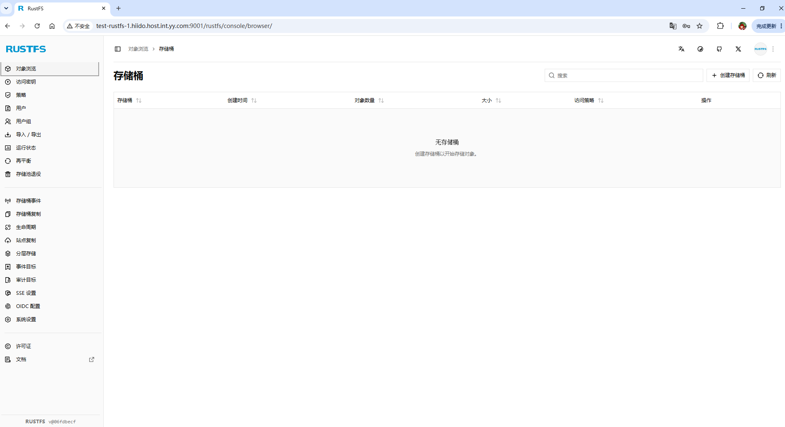

# rustFS环境和编译
RustFS 是一个高性能的分布式对象存储系统，它使用 Rust 语言构建——Rust 是全球最受欢迎的编程语言之一。RustFS 结合了 MinIO 的简洁性和 Rust 的内存安全性和强大的性能。它完全兼容 S3，完全开源，并针对数据湖、人工智能和大数据工作负载进行了优化。    
与其他存储系统不同，RustFS 采用宽松的 Apache 2.0 许可证发布，避免了 AGPL 的限制。RustFS 基于 Rust 语言，为下一代对象存储提供卓越的速度和安全的分布式特性。   
clone源码 https://github.com/rustfs/rustfs    

## rustFS开发环境
这里以VS code为例，VS code用的是rust-analyzer插件。    


 
## 编译工具
```shell
wsl --install -d Ubuntu-22.04

# 安装依懒工具
sudo apt update
sudo apt install -y protobuf-compiler pkg-config build-essential cmake clang
protoc --version


# build
cd /mnt/f/pro/github/rustfs
sudo -s  # 切换到root用户
sudo apt install -y dos2unix
sudo apt install -y zip
dos2unix build-rustfs.sh
./build-rustfs.sh --platform x86_64-unknown-linux-gnu


# 会产出
target/release/x86_64-unknown-linux-gnu/rustfs
```

# 安装

## rust用户
配置一个专门的无登录权限的用户进行启动 RustFS 的服务。在 rustfs.service 启动控制脚本中。  
```shell
# -r 创建系统用户，-M 不创建家目录  -g 指定用户组  
groupadd -r rustfs-user
useradd -M -r -g rustfs-user rustfs-user
mkdir -p /data/logs/rustfs/
chown -R rustfs-user:rustfs-user /data/logs/rustfs/
```

## 磁盘XFS格式化
rustfs 推荐使用XFS格式化磁盘，因为XFS是高性能的文件系统。    
```shell
# 安装xfsprogs
sudo apt-get update && sudo apt-get install xfsprogs
sudo umount /data1
: << 'EOF'
 重新格式化磁盘分区
 我们可以在格式化时加入一些推荐选项来优化性能:
-L <label>: 为文件系统设置一个标签（label），方便后续识别和挂载。
-i size=512: RustFS官方推荐将inode大小设置为512字节，这对于存储大量小对象（元数据）的场景有性能优势。
-n ftype=1: 开启ftype功能。这允许文件系统在目录结构中记录文件类型，可以提高类似readdir和unlink操作的性能，对RustFS非常有利。
-f: 强制格式化，忽略文件系统已存在的警告。
EOF
sudo mkfs.xfs  -i size=512 -n ftype=1 -L RUSTFS1  -f /dev/sdb1

# blkid /dev/sdb1 查看新的 UUID 并更新到 修改fstab
vim /etc/fstab
LABEL=RUSTFS1 /data1   xfs   defaults,noatime,nodiratime   0   0

sudo mount -a

#检查磁盘格式
lsblk -o NAME,TYPE,SIZE,FSTYPE,MOUNTPOINT

```
完整的自动更换磁盘格式类型脚本：  
```shell
#!/bin/bash
set -e

if [[ $EUID -ne 0 ]]; then
   echo "not root user"
   exit 1
fi

START_DISK=1
END_DISK=12

echo "start..."

for i in $(seq $START_DISK $END_DISK); do
    MOUNT_POINT="/data${i}"
    LABEL="RUSTFS${i}"
    
    DEVICE=$(df -P | grep -w "${MOUNT_POINT}$" | awk '{print $1}')

    if [ -z "$DEVICE" ]; then
        echo "wran: not ${MOUNT_POINT} divce skip"
        continue
    fi

    FSTYPE=$(lsblk -no fstype "$DEVICE")
    CURRENT_LABEL=$(blkid -o value -s LABEL "$DEVICE" || echo "")

    if [[ "$FSTYPE" == "xfs" && "$CURRENT_LABEL" == "$LABEL" ]]; then
        echo "skip: ${DEVICE} (${MOUNT_POINT}) exist XFS 。"
        continue
    fi
    # ----------------------------------------------------

    echo "----------------------------------------"
    echo "process: ${DEVICE} -> ${MOUNT_POINT} (label: ${LABEL})"

    umount "${MOUNT_POINT}" 2>/dev/null || true

    # xfs format
    mkfs.xfs -i size=512 -n ftype=1 -L "${LABEL}" -f "${DEVICE}"

    # update fstab
    if grep -qE "\s+${MOUNT_POINT}[[:space:]]" /etc/fstab; then
        sed -i "\|[[:space:]]${MOUNT_POINT}[[:space:]]|c LABEL=${LABEL} ${MOUNT_POINT} xfs defaults,noatime,nodiratime 0 0" /etc/fstab
    else
        echo "LABEL=${LABEL} ${MOUNT_POINT} xfs defaults,noatime,nodiratime 0 0" >> /etc/fstab
    fi
    # new rustfs dir
    mkdir ${MOUNT_POINT}/rustfs
    chown rustfs-user:rustfs-user  ${MOUNT_POINT}/rustfs
done

echo "----------------------------------------"
echo "execution mount -a ..."
mount -a
echo "operation success done!"

```


## 配置环境
```shell
# 多机多盘模式
sudo tee /etc/default/rustfs <<EOF
RUSTFS_ACCESS_KEY=rustfsadmin
RUSTFS_SECRET_KEY=rustfsadmin
RUSTFS_VOLUMES="http://test-rustfs-{1...4}.hiido.host.int.yy.com:9000/data{1...12}/rustfs"
RUSTFS_ADDRESS=":9000"
RUSTFS_CONSOLE_ENABLE=true
RUST_LOG=error
RUSTFS_OBS_LOG_DIRECTORY="/data/logs/rustfs/"
EOF
```

systemd服务文件：  
```shell
sudo tee /etc/systemd/system/rustfs.service <<EOF
[Unit]
Description=RustFS Object Storage Server
Documentation=https://rustfs.com/docs/
After=network-online.target
Wants=network-online.target

[Service]
Type=notify
NotifyAccess=main
User=root
Group=root

WorkingDirectory=/usr/local
EnvironmentFile=-/etc/default/rustfs
ExecStart=/usr/local/rustfs/rustfs \$RUSTFS_VOLUMES

LimitNOFILE=1048576
LimitNPROC=32768
TasksMax=infinity

Restart=always
RestartSec=10s

OOMScoreAdjust=-1000
SendSIGKILL=no

TimeoutStartSec=30s
TimeoutStopSec=30s

NoNewPrivileges=true
 
ProtectHome=true
PrivateTmp=true
PrivateDevices=true
ProtectClock=true
ProtectKernelTunables=true
ProtectKernelModules=true
ProtectControlGroups=true
RestrictSUIDSGID=true
RestrictRealtime=true

# service log configuration
StandardOutput=append:/data/logs/rustfs/rustfs.log
StandardError=append:/data/logs/rustfs/rustfs-err.log

[Install]
WantedBy=multi-user.target
EOF

# 启动服务
sudo systemctl daemon-reload
# 启动服务并设置为开机自启，后面用start即可
sudo systemctl enable --now rustfs
# ll /etc/systemd/system/multi-user.target.wants/ | grep rust
systemctl start rustfs
systemctl restart rustfs
systemctl status rustfs

systemctl stop rustfs
rm -rf /data/logs/rustfs/*
netstat -ntpl

# 手动调试
mkdir -p /data{1..12}/rustfs
chown -R rustfs-user:rustfs-user /data{1..12}/rustfs
chmod -R 755 /data{1..12}/rustfs
export RUSTFS_VOLUMES="$(echo http://test-rustfs-{1..5}.hiido.host.int.yy.com:9000/data{1..12}/rustfs)"
/usr/local/rustfs/rustfs $RUSTFS_VOLUMES

```

## 验证
```shell
root@test-rustfs-5:/data/logs/rustfs# systemctl status rustfs
● rustfs.service - RustFS Object Storage Server
     Loaded: loaded (/etc/systemd/system/rustfs.service; enabled; vendor preset: enabled)
     Active: active (running) since Mon 2026-06-29 15:54:29 CST; 1min 34s ago
       Docs: https://rustfs.com/docs/
   Main PID: 40632 (rustfs)
     Status: "Starting"
      Tasks: 90
     Memory: 33.5M
     CGroup: /system.slice/rustfs.service
             └─40632 /usr/local/rustfs/rustfs http://test-rustfs-{1...4}.hiido.host.int.yy.com:9000/data{1...12}

Jun 29 15:54:29 test-rustfs-5.hiido.host.int.yy.com systemd[1]: Started RustFS Object Storage Server.
```


## login  
user and password : rustfsadmin 


## 客户端使用    
使用 MinIO Client (mc) 工具进行操作。首先，确保已经安装了 mc 客户端。如果还没有安装，可以从 MinIO 的官方网站下载并安装：https://min.io/download#/linux   
```shell
curl -LO https://dl.min.io/client/mc/release/linux-amd64/mc
chmod +x mc
sudo mv mc /usr/local/bin/mc
mc --version
```

配置 RustFS 服务端地址和访问凭证：  
首先需要使用 mc alias 命令配置 RustFS 的别名：  
`mc alias set rustfs http://test-rustfs-1.hiido.host.int.yy.com:9000 rustfsadmin rustfsadmin`

基本命令     
```shell 
# 新建
mc mb rustfs/bucket-test01-by-mc

# 查看桶列表
mc ls rustfs 

# 上传文件
mc cp file_name rustfs/bucket-test01-by-mc
# 查看文件
mc ls rustfs/bucket-test01-by-mc/ 
[2026-06-30 16:13:30 CST]    13B STANDARD hello.txt

# 删除
mc rb rustfs/bucket-test01-by-mc

```

<div class="post-date">
  <span class="calendar-icon">📅</span>
  <span class="date-label">发布：</span>
  <time datetime="2026-06-16" class="date-value">2026-06-16</time>
</div>

<div class="outline" style="background:#f6f8fa;padding:1em 1.5em 1em 1.5em;margin-bottom:2em;border-radius:8px;">
  <strong>大纲：</strong>
  <ul id="outline-list" style="margin:0;padding-left:1.2em;"></ul>
</div>

<!--菜单栏-->
  <nav class="blog-nav">
    <button class="collapse-btn" onclick="toggleBlogNav()">☰</button>
    
 </nav>

 <script src="/assets/blog.js"></script>
<link rel="stylesheet" href="/assets/blog.css">
<!--评论区-->
<div id="giscus-comments" style="max-width:900px;margin:2em auto 0 auto;padding:0 1em;"></div>
<script>
  insertGiscusComment('giscus-comments');
</script>