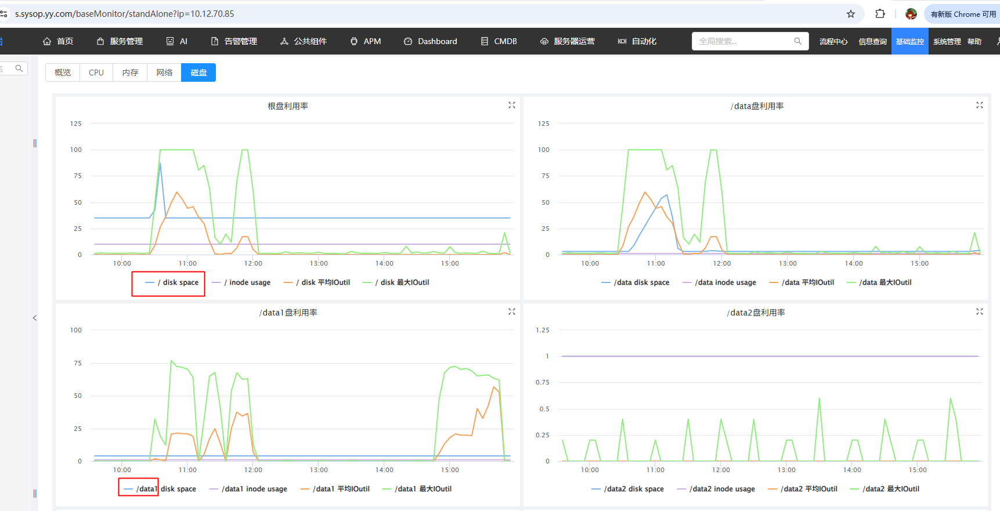
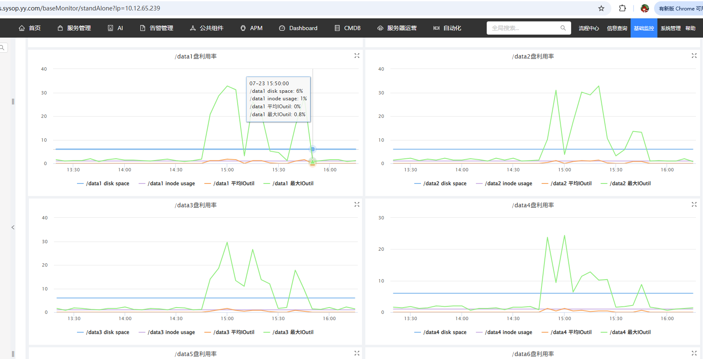
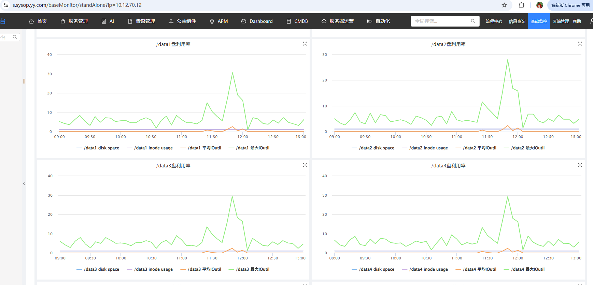

# rustFS和HDFS的压测
主要是想看tensorFlow在rustFS和HDFS上的性能差异。 
环境:ubuntu22.04


## 环境安装
```shell
# pip安装tensorflow和tensorboard-plugin-profile
apt-get install python3-pip

pip install tensorflow==2.16.1
sudo pip install tensorboard-plugin-profile==2.16.0
pip install  tensorflow-io boto3 


# 查看版本
python3 -c "import tensorflow as tf; print('TF:', tf.__version__)"
python3 -c "import tensorflow_io as tfio; print('TF-IO:', tfio.__version__)"


```

## 压测数据逻辑
/data1/test_data/tianmu 包含所有子目录，一共有144.5 G 和137891个文件，分别上传到hdfs和rustfs。 
```shell
find tianmu/ -type f | wc -l
137891
145G    tianmu
```

## 测试写

### tensorFlow Write RustFs压测
```python
import os
import sys
import time
import glob
import tensorflow as tf
import tensorflow_io as tfio

# ==============================================================================
# 1. 确保临时目录设置 (必须确保在 Shell 中 export TMPDIR=/data/tf_tmp)
# ==============================================================================
os.environ["TMPDIR"] = "/data/tf_tmp"
os.environ["TMP"] = "/data/tf_tmp"
os.environ["TEMP"] = "/data/tf_tmp"

# ==============================================================================
# 2. RustFS (S3 协议) 环境变量配置
# ==============================================================================
S3_ENDPOINT = "http://rust-work.yy.com"
AWS_ACCESS_KEY_ID = "accessrustfsadmin"
AWS_SECRET_ACCESS_KEY = "secretrustfsadmin"
BUCKET_NAME = "benchmark-bucket"

# 🧠 注意：S3_ENDPOINT 在 TensorFlow 底层通常需要去除 http:// 前缀或保持一致
os.environ["S3_ENDPOINT"] = S3_ENDPOINT.replace("http://", "").replace("https://", "")
os.environ["AWS_ACCESS_KEY_ID"] = AWS_ACCESS_KEY_ID
os.environ["AWS_SECRET_ACCESS_KEY"] = AWS_SECRET_ACCESS_KEY
os.environ["S3_USE_HTTPS"] = "0"
os.environ["S3_VERIFY_SSL"] = "0"

LOCAL_SRC_DIR = "/data1/test_data/tianmu"
RUSTFS_TARGET_DIR = f"s3://{BUCKET_NAME}/tianmu_tfrecords"

NUM_SHARDS = 100
PROFILER_LOG_DIR = "./logdir/rustfs_write_profile"

def ensure_bucket_exists():
    """使用 TF 内部封装的 API 确认或尝试创建 Bucket"""
    print(f"🪣 正在检查 RustFS Bucket [{BUCKET_NAME}] ...")
    bucket_path = f"s3://{BUCKET_NAME}"
    try:
        if not tf.io.gfile.exists(bucket_path + "/"):
            tf.io.gfile.makedirs(bucket_path + "/")
            print(f"✅ Bucket 创建指令已发送: {BUCKET_NAME}")
        else:
            print(f"✅ Bucket 已存在: {BUCKET_NAME}")
    except Exception as e:
        print(f"⚠️ 桶检查/创建提示 (如果桶已由管理员预先建立可忽略): {e}")

def serialize_file(filepath):
    raw_bytes = tf.io.read_file(filepath)
    filename = tf.strings.split(filepath, os.sep)[-1]
    
    feature = {
        'filename': tf.train.Feature(bytes_list=tf.train.BytesList(value=[filename.numpy()])),
        'data': tf.train.Feature(bytes_list=tf.train.BytesList(value=[raw_bytes.numpy()]))
    }
    example = tf.train.Example(features=tf.train.Features(feature=feature))
    return example.SerializeToString()

def run_rustfs_write_benchmark():
    ensure_bucket_exists()

    print(f"🔍 正在扫描本地目录: {LOCAL_SRC_DIR} ...")
    all_files = glob.glob(f"{LOCAL_SRC_DIR}/**/*", recursive=True)
    all_files = [f for f in all_files if os.path.isfile(f)]
    total_files = len(all_files)
    print(f"✅ 共扫描到 {total_files} 个文件")

    files_per_shard = total_files // NUM_SHARDS
    
    print("\n📸 启动 TensorFlow Profiler 捕获 RustFS 写入性能...")
    tf.profiler.experimental.start(PROFILER_LOG_DIR)
    
    start_time = time.time()
    total_bytes_written = 0

    try:
        for shard_idx in range(NUM_SHARDS):
            shard_path = f"{RUSTFS_TARGET_DIR}/shard_{shard_idx:04d}.tfrecord"
            shard_files = all_files[shard_idx * files_per_shard : (shard_idx + 1) * files_per_shard]
            if shard_idx == NUM_SHARDS - 1:
                shard_files = all_files[shard_idx * files_per_shard:]

            with tf.io.TFRecordWriter(shard_path) as writer:
                for file_path in shard_files:
                    serialized_bytes = serialize_file(file_path)
                    writer.write(serialized_bytes)
                    total_bytes_written += len(serialized_bytes)

            print(f"   [RustFS 写入] 完成分片 {shard_idx + 1}/{NUM_SHARDS} -> {shard_path}")

    finally:
        tf.profiler.experimental.stop()
        print("📸 Profiler 采样结束并成功保存日志！")

    elapsed = time.time() - start_time
    total_gb = total_bytes_written / (1024 ** 3)
    throughput_mb = (total_bytes_written / (1024 ** 2)) / elapsed

    print("=" * 60)
    print(f"🎉 RustFS 真实 TFRecord 写入压测完成！")
    print(f"⏱️ 总耗时   : {elapsed:.2f} 秒")
    print(f"📦 写入数据 : {total_gb:.2f} GB")
    print(f"🚀 平均吞吐 : {throughput_mb:.2f} MB/s")
    print("=" * 60)

if __name__ == "__main__":
    run_rustfs_write_benchmark()

```
output:
```log
...
📸 Profiler 采样结束并成功保存日志！
============================================================
🎉 RustFS 真实 TFRecord 写入压测完成！
⏱️ 总耗时   : 5059.42 秒
📦 写入数据 : 144.52 GB
🚀 平均吞吐 : 29.25 MB/s
============================================================
```

这段代码展示了如何在 TensorFlow 中使用 RustFS 作为后端存储，并通过 tf.data API 进行高并发 I/O 操作。通过设置环境变量和利用 boto3 客户端与 S3 兼容的 RustFS 服务交互，实现了数据的上传、读取以及性能分析的全 
tensorFlow写s3时会在本地生成临时文件，然后上传到RustFS，因为对象存储是 不可变（Immutable） 的。在测试结束后，它会清理这些本地临时文件以释放磁盘空间，注意/tmp目录的空间大小，如果太小需要软连到大磁盘上。


 #### 启动tensorboard 
 指标说明文档：<a href="https://www.tensorflow.org/guide/data_performance_analysis?hl=zh-cn">使用 TF Profiler 分析 tf.data 性能</a>  


### 测试tensorFlow Write HDFS
环境安装：
```shell
apt-get install openjdk-8-jre

```
tensorFlow 读写hdfs的配置,最后是放到/etc/profile.d/tensorflow_hdfs.sh中，然后执行source /etc/profile.d/tensorflow_hdfs.sh  

```shell
# java 环境变量配置
export JAVA_HOME=//usr/lib/jvm/java-8-openjdk-amd64
export PATH=$JAVA_HOME/bin:$PATH

# 1. 确保指定 Hadoop 安装根路径（如果你的 Hadoop 在 /usr/local/hadoop）
export HADOOP_HOME=/usr/local/hadoop
export PATH=$HADOOP_HOME/bin:$PATH

# 2. 补全原生 C 库路径（包含 libhdfs.so）+ Java libjvm.so
JAVA_LIBJVM_DIR=$(dirname $(find $JAVA_HOME/ -name "libjvm.so" 2>/dev/null | head -n 1))
HADOOP_NATIVE_DIR=$HADOOP_HOME/lib/native

export LD_LIBRARY_PATH=$HADOOP_NATIVE_DIR:$JAVA_LIBJVM_DIR:$LD_LIBRARY_PATH

# 3. 将 Hadoop 配置文件目录（core-site.xml, hdfs-site.xml 所在的目录）强制插入 CLASSPATH 最前面
#  注意：如果你的配置文件在 /etc/hadoop/conf，请改为 /etc/hadoop/conf
HADOOP_CONF_DIR=${HADOOP_CONF_DIR:-/etc/hadoop/conf}
export CLASSPATH=$HADOOP_CONF_DIR:$(hadoop classpath --glob)

# 4. 显式指定 Kerberos 认证
export HADOOP_SECURITY_AUTHENTICATION="kerberos"
```

#### 测试代码
python 代码  
```python
import os
import sys
import time
import glob
import tensorflow as tf
import tensorflow_io as tfio

# ==============================================================================
# 1. HDFS 配置 (替换为你实际的 NameNode IP 和 端口)
# ==============================================================================
HDFS_NAMENODE = "yycluster01"    # 🧠 请修改为真实的 HDFS NameNode 地址和端口
HDFS_TARGET_DIR = f"hdfs://{HDFS_NAMENODE}/user/liangrui06/tianmu_tfrecords"

LOCAL_SRC_DIR = "/data1/test_data/tianmu"
NUM_SHARDS = 100
PROFILER_LOG_DIR = "./logdir/hdfs_write_profile"

def ensure_hdfs_dir_exists(target_dir):
    """确保 HDFS 上的目标目录存在"""
    print(f"📁 正在检查并确保 HDFS 目录存在: {target_dir}")
    if not tf.io.gfile.exists(target_dir):
        tf.io.gfile.makedirs(target_dir)
        print(f"✅ 成功创建 HDFS 目录")
    else:
        print(f"✅ HDFS 目录已存在")

def serialize_file(filepath):
    raw_bytes = tf.io.read_file(filepath)
    filename = tf.strings.split(filepath, os.sep)[-1]
    
    feature = {
        'filename': tf.train.Feature(bytes_list=tf.train.BytesList(value=[filename.numpy()])),
        'data': tf.train.Feature(bytes_list=tf.train.BytesList(value=[raw_bytes.numpy()]))
    }
    example = tf.train.Example(features=tf.train.Features(feature=feature))
    return example.SerializeToString()

def run_hdfs_write_benchmark():
    ensure_hdfs_dir_exists(HDFS_TARGET_DIR)

    print(f"🔍 正在扫描本地目录: {LOCAL_SRC_DIR} ...")
    all_files = glob.glob(f"{LOCAL_SRC_DIR}/**/*", recursive=True)
    all_files = [f for f in all_files if os.path.isfile(f)]
    total_files = len(all_files)
    print(f"✅ 共扫描到 {total_files} 个文件")

    files_per_shard = total_files // NUM_SHARDS
    
    print("\n📸 启动 TensorFlow Profiler 捕获 HDFS 写入性能...")
    tf.profiler.experimental.start(PROFILER_LOG_DIR)
    
    start_time = time.time()
    total_bytes_written = 0

    try:
        for shard_idx in range(NUM_SHARDS):
            shard_path = f"{HDFS_TARGET_DIR}/shard_{shard_idx:04d}.tfrecord"
            shard_files = all_files[shard_idx * files_per_shard : (shard_idx + 1) * files_per_shard]
            if shard_idx == NUM_SHARDS - 1:
                shard_files = all_files[shard_idx * files_per_shard:]

            # HDFS 写入是网络 Streaming 模式，不会写爆本地盘
            with tf.io.TFRecordWriter(shard_path) as writer:
                for file_path in shard_files:
                    serialized_bytes = serialize_file(file_path)
                    writer.write(serialized_bytes)
                    total_bytes_written += len(serialized_bytes)

            print(f"   [HDFS 写入] 完成分片 {shard_idx + 1}/{NUM_SHARDS} -> {shard_path}")

    finally:
        tf.profiler.experimental.stop()
        print("📸 Profiler 采样结束并成功保存日志！")

    elapsed = time.time() - start_time
    total_gb = total_bytes_written / (1024 ** 3)
    throughput_mb = (total_bytes_written / (1024 ** 2)) / elapsed

    print("=" * 60)
    print(f"🎉 HDFS 真实 TFRecord 写入压测完成！")
    print(f"⏱️ 总耗时   : {elapsed:.2f} 秒")
    print(f"📦 写入数据 : {total_gb:.2f} GB")
    print(f"🚀 平均吞吐 : {throughput_mb:.2f} MB/s")
    print("=" * 60)

if __name__ == "__main__":
    run_hdfs_write_benchmark()
```
运行输出:   
```shell 
python3 hdfsStressTest.py

# output:
...
📸 Profiler 采样结束并成功保存日志！
============================================================
🎉 HDFS 真实 TFRecord 写入压测完成！
⏱️ 总耗时   : 3780.97 秒
📦 写入数据 : 144.52 GB
🚀 平均吞吐 : 39.14 MB/s
============================================================
```    
查看压测报告:  
```shell
tensorboard --logdir ./logdir/rustfs_write_profile --bind_all --port 6006
tensorboard --logdir ./logdir/hdfs_write_profile --bind_all --port 6007

```    


### 写测试总结
RustFs：在客户端组装数据，消耗客户端的性能和磁盘做组装，在写rustfs服务端的时候直接写一个完整的数据格式，就会很快。
HDFS：客户端是直接和hdfs服务端进行交互，一点一点的写，不在客户端做过多的处理，但会和服务端有N多个写的交互，服务端会消耗过多的资源写数据。   
**通过服务器监控指标也可以说明这一点：**   
客户端磁盘监控：  
  
10：30-12：00是rustfs在压测，对应的数据盘（/data1在读取数据，但他会写在系统/tmp下组装TF格式的数据后写入在本地（可以看到/根盘io和容量很大））    
14：50-16：00是hdfs在压测，对应的数据盘（/data1在读取数据，但他会直接写到hdfs服务端上），不会消耗系统盘的任何资源。  

**服务端磁盘监控：**    
HDFS:服务端磁盘IO相对很高  


RustFS:服务端磁盘IO很低，因为数据组装在客户端完成，直接写完整的数据格式。  


**HDFS vs RustFS 写入机制全景对比：**   

| 维度 | RustFS (S3 对象存储) | HDFS (分布式文件系统) |
| --- | --- | --- |
| 客户端行为 | 重客户端 (Heavy Client)在本地缓冲/拼装完整文件，再批量上传 | 轻客户端 (Light Client)仅做简单分块和 Stream 转发，不做大文件本地落盘 |
| 客户端资源消耗 | 消耗本地磁盘 IO 与 临时空间（如果磁盘慢，客户端会成为瓶颈） | 极低 CPU / 极低磁盘占用（几乎只消耗网络内存 Buffer） |
| 交互模式 | 少次、大块的 HTTP 请求（通过 1 个或几个 Multipart API 搞定） | 频繁、流式的 TCP / Socket 交互（每次追加/写 block 都要与 DataNode 交互） |
| 服务端压力 | 压力小、简单高吞吐；服务端只管接收连续的 Chunk/Object，处理非常高效 | 压力大、元数据与连接繁重；NameNode 要频繁维护 Block 映射，DataNode 承担实时 Sync 和副本复制压力 |
| 写入网络特性 | 突发型高吞吐（Burst High Bandwidth），本地拼装好后一次性打满带宽上传 | 平滑型持续网络（Continuous Streaming），随着数据产生持续稳定发送 |

## 测试读


## minIO工具warp压测
install warp  
```shell
dpkg -i warp_1.5.0_amd64.deb

warp --version
warp version v1.5.0 - ddb528b

# 配置环境变量
export WARP_ACCESS_KEY_ID=accessrustfsadmin
export WARP_SECRET_ACCESS_KEY=secretrustfsadmin


warp mixed \
  --host=http://rust-work.yy.com \
  --access-key="$WARP_ACCESS_KEY_ID" \
  --secret-key="$WARP_SECRET_ACCESS_KEY" \
  --obj.size=10MiB \
  --concurrent=32 \
  --duration=5m \
  --bucket=warptest \
  --insecure


```


<div class="post-date">
  <span class="calendar-icon">📅</span>
  <span class="date-label">发布：</span>
  <time datetime="2026-07-20" class="date-value">2026-07-20</time>
</div>

<div class="outline" style="background:#f6f8fa;padding:1em 1.5em 1em 1.5em;margin-bottom:2em;border-radius:8px;">
  <strong>大纲：</strong>
  <ul id="outline-list" style="margin:0;padding-left:1.2em;"></ul>
</div>

<!--菜单栏-->
  <nav class="blog-nav">
    <button class="collapse-btn" onclick="toggleBlogNav()">☰</button>
    
 </nav>

 <script src="/assets/blog.js"></script>
<link rel="stylesheet" href="/assets/blog.css">
<!--评论区-->
<div id="giscus-comments" style="max-width:900px;margin:2em auto 0 auto;padding:0 1em;"></div>
<script>
  insertGiscusComment('giscus-comments');
</script>