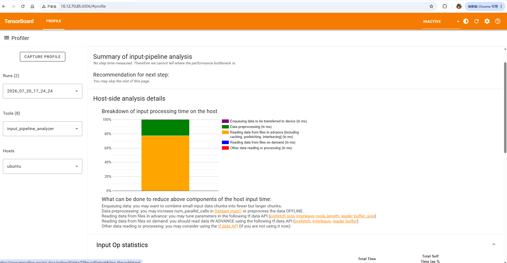

# rustFS和HDFS的压测
主要是想看tensorFlow在rustFS和HDFS上的性能差异。 
环境:ubuntu22.04


## 环境安装
```shell
# pip安装tensorflow和tensorboard-plugin-profile

pip install tensorflow==2.16.1
sudo pip install tensorboard-plugin-profile==2.16.0
pip install  tensorflow-io boto3 


# 查看版本
python3 -c "import tensorflow as tf; print('TF:', tf.__version__)"
python3 -c "import tensorflow_io as tfio; print('TF-IO:', tfio.__version__)"
```

## tensorFlow on RustFs压测
```python
import os
import time
import io
import boto3
import tensorflow as tf
import tensorflow_io as tfio  # 💡 必须加上这一行，它会自动注册 s3:// 协议的底层 C++ 实现

# ==============================================================================
# 1. 基础配置信息
# ==============================================================================
ENDPOINT_URL = 'http://rust-work.yy.com'
ACCESS_KEY = 'accessrustfsadmin'
SECRET_KEY = 'secretrustfsadmin'
BUCKET_NAME = 'tf-profiler-benchmark'

# 设置 TensorFlow 的 S3 环境变量（使 tf.data.TFRecordDataset 能直接识别 s3:// 协议）
os.environ["AWS_ACCESS_KEY_ID"] = ACCESS_KEY
os.environ["AWS_SECRET_ACCESS_KEY"] = SECRET_KEY
os.environ["S3_ENDPOINT"] = ENDPOINT_URL
os.environ["S3_USE_HTTPS"] = "0"        # RustFS 如果是 http 协议，必须设为 0
os.environ["S3_VERIFY_SSL"] = "0"       # 禁用 SSL 证书验证

# 模拟数据集大小：10 个 Shard 文件，每个 100MB
NUM_SHARDS = 10
RECORD_SIZE_BYTES = 1024 * 1024  # 单个样本 1MB
RECORDS_PER_SHARD = 100          # 每个文件 100 个样本

# Profiler 日志输出路径
LOG_DIR = "./logdir/rustfs_profile"

# ==============================================================================
# 2. 准备阶段：向 RustFS 写入测试数据
# ==============================================================================
def prepare_test_data_on_rustfs():
    """初始化 BUCKET 并生成 1GB 的 TFRecord 数据集"""
    print(f"👉 正在初始化连接 RustFS 并准备测试数据...")
    s3_client = boto3.client(
        's3',
        endpoint_url=ENDPOINT_URL,
        aws_access_key_id=ACCESS_KEY,
        aws_secret_access_key=SECRET_KEY
    )
    
    # 创建 Bucket
    try:
        s3_client.create_bucket(Bucket=BUCKET_NAME)
        print(f"✅ 成功创建 Bucket: {BUCKET_NAME}")
    except s3_client.exceptions.BucketAlreadyExists:
        pass
    except s3_client.exceptions.BucketAlreadyOwnedByYou:
        pass

    # 生成一个标准 TFRecord 样本
    dummy_bytes = b"X" * RECORD_SIZE_BYTES
    feature = {'data': tf.train.Feature(bytes_list=tf.train.BytesList(value=[dummy_bytes]))}
    example = tf.train.Example(features=tf.train.Features(feature=feature))
    serialized_example = example.SerializeToString()

    print(f"👉 开始上传 {NUM_SHARDS} 个 100MB 的大文件分片至 RustFS...")
    
    # 修复核心：在本地创建一个临时文件
    local_temp_file = "temp_shard.tfrecord"
    
    # 1. 先把数据写入本地这个临时文件
    with tf.io.TFRecordWriter(local_temp_file) as writer:
        for _ in range(RECORDS_PER_SHARD):
            writer.write(serialized_example)

    # 2. 循环将这个本地文件上传到 RustFS 的不同位置
    try:
        for shard_idx in range(NUM_SHARDS):
            key_name = f"data/shard_{shard_idx}.tfrecord"
            
            # 使用 upload_file 直接上传本地路径
            s3_client.upload_file(local_temp_file, BUCKET_NAME, key_name)
            print(f"   [已上传] s3://{BUCKET_NAME}/{key_name}")
    finally:
        # 3. 上传完成后，清理本地临时文件，不占用服务器磁盘空间
        if os.path.exists(local_temp_file):
            os.remove(local_temp_file)

    print("🎉 压测数据准备就绪！\n")

# ==============================================================================
# 3. 压测阶段：tf.data 并发读取 + tf.profiler 性能采样
# ==============================================================================
def run_rustfs_io_profiler():
    print("\n🚀 正在构建 TensorFlow 高并发 I/O 管道 (强力压测版)...")
    
    # 匹配刚刚上传的所有大文件分片
    file_pattern = f"s3://{BUCKET_NAME}/data/shard_*.tfrecord"
    
    # 1. 找到所有文件路径
    files_ds = tf.data.Dataset.list_files(file_pattern, shuffle=False)
    
    # 💡 强力加压改动 1：使用 AUTOTUNE 让系统自动或强制使用最大 CPU 核心数进行并发读取
    # cycle_length 决定了同时打开并读取的文件数量
    dataset = files_ds.interleave(
        lambda filename: tf.data.TFRecordDataset(filename, buffer_size=16 * 1024 * 1024), # 每个文件给 16MB 读缓冲区
        cycle_length=NUM_SHARDS,               # 10个分片同时并发拉取
        block_length=16,                       # 每次从一个文件连续读 16 个 record，减少线程切换
        num_parallel_calls=tf.data.AUTOTUNE    # 开启异步多线程并行交错读取
    )
    
    # 💡 强力加压改动 2：加大 Batch 块大小，降低 CPU 的迭代循环次数开销
    dataset = dataset.batch(512) 
    
    # 💡 强力加压改动 3：狂拉预取缓存区（Prefetch）
    # 让网络层不等 CPU 消费完，就提前在内存里囤积大量的 batch，直接把 RustFS 的带宽拉满
    dataset = dataset.prefetch(buffer_size=tf.data.AUTOTUNE)

    # 启动 tf.profiler 采样
    log_dir = "./logdir/rustfs_profile"
    print(f"📸 启动 tf.profiler。采样日志将保存在: {log_dir}")
    
    tf.profiler.experimental.start(log_dir)
    
    start_time = time.time()
    total_batches = 0
    
    print("⏳ 正在全力轰炸 RustFS 存储层中...")
    try:
        # 💡 强力加压改动 4：彻底移除原先的 tf.io.decode_raw 和 tf.reduce_sum 计算
        # 换成最纯粹的空转迭代，让 CPU 100% 的精力都用来从网卡搬运数据
        for batch in dataset:
            total_batches += 1
            # pass 掉任何计算，只保留纯粹的 I/O 流
            pass
            
    finally:
        # 确保哪怕报错也能正常安全关闭并保存 profile 日志
        tf.profiler.experimental.stop()
        print("2026-07-20 16:05:06.608902: I external/local_tsl/tsl/profiler/lib/profiler_session.cc:131] Profiler session tear down.")
        
    end_time = time.time()
    elapsed = end_time - start_time
    
    print(f"\n🎉 压测完成！")
    print(f"⏱️ 耗时: {elapsed:.2f} 秒")
    print(f"📦 成功消费 Batch 数量: {total_batches}")

if __name__ == "__main__":
    # 1. 初始化 RustFS 数据
    prepare_test_data_on_rustfs()
    
    # 2. 运行带 Profiler 的 I/O 压测
    run_rustfs_io_profiler()
```

这段代码展示了如何在 TensorFlow 中使用 RustFS 作为后端存储，并通过 tf.data API 进行高并发 I/O 操作。通过设置环境变量和利用 boto3 客户端与 S3 兼容的 RustFS 服务交互，实现了数据的上传、读取以及性能分析的全   

 ### 启动tensorboard 
 指标说明文档：<a href="https://www.tensorflow.org/guide/data_performance_analysis?hl=zh-cn">使用 TF Profiler 分析 tf.data 性能</a>  

`tensorboard --logdir ./logdir/rustfs_profile --bind_all --port 6006`  


## 测试tensorFlow读写HDFS
环境安装：
```shell
apt-get install openjdk-8-jre

```
tensorFlow 读写hdfs的配置,最后是放到/etc/profile.d/tensorflow_hdfs.sh中，然后执行source /etc/profile.d/tensorflow_hdfs.sh  

```shell
# java 环境变量配置
export JAVA_HOME=//usr/lib/jvm/java-8-openjdk-amd64
export PATH=$JAVA_HOME/bin:$PATH

# 1. 确保指定 Hadoop 安装根路径（如果你的 Hadoop 在 /usr/local/hadoop）
export HADOOP_HOME=/usr/local/hadoop
export PATH=$HADOOP_HOME/bin:$PATH

# 2. 补全原生 C 库路径（包含 libhdfs.so）+ Java libjvm.so
JAVA_LIBJVM_DIR=$(dirname $(find $JAVA_HOME/ -name "libjvm.so" 2>/dev/null | head -n 1))
HADOOP_NATIVE_DIR=$HADOOP_HOME/lib/native

export LD_LIBRARY_PATH=$HADOOP_NATIVE_DIR:$JAVA_LIBJVM_DIR:$LD_LIBRARY_PATH

# 3. 将 Hadoop 配置文件目录（core-site.xml, hdfs-site.xml 所在的目录）强制插入 CLASSPATH 最前面
#  注意：如果你的配置文件在 /etc/hadoop/conf，请改为 /etc/hadoop/conf
HADOOP_CONF_DIR=${HADOOP_CONF_DIR:-/etc/hadoop/conf}
export CLASSPATH=$HADOOP_CONF_DIR:$(hadoop classpath --glob)

# 4. 显式指定 Kerberos 认证
export HADOOP_SECURITY_AUTHENTICATION="kerberos"
```

### 测试代码

```python
import os
import sys
import time
import tensorflow as tf
import tensorflow_io as tfio  # 确保导入了 tfio 以注册 hdfs 模块

# ==============================================================================
# 1. HDFS 配置信息
# ==============================================================================
HDFS_NAMENODE = "hdfs://yycluster01"
HDFS_BASE_DIR = f"{HDFS_NAMENODE}/tmp/tf_bench"

KEYTAB_FILE = "/home/liangrui06/test-hiido2.keytab"
PRINCIPAL = "test-hiido2@TESTCLUSTER.COM"

def init_kerberos():
    """在脚本启动时，强制执行 kinit 刷新票据"""
    print(f"🔐 正在通过 Keytab 进行 Kerberos 认证...")
    kinit_cmd = f"kinit -kt {KEYTAB_FILE} {PRINCIPAL}"
    status = os.system(kinit_cmd)
    if status != 0:
        raise RuntimeError("❌ Kerberos 认证失败，请检查 Keytab 路径和 Principal 是否正确！")
    print("✅ Kerberos 认证成功，已获取有效票据。")

NUM_SHARDS = 10
RECORD_SIZE_BYTES = 1024 * 1024  # 单个样本 1MB
RECORDS_PER_SHARD = 100          # 每个文件 100 个样本

# ==============================================================================
# 2. 准备阶段：向 HDFS 写入测试数据
# ==============================================================================
def prepare_test_data_on_hdfs():
    print(f"\n👉 正在初始化连接 HDFS 并准备测试数据...")
    
    if not tf.io.gfile.exists(HDFS_BASE_DIR):
        tf.io.gfile.makedirs(HDFS_BASE_DIR)
        print(f"✅ 成功创建 HDFS 目录: {HDFS_BASE_DIR}")

    dummy_bytes = b"X" * RECORD_SIZE_BYTES
    feature = {'data': tf.train.Feature(bytes_list=tf.train.BytesList(value=[dummy_bytes]))}
    example = tf.train.Example(features=tf.train.Features(feature=feature))
    serialized_example = example.SerializeToString()

    print(f"👉 开始上传 {NUM_SHARDS} 个 100MB 的大文件分片至 HDFS...")
    write_start_time = time.time()
    
    for shard_idx in range(NUM_SHARDS):
        hdfs_path = f"{HDFS_BASE_DIR}/shard_{shard_idx}.tfrecord"
        with tf.io.TFRecordWriter(hdfs_path) as writer:
            for _ in range(RECORDS_PER_SHARD):
                writer.write(serialized_example)
        print(f"   [已写入] {hdfs_path}")

    write_elapsed = time.time() - write_start_time
    print(f"🎉 HDFS 压测数据准备就绪！")
    print(f"📊 [写入性能] HDFS 写入耗时: {write_elapsed:.2f} 秒，吞吐量: {1000 / write_elapsed:.2f} MB/s\n")

# ==============================================================================
# 3. 压测阶段：HDFS + tf.data 高并发读取
# ==============================================================================
def run_hdfs_io_profiler():
    print("\n🚀 正在构建 TensorFlow 高并发 HIO 管道 (HDFS 强力压测版)...")
    
    file_pattern = f"{HDFS_BASE_DIR}/shard_*.tfrecord"
    files_ds = tf.data.Dataset.list_files(file_pattern, shuffle=False)
    
    dataset = files_ds.interleave(
        lambda filename: tf.data.TFRecordDataset(filename, buffer_size=16 * 1024 * 1024),
        cycle_length=NUM_SHARDS,
        block_length=16,
        num_parallel_calls=tf.data.AUTOTUNE
    )
    
    dataset = dataset.batch(512)
    dataset = dataset.prefetch(buffer_size=tf.data.AUTOTUNE)

    log_dir = "./logdir/hdfs_profile"
    print(f"📸 启动 tf.profiler。采样日志将保存在: {log_dir}")
    
    tf.profiler.experimental.start(log_dir)
    
    start_time = time.time()
    total_batches = 0
    
    print("⏳ 正在全力轰炸 HDFS 存储层中...")
    try:
        for batch in dataset:
            total_batches += 1
            pass
    finally:
        tf.profiler.experimental.stop()
        print("Profiler session tear down.")
        
    end_time = time.time()
    elapsed = end_time - start_time
    
    print(f"\n🎉 HDFS 读取压测完成！")
    print(f"⏱️ [读取性能] 耗时: {elapsed:.2f} 秒")
    print(f"📦 吞吐率: {1000 / elapsed:.2f} MB/s")
    print(f"📦 成功消费 Batch 数量: {total_batches}")

if __name__ == "__main__":
    init_kerberos()
    prepare_test_data_on_hdfs()
    run_hdfs_io_profiler()
```
运行:   
`python3 hdfsStressTest.py `    
查看压测报告:  
`tensorboard --logdir ./logdir/hdfs_profile --bind_all --port 6007`    


/data1/test_data/tianmu包含所有子目录，一共有144.5 G 和137891个文件。分别上传到hdfs和rustfs  

<div class="post-date">
  <span class="calendar-icon">📅</span>
  <span class="date-label">发布：</span>
  <time datetime="2026-07-20" class="date-value">2026-07-20</time>
</div>

<div class="outline" style="background:#f6f8fa;padding:1em 1.5em 1em 1.5em;margin-bottom:2em;border-radius:8px;">
  <strong>大纲：</strong>
  <ul id="outline-list" style="margin:0;padding-left:1.2em;"></ul>
</div>

<!--菜单栏-->
  <nav class="blog-nav">
    <button class="collapse-btn" onclick="toggleBlogNav()">☰</button>
    
 </nav>

 <script src="/assets/blog.js"></script>
<link rel="stylesheet" href="/assets/blog.css">
<!--评论区-->
<div id="giscus-comments" style="max-width:900px;margin:2em auto 0 auto;padding:0 1em;"></div>
<script>
  insertGiscusComment('giscus-comments');
</script>